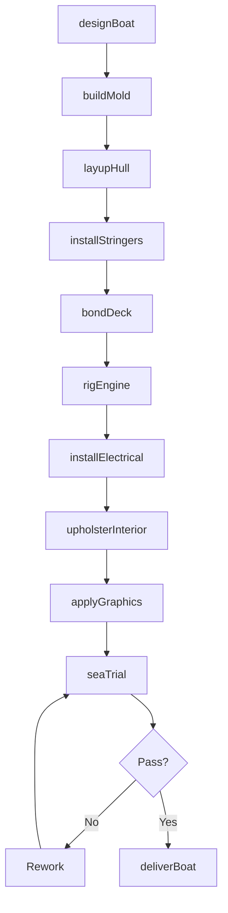
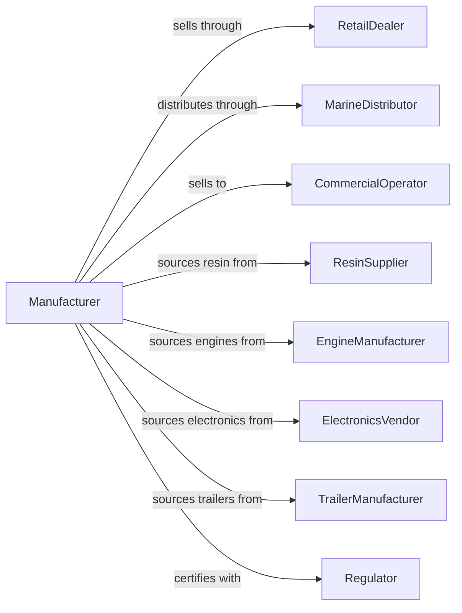

# Boat Building

> Business-as-Code definition for boat building operations. Models the complete production process from design through construction, finishing, and delivery.

## Overview

This U.S. industry comprises establishments primarily engaged in building boats. Boats are defined as watercraft not built in shipyards and typically suitable or intended for personal use. Products include motorboats, rowboats, canoes, kayaks, sailboats, inflatable boats, pontoon boats, fishing boats, and personal watercraft. Also included are establishments that manufacture heavy-duty inflatable rubber or plastic boats.

## Actors

| Actor | Description |
|-------|-------------|
| RetailDealer | Sells boats to recreational consumers |
| MarineDistributor | Distributes boats to dealer network |
| CommercialOperator | Purchases workboats for commercial use |
| ResinSupplier | Provides fiberglass and composite materials |
| EngineManufacturer | Supplies outboard and inboard engines |
| ElectronicsVendor | Provides navigation and fish finding equipment |
| TrailerManufacturer | Supplies boat trailers for transport |
| Regulator | USCG enforcing safety and capacity standards |
| MarineFinance | Provides boat loans and floor plan financing |

## Roles

| Role | Description |
|------|-------------|
| PlantManager | Oversees boat manufacturing facility |
| DesignEngineer | Creates hull designs and specifications |
| ProductionManager | Coordinates lamination and assembly operations |
| Laminator | Builds fiberglass hulls and components |
| Rigger | Installs engines, controls, and systems |
| Upholsterer | Installs seating and interior finishes |
| Finisher | Applies gelcoat and final finish |
| QualityInspector | Verifies compliance with standards |

## Entities

| Entity | Description |
|--------|-------------|
| Boat | Personal watercraft for recreation or light commercial use |
| Hull | Watertight body of the boat |
| Deck | Top surface providing working and walking area |
| Engine | Outboard or inboard propulsion unit |
| Mold | Form used for fiberglass layup |
| Gelcoat | Smooth outer finish layer |
| Stringers | Structural support members in hull |
| Console | Helm station with controls and instruments |
| Trailer | Wheeled vehicle for boat transport |
| Capacity | Maximum persons and weight rating |

## Actions

| Action | Description |
|--------|-------------|
| designBoat | Create hull lines and deck layout |
| buildMold | Construct plug and production mold |
| layupHull | Apply fiberglass and resin to mold |
| installStringers | Bond structural members to hull |
| bondDeck | Join deck to hull assembly |
| rigEngine | Install engine, controls, and fuel system |
| installElectrical | Wire navigation and accessory systems |
| upholsterInterior | Install seats, cushions, and trim |
| applyGraphics | Add decals and customer graphics |
| seaTrial | Test boat performance on water |
| deliverBoat | Ship completed boat to dealer |

## Events

| Event | Description |
|-------|-------------|
| boatDesigned | Hull and deck designs approved |
| moldBuilt | Production mold completed |
| hullLaidUp | Hull lamination completed |
| stringersInstalled | Structural members bonded |
| deckBonded | Deck joined to hull |
| engineRigged | Propulsion system installed |
| electricalInstalled | Wiring and electronics completed |
| interiorUpholstered | Seating and trim completed |
| graphicsApplied | Finish decoration completed |
| seaTrialPassed | Water testing successful |
| boatDelivered | Boat shipped to customer |

## Searches

| Search | Description |
|--------|-------------|
| findOrders | Query production orders by dealer or model |
| getInventory | Check work-in-progress and finished boats |
| trackProduction | Monitor boats through manufacturing stages |
| findSuppliers | List suppliers by material or component |
| getMoldStatus | Check mold condition and availability |
| getDealerNetwork | Locate dealers by region |
| getWarrantyData | Retrieve warranty claims by model |

## Workflow

## Actor Relationships

