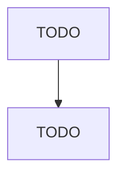

# Boat Building

> TODO: Business-as-Code definition

## Overview

This U.S. industry comprises establishments primarily engaged in building boats. Boats are defined as watercraft not built in shipyards and typically of the type suitable or intended for personal use. Included in this industry are establishments that manufacture heavy-duty inflatable rubber or inflatable plastic boats (RIBs). Illustrative Examples: Inflatable plastic boats, heavy-duty, manufacturing Inflatable rubber boats, heavy-duty, manufacturing Boats (e.g., motorboats, rowboats, canoes, kay

## Actors

| Actor | Description |
|-------|-------------|
| TODO | TODO |

## Roles

| Role | Description |
|------|-------------|
| TODO | TODO |

## Entities

| Entity | Description |
|--------|-------------|
| TODO | TODO |

## Actions

| Action | Description |
|--------|-------------|
| TODO | TODO |

## Events

| Event | Description |
|-------|-------------|
| TODO | TODO |

## Searches

| Search | Description |
|--------|-------------|
| TODO | TODO |

## Workflow

## Actor Relationships

