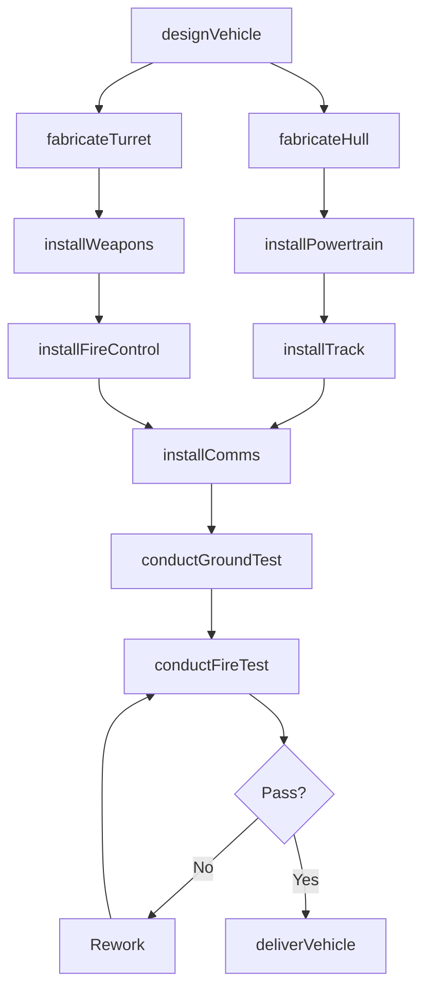
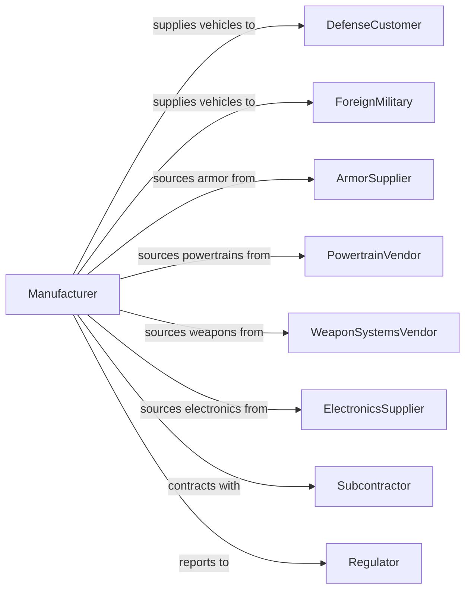

# Military Armored Vehicle, Tank, and Tank Component Manufacturing

> Business-as-Code definition for military armored vehicle and tank manufacturing. Models the complete production process from design through fabrication, assembly, and delivery.

## Overview

This U.S. industry comprises establishments primarily engaged in manufacturing complete military armored vehicles, combat tanks, specialized components for combat tanks, and self-propelled weapons. Products include main battle tanks, infantry fighting vehicles, armored personnel carriers, mine-resistant vehicles, and specialized tank components including turrets, hulls, and weapon systems.

## Actors

| Actor | Description |
|-------|-------------|
| DefenseCustomer | Military branch procuring armored vehicles |
| ForeignMilitary | Allied nation purchasing vehicles through FMS |
| ArmorSupplier | Provides ballistic armor plate and materials |
| PowertrainVendor | Supplies engines, transmissions, and drivetrains |
| WeaponSystemsVendor | Provides main guns, turrets, and fire control |
| ElectronicsSupplier | Supplies communications and battlefield systems |
| Subcontractor | Manufactures specialized components |
| Regulator | Defense contract administration authorities |
| TestRange | Provides proving grounds for vehicle testing |

## Roles

| Role | Description |
|------|-------------|
| ProgramManager | Oversees vehicle development and production program |
| SystemsEngineer | Integrates vehicle subsystems |
| DesignEngineer | Creates hull and turret specifications |
| ProductionManager | Coordinates fabrication and assembly operations |
| ArmorWelder | Fabricates armored hull and turret structures |
| SystemsInstaller | Mounts powertrain and electronic systems |
| WeaponsMechanic | Installs and aligns weapon systems |
| QualityInspector | Verifies conformance to military specifications |

## Entities

| Entity | Description |
|--------|-------------|
| Tank | Heavily armored tracked combat vehicle |
| IFV | Infantry fighting vehicle with troop compartment |
| APC | Armored personnel carrier for troop transport |
| MRAP | Mine-resistant ambush protected vehicle |
| Hull | Armored body structure of vehicle |
| Turret | Rotating weapon platform on tank |
| Armor | Ballistic protection material |
| MainGun | Primary weapon system on combat vehicle |
| FireControl | Targeting and weapon aiming system |
| Track | Continuous track propulsion system |

## Actions

| Action | Description |
|--------|-------------|
| designVehicle | Create vehicle architecture and specifications |
| fabricateHull | Build armored hull structure |
| fabricateTurret | Build armored turret assembly |
| installPowertrain | Mount engine and transmission |
| installTrack | Mount track and suspension system |
| installWeapons | Mount main gun and secondary weapons |
| installFireControl | Mount targeting and fire control systems |
| installComms | Install communications and battlefield systems |
| conductGroundTest | Perform mobility and systems testing |
| conductFireTest | Execute live fire qualification |
| deliverVehicle | Transfer completed vehicle to customer |

## Events

| Event | Description |
|-------|-------------|
| vehicleDesigned | Specifications completed and approved |
| hullFabricated | Armored hull structure completed |
| turretFabricated | Turret assembly completed |
| powertrainInstalled | Engine and transmission mounted |
| trackInstalled | Suspension and track system mounted |
| weaponsInstalled | Main armament mounted |
| fireControlInstalled | Targeting systems mounted |
| commsInstalled | Communications systems mounted |
| groundTestComplete | Mobility testing passed |
| fireTestComplete | Live fire qualification passed |
| vehicleDelivered | Vehicle transferred to customer |

## Searches

| Search | Description |
|--------|-------------|
| findOrders | Query production contracts by customer or vehicle type |
| getInventory | Check component and vehicle inventory |
| trackProduction | Monitor vehicles through manufacturing stages |
| findSuppliers | List suppliers by component category |
| getTestData | Retrieve qualification test results |
| getSparesDemand | Check customer spare parts requirements |
| getFleetStatus | Track delivered fleet readiness |

## Workflow

## Actor Relationships

