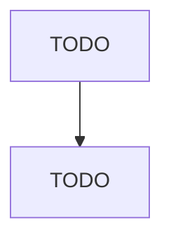

# All Other Transportation Equipment Manufacturing

> TODO: Business-as-Code definition

## Overview

This U.S. industry comprises establishments primarily engaged in manufacturing transportation equipment (except motor vehicles, motor vehicle parts, boats, ships, railroad rolling stock, aerospace products, motorcycles, bicycles, armored vehicles, and tanks). Illustrative Examples: All-terrain vehicles (ATVs), wheeled or tracked, manufacturing Animal-drawn vehicles and parts manufacturing Gocarts (except children's) manufacturing Golf carts and similar motorized passenger carriers manufacturing 

## Actors

| Actor | Description |
|-------|-------------|
| TODO | TODO |

## Roles

| Role | Description |
|------|-------------|
| TODO | TODO |

## Entities

| Entity | Description |
|--------|-------------|
| TODO | TODO |

## Actions

| Action | Description |
|--------|-------------|
| TODO | TODO |

## Events

| Event | Description |
|-------|-------------|
| TODO | TODO |

## Searches

| Search | Description |
|--------|-------------|
| TODO | TODO |

## Workflow

## Actor Relationships

