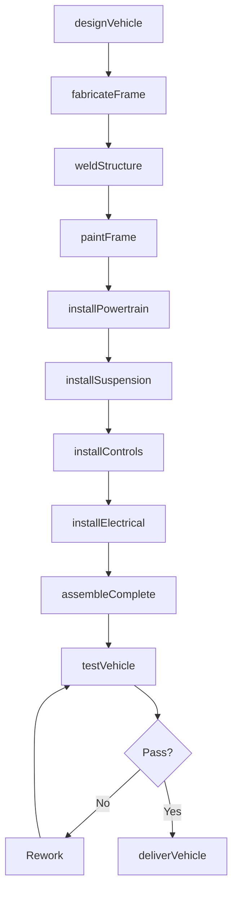
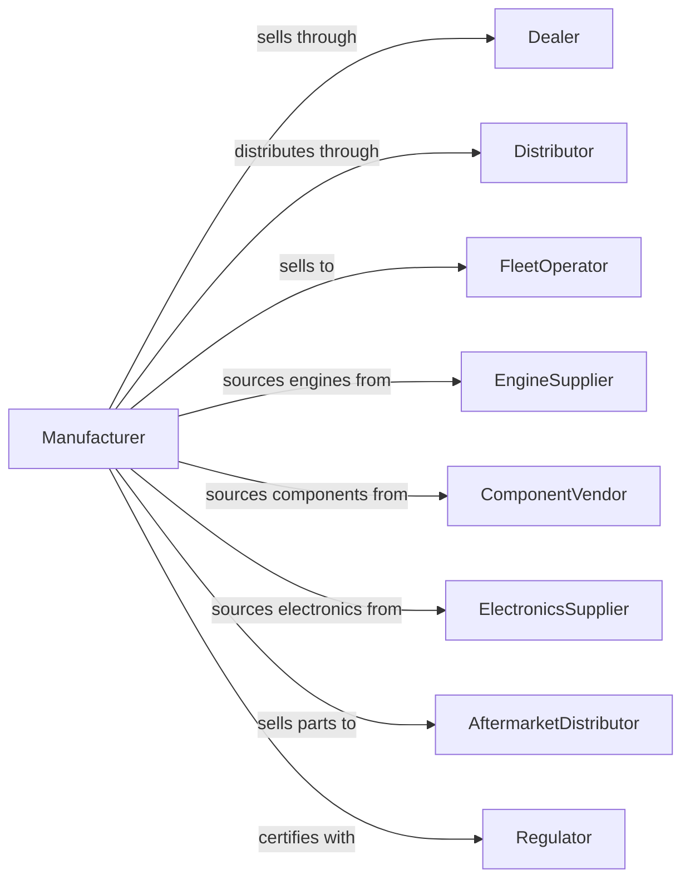

# All Other Transportation Equipment Manufacturing

> Business-as-Code definition for miscellaneous transportation equipment manufacturing. Models the complete production process from design through assembly, testing, and delivery.

## Overview

This U.S. industry comprises establishments primarily engaged in manufacturing transportation equipment (except motor vehicles, motor vehicle parts, boats, ships, railroad rolling stock, aerospace products, motorcycles, bicycles, armored vehicles, and tanks). Products include all-terrain vehicles, golf carts, snowmobiles, personal watercraft, go-karts, animal-drawn vehicles, and other specialty transportation equipment.

## Actors

| Actor | Description |
|-------|-------------|
| Dealer | Franchise or independent retailer selling equipment |
| Distributor | Distributes products to dealer network |
| FleetOperator | Purchases equipment for commercial operations |
| EngineSupplier | Provides small engines and electric powertrains |
| ComponentVendor | Supplies frames, suspension, and mechanical components |
| ElectronicsSupplier | Provides controls, displays, and lighting |
| AftermarketDistributor | Purchases parts and accessories |
| Regulator | CPSC and EPA enforcing safety and emissions |
| ResortOperator | Purchases golf carts and utility vehicles |

## Roles

| Role | Description |
|------|-------------|
| PlantManager | Oversees manufacturing facility operations |
| DesignEngineer | Creates vehicle specifications and designs |
| ProductionManager | Coordinates fabrication and assembly operations |
| FrameBuilder | Fabricates structural components |
| Assembler | Builds complete vehicle assemblies |
| PaintTechnician | Applies finish coatings |
| TestOperator | Evaluates performance and safety |
| QualityInspector | Verifies conformance to specifications |

## Entities

| Entity | Description |
|--------|-------------|
| ATV | All-terrain vehicle for off-road recreation |
| UTV | Utility terrain vehicle with side-by-side seating |
| GolfCart | Low-speed vehicle for golf course transport |
| Snowmobile | Tracked vehicle for snow travel |
| GoKart | Small racing or recreational vehicle |
| PWC | Personal watercraft for water recreation |
| AnimalDrawn | Vehicle designed for animal propulsion |
| Frame | Structural chassis of vehicle |
| Powertrain | Engine or motor and transmission assembly |
| Suspension | Shock absorbing and wheel mounting system |

## Actions

| Action | Description |
|--------|-------------|
| designVehicle | Create chassis and system specifications |
| fabricateFrame | Build structural frame assembly |
| weldStructure | Join frame components |
| paintFrame | Apply protective coating |
| installPowertrain | Mount engine or electric drive |
| installSuspension | Mount wheels and shock absorbers |
| installControls | Add steering, throttle, and brake systems |
| installElectrical | Wire lighting and accessories |
| assembleComplete | Final assembly and accessories |
| testVehicle | Perform performance and safety testing |
| deliverVehicle | Ship to dealer or customer |

## Events

| Event | Description |
|-------|-------------|
| vehicleDesigned | Specifications completed |
| frameFabricated | Frame structure built |
| structureWelded | Frame assembly completed |
| framePainted | Finish coating applied |
| powertrainInstalled | Drive system mounted |
| suspensionInstalled | Wheels and shocks mounted |
| controlsInstalled | Operating systems installed |
| electricalInstalled | Wiring completed |
| assemblyComplete | Vehicle fully assembled |
| vehicleTested | Testing passed |
| vehicleDelivered | Product shipped |

## Searches

| Search | Description |
|--------|-------------|
| findOrders | Query production orders by dealer or model |
| getInventory | Check component and finished goods inventory |
| trackProduction | Monitor vehicles through assembly |
| findSuppliers | List suppliers by component category |
| getTestData | Retrieve performance and safety data |
| getDealerNetwork | Locate dealers by region |
| getWarrantyData | Retrieve warranty claims by model |

## Workflow

## Actor Relationships

