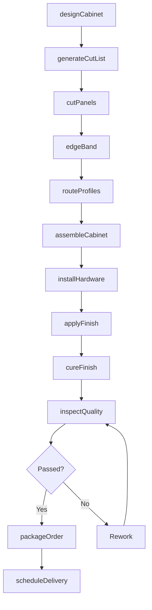
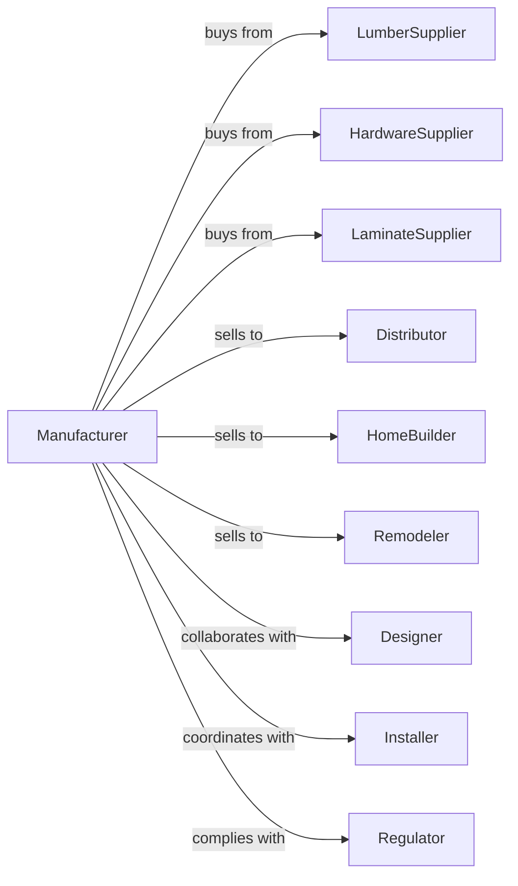

# Wood Kitchen Cabinet and Countertop Manufacturing

> Business-as-Code definition for wood kitchen cabinet and countertop manufacturing operations. Models the complete production lifecycle from design through installation.

## Overview

Wood kitchen cabinet and countertop manufacturing involves producing custom and stock cabinetry, bathroom vanities, and countertops using wood and plastics laminated on wood. This definition exposes actions for design, fabrication, finishing, and delivery, events for workflow automation, and searches for inventory and order management.

## Actors

| Actor | Description |
|-------|-------------|
| LumberSupplier | Provides hardwood, plywood, and particleboard materials |
| HardwareSupplier | Supplies hinges, drawer slides, knobs, and handles |
| LaminateSupplier | Provides plastic laminates and edge banding |
| Distributor | Purchases cabinets for resale to retailers and contractors |
| HomeBuilder | Orders cabinets for new residential construction |
| Remodeler | Purchases cabinets for kitchen renovation projects |
| Designer | Creates kitchen layouts and specifies cabinet configurations |
| Installer | Provides on-site cabinet installation services |
| Regulator | Enforces formaldehyde emissions and safety standards |

## Roles

| Role | Description |
|------|-------------|
| PlantManager | Oversees all manufacturing operations and production schedules |
| CabinetDesigner | Creates cabinet drawings and cut lists from specifications |
| CNCOperator | Programs and operates computer-controlled cutting equipment |
| CabinetMaker | Assembles cabinet boxes, doors, and drawer fronts |
| Finisher | Applies stains, paints, and protective coatings |
| QualityInspector | Verifies dimensions, finish quality, and hardware function |
| ShippingCoordinator | Manages packaging, loading, and delivery logistics |

## Entities

| Entity | Description |
|--------|-------------|
| Cabinet | The storage unit including box, doors, and drawers |
| Countertop | The horizontal work surface installed on base cabinets |
| Door | The front panel that opens to access cabinet interior |
| Drawer | The sliding storage component with front, sides, and bottom |
| Hardware | Hinges, slides, pulls, and mounting components |
| Finish | The stain, paint, or lacquer applied to surfaces |
| CutList | The detailed breakdown of parts and dimensions |
| WorkOrder | The production job with specifications and timeline |
| Material | Raw lumber, plywood, or laminate sheet goods |

## Actions

| Action | Description |
|--------|-------------|
| designCabinet | Create detailed drawings and specifications for custom units |
| generateCutList | Produce optimized cutting instructions from design |
| cutPanels | Machine lumber and sheet goods to required dimensions |
| edgeBand | Apply edge treatment to exposed panel edges |
| routeProfiles | Cut decorative profiles on doors and drawer fronts |
| assembleCabinet | Join components into complete cabinet boxes |
| installHardware | Attach hinges, slides, and mounting hardware |
| applyFinish | Apply stain, paint, or clear coat to surfaces |
| cureFinish | Allow finish to dry and harden to specification |
| inspectQuality | Verify dimensions, finish, and functionality |
| packageOrder | Wrap and protect cabinets for shipment |
| scheduleDelivery | Coordinate shipping to job site or distributor |

## Events

| Event | Description |
|-------|-------------|
| cabinetDesigned | Design drawings and specifications completed |
| cutListGenerated | Production cut list optimized and released |
| panelsCut | All panels machined to dimension |
| cabinetAssembled | Cabinet box construction completed |
| hardwareInstalled | All hardware attached and adjusted |
| finishApplied | Coating application completed |
| finishCured | Finish dried and ready for handling |
| qualityApproved | Inspection passed all criteria |
| orderPackaged | Cabinets wrapped and ready for shipment |
| orderShipped | Cabinets loaded and in transit |
| orderDelivered | Cabinets received at destination |

## Searches

| Search | Description |
|--------|-------------|
| findOrders | List work orders by status, customer, or due date |
| getMaterials | Query inventory levels for lumber and sheet goods |
| getHardwareStock | Check availability of hinges, slides, and pulls |
| findDesigns | Search cabinet designs by style, size, or features |
| getProductionSchedule | View machine and labor allocation by date |
| trackShipment | Get delivery status and location for orders |
| getFinishOptions | List available stain and paint color choices |

## Workflow

## Actor Relationships

