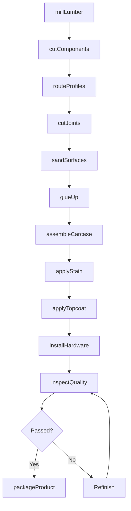
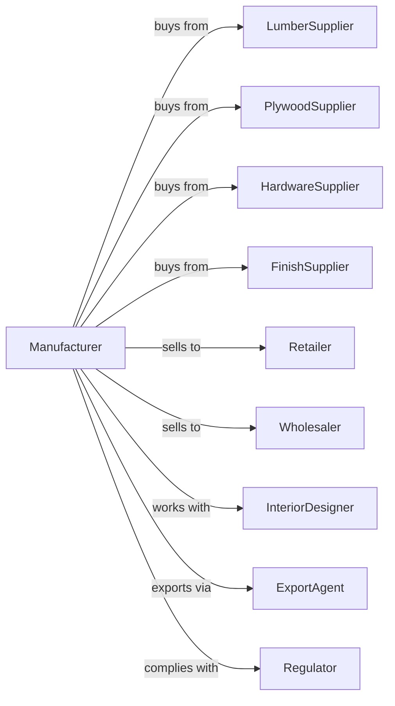

# Nonupholstered Wood Household Furniture Manufacturing

> Business-as-Code definition for nonupholstered wood household furniture manufacturing operations. Models the complete production lifecycle from lumber processing through finished goods.

## Overview

Nonupholstered wood household furniture manufacturing involves producing beds, dressers, dining tables, chairs, and freestanding cabinets made primarily of wood. This definition exposes actions for milling, joinery, assembly, and finishing, events for workflow automation, and searches for materials and production tracking.

## Actors

| Actor | Description |
|-------|-------------|
| LumberSupplier | Provides hardwood and softwood lumber in various species |
| PlywoodSupplier | Supplies veneered and composite panel products |
| HardwareSupplier | Provides drawer slides, hinges, knobs, and fasteners |
| FinishSupplier | Supplies stains, lacquers, and protective coatings |
| Retailer | Purchases furniture for consumer showroom sales |
| Wholesaler | Buys in volume for distribution to multiple retailers |
| InteriorDesigner | Specifies custom pieces for residential projects |
| ExportAgent | Facilitates international sales and shipping |
| Regulator | Enforces wood sourcing and emissions standards |

## Roles

| Role | Description |
|------|-------------|
| PlantManager | Oversees manufacturing operations and schedules |
| MillOperator | Processes rough lumber into dimensioned stock |
| CNCProgrammer | Creates and optimizes machine cutting programs |
| CabinetMaker | Performs joinery and assembles furniture components |
| Finisher | Applies stains, sealers, and topcoats |
| Sander | Prepares surfaces between finishing stages |
| QualityInspector | Verifies construction and finish standards |
| PackagingTech | Prepares furniture for shipment and knockdown packaging |

## Entities

| Entity | Description |
|--------|-------------|
| Lumber | Raw or dimensioned wood material |
| Panel | Plywood, MDF, or particleboard sheet material |
| Component | Individual furniture part ready for assembly |
| Joint | Connection between wood components |
| Finish | Stain, paint, or clear protective coating |
| Hardware | Functional and decorative metal components |
| Blueprint | Technical drawing with dimensions and specifications |
| WorkOrder | Production job tracking document |
| BOM | Bill of materials listing all required components |

## Actions

| Action | Description |
|--------|-------------|
| millLumber | Process rough lumber to specified dimensions |
| cutComponents | Machine parts to size using saws and CNC |
| routeProfiles | Cut decorative edges and joinery features |
| sandSurfaces | Smooth components to required finish grade |
| assembleCarcase | Join panels into cabinet or case bodies |
| cutJoints | Create mortise, tenon, dovetail, or other joints |
| glueUp | Bond components using adhesives and clamps |
| applyStain | Color wood with penetrating stain |
| applyTopcoat | Apply protective lacquer or varnish |
| installHardware | Attach drawer slides, hinges, and pulls |
| inspectQuality | Verify dimensions, finish, and function |
| packageProduct | Wrap or box for assembled or knockdown shipment |

## Events

| Event | Description |
|-------|-------------|
| lumberMilled | Stock processed to dimension |
| componentsCut | All parts machined to size |
| jointsCompleted | Joinery features cut and fitted |
| carcaseAssembled | Main body structure completed |
| stainApplied | Color coat applied to surfaces |
| topcoatCured | Protective finish dried and hardened |
| hardwareInstalled | All functional hardware attached |
| qualityApproved | Inspection passed |
| productPackaged | Item ready for shipment |
| orderShipped | Furniture dispatched to customer |

## Searches

| Search | Description |
|--------|-------------|
| findOrders | List work orders by status or due date |
| getLumberInventory | Query available species, grades, and quantities |
| getPanelStock | Check sheet goods inventory |
| getHardwareSupply | View hardware inventory by type |
| findBlueprints | Search furniture designs by style or collection |
| getFinishSchedule | View finishing booth availability |
| trackProduction | Get status of orders through manufacturing |

## Workflow

## Actor Relationships

