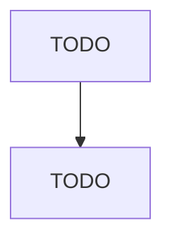

# Household Furniture (except Wood and Upholstered) Manufacturing

> TODO: Business-as-Code definition

## Overview

This U.S. industry comprises establishments primarily engaged in manufacturing nonupholstered household-type furniture of materials other than wood, such as metal, plastics, reed, rattan, wicker, and fiberglass. The furniture may be partially upholstered (e.g., chairs with upholstered seats or backs), made on a stock or custom basis, and may be assembled or unassembled (i.e., knockdown). Cross-References. Establishments primarily engaged in--

## Actors

| Actor | Description |
|-------|-------------|
| TODO | TODO |

## Roles

| Role | Description |
|------|-------------|
| TODO | TODO |

## Entities

| Entity | Description |
|--------|-------------|
| TODO | TODO |

## Actions

| Action | Description |
|--------|-------------|
| TODO | TODO |

## Events

| Event | Description |
|-------|-------------|
| TODO | TODO |

## Searches

| Search | Description |
|--------|-------------|
| TODO | TODO |

## Workflow

## Actor Relationships

