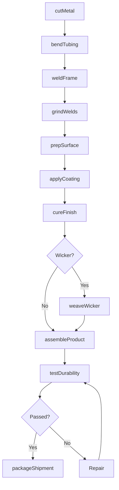
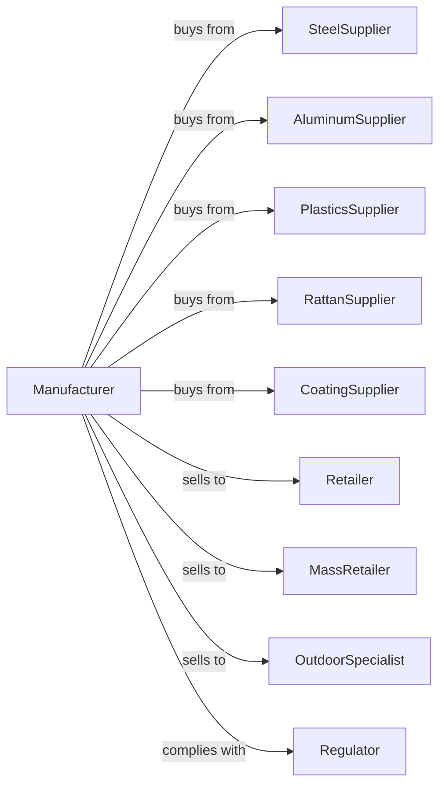

# Household Furniture (except Wood and Upholstered) Manufacturing

> Business-as-Code definition for household furniture manufacturing using metal, plastics, and other non-wood materials. Models the complete production lifecycle from raw materials through finished goods.

## Overview

Household furniture manufacturing using materials other than wood includes producing metal beds, patio furniture, plastic chairs, and wicker or rattan pieces. This definition exposes actions for metal fabrication, molding, welding, and finishing, events for workflow automation, and searches for materials and order management.

## Actors

| Actor | Description |
|-------|-------------|
| SteelSupplier | Provides steel tubing, sheet, and bar stock |
| AluminumSupplier | Supplies aluminum extrusions and sheet |
| PlasticsSupplier | Provides resin pellets and molded components |
| RattanSupplier | Supplies natural and synthetic wicker materials |
| CoatingSupplier | Provides powder coatings and paint finishes |
| Retailer | Purchases furniture for consumer sales |
| MassRetailer | High-volume buyer for big-box store distribution |
| OutdoorSpecialist | Focuses on patio and garden furniture sales |
| Regulator | Enforces safety standards and material certifications |

## Roles

| Role | Description |
|------|-------------|
| ProductionManager | Oversees manufacturing schedules and output |
| MetalFabricator | Cuts, bends, and shapes metal components |
| Welder | Joins metal parts using MIG, TIG, or spot welding |
| MoldOperator | Runs injection molding or rotomolding equipment |
| Weaver | Creates wicker patterns on furniture frames |
| PowderCoater | Applies and cures protective powder coatings |
| Assembler | Combines components into finished furniture |
| QualityInspector | Tests durability and verifies specifications |

## Entities

| Entity | Description |
|--------|-------------|
| Tubing | Hollow metal structural elements |
| Sheet | Flat metal material for panels and components |
| Extrusion | Shaped aluminum profiles |
| Resin | Plastic material for molding |
| Wicker | Natural or synthetic weaving material |
| Coating | Powder coat or paint finish |
| Frame | The structural skeleton of furniture |
| Cushion | Optional padded seating components |
| Hardware | Fasteners, connectors, and adjustment mechanisms |

## Actions

| Action | Description |
|--------|-------------|
| cutMetal | Saw or laser cut metal stock to length |
| bendTubing | Form metal tubing into curved shapes |
| weldFrame | Join metal components using welding |
| grindWelds | Smooth welded joints for finishing |
| moldPlastic | Form plastic components using molds |
| weaveWicker | Apply wicker material to frame in pattern |
| prepSurface | Clean and prepare metal for coating |
| applyCoating | Apply powder coat or wet paint finish |
| cureFinish | Bake or dry coating to specification |
| assembleProduct | Combine frame, cushions, and hardware |
| testDurability | Verify load capacity and stability |
| packageShipment | Prepare for flat-pack or assembled delivery |

## Events

| Event | Description |
|-------|-------------|
| metalCut | Stock cut to required dimensions |
| tubingBent | Metal formed to design shape |
| frameWelded | Structural welding completed |
| weldsCleaned | Joints ground and smoothed |
| plasticMolded | Components formed from mold |
| wickerWoven | Pattern completed on frame |
| coatingApplied | Finish applied to surfaces |
| finishCured | Coating hardened and ready |
| productAssembled | All components joined |
| qualityApproved | Testing and inspection passed |
| orderShipped | Product dispatched to customer |

## Searches

| Search | Description |
|--------|-------------|
| findOrders | List production orders by status or date |
| getMetalInventory | Query steel and aluminum stock levels |
| getResinSupply | Check plastic material availability |
| getCoatingColors | View available finish color options |
| findFrameDesigns | Search frame specifications by product line |
| getWeldingSchedule | View welding station availability |
| trackProduction | Monitor order progress through manufacturing |

## Workflow

## Actor Relationships

