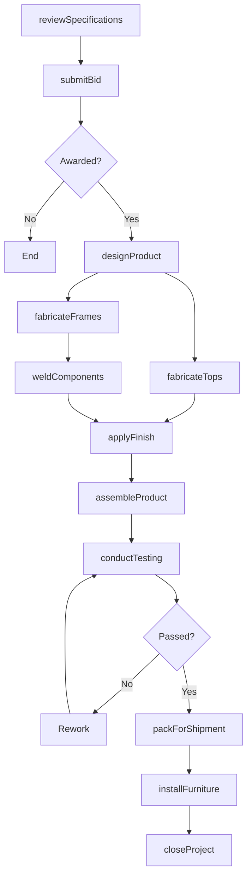
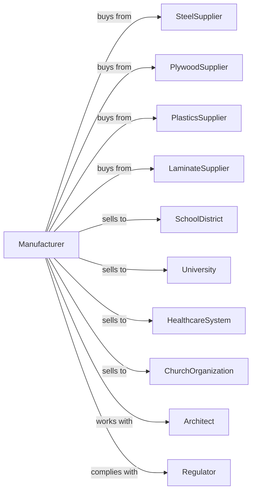

# Institutional Furniture Manufacturing

> Business-as-Code definition for institutional furniture manufacturing operations. Models the complete production lifecycle for school, library, theater, church, and healthcare furniture.

## Overview

Institutional furniture manufacturing involves producing durable furniture for schools, libraries, theaters, churches, hospitals, and laboratories. This definition exposes actions for design, fabrication, assembly, and delivery, events for workflow automation, and searches for specifications and order management.

## Actors

| Actor | Description |
|-------|-------------|
| SteelSupplier | Provides steel tubing and sheet for frames |
| PlywoodSupplier | Supplies laminated wood panels and veneers |
| PlasticsSupplier | Provides molded seats, backs, and surfaces |
| LaminateSupplier | Supplies high-pressure laminates for surfaces |
| SchoolDistrict | Purchases classroom desks, chairs, and tables |
| University | Orders lecture hall seating and laboratory furniture |
| HealthcareSystem | Buys exam tables, stools, and waiting room seating |
| ChurchOrganization | Purchases pews, pulpits, and choir seating |
| Architect | Specifies furniture for new institutional buildings |
| Regulator | Enforces ADA compliance and safety standards |

## Roles

| Role | Description |
|------|-------------|
| ProjectManager | Coordinates large institutional orders and installations |
| DesignEngineer | Creates furniture designs meeting institutional requirements |
| MetalFabricator | Produces steel frames and structural components |
| Woodworker | Fabricates wood tops, panels, and trim |
| Upholsterer | Applies fabric or vinyl to seating surfaces |
| Welder | Joins metal frame components |
| Finisher | Applies powder coating, stain, or lacquer |
| Installer | Performs on-site assembly and placement |

## Entities

| Entity | Description |
|--------|-------------|
| Desk | Student or teacher work surface with storage |
| Chair | Seating for classroom, waiting area, or auditorium |
| Table | Work or dining surface for institutional use |
| Pew | Long bench seating for religious worship |
| Lectern | Standing presentation furniture |
| LabBench | Durable work surface for laboratory use |
| StorageUnit | Cabinets, lockers, or shelving for institutions |
| Specification | Detailed requirements document from buyer |
| BidPackage | Pricing and terms for competitive procurement |

## Actions

| Action | Description |
|--------|-------------|
| reviewSpecifications | Analyze buyer requirements and compliance needs |
| submitBid | Prepare and deliver competitive pricing proposal |
| designProduct | Engineer furniture to meet specifications |
| fabricateFrames | Manufacture metal structural components |
| fabricateTops | Produce wood or laminate work surfaces |
| weldComponents | Join metal parts into frame assemblies |
| applyFinish | Coat metal and wood surfaces |
| assembleProduct | Combine components into finished furniture |
| conductTesting | Verify load capacity and durability standards |
| packForShipment | Prepare for transport to installation site |
| installFurniture | Place and anchor furniture at institutional site |
| closeProject | Complete punch list and transfer warranty |

## Events

| Event | Description |
|-------|-------------|
| specificationReceived | Buyer requirements document obtained |
| bidSubmitted | Pricing proposal delivered to buyer |
| contractAwarded | Order confirmed and production authorized |
| designApproved | Furniture specifications finalized |
| framesCompleted | Metal fabrication finished |
| topsCompleted | Surface components manufactured |
| finishApplied | Coating and finishing completed |
| productAssembled | Furniture units completed |
| testingPassed | Quality and safety tests approved |
| orderShipped | Furniture transported to site |
| installationComplete | All items placed and anchored |
| projectClosed | Warranty activated and project finalized |

## Searches

| Search | Description |
|--------|-------------|
| findProjects | List active projects by customer or status |
| getSpecifications | Retrieve buyer requirement documents |
| getBidHistory | View past proposals and win rates |
| getMaterialInventory | Query available steel, wood, and laminates |
| getProductionSchedule | View manufacturing capacity by week |
| trackOrder | Monitor project progress through production |
| getComplianceRecords | Access ADA and safety certification documents |

## Workflow

## Actor Relationships

