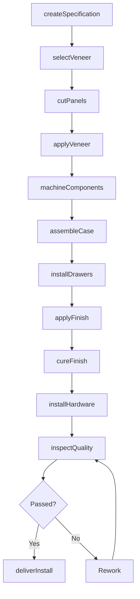
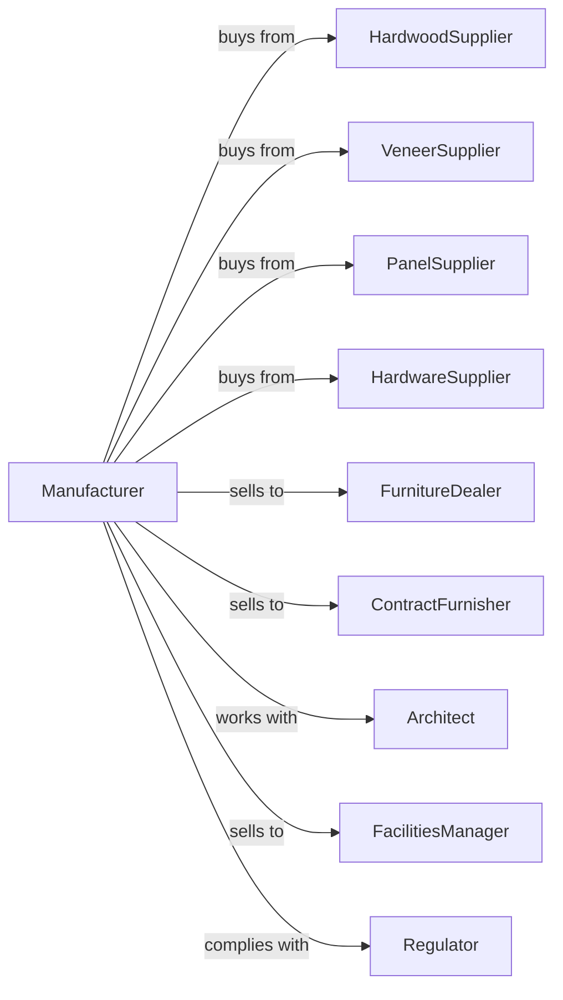

# Wood Office Furniture Manufacturing

> Business-as-Code definition for wood office furniture manufacturing operations. Models the complete production lifecycle from design through delivery of desks, credenzas, and conference tables.

## Overview

Wood office furniture manufacturing involves producing desks, credenzas, bookcases, conference tables, and executive seating frames using solid wood, veneers, and engineered wood products. This definition exposes actions for design, machining, assembly, and finishing, events for workflow automation, and searches for specifications and order tracking.

## Actors

| Actor | Description |
|-------|-------------|
| HardwoodSupplier | Provides solid hardwood lumber in various species |
| VeneerSupplier | Supplies decorative wood veneers and laminates |
| PanelSupplier | Provides plywood, MDF, and particleboard |
| HardwareSupplier | Supplies drawer slides, hinges, and cable management |
| FurnitureDealer | Purchases for resale to corporate accounts |
| ContractFurnisher | Specifies and procures for commercial projects |
| Architect | Designs workspaces and specifies furniture |
| FacilitiesManager | Manages corporate furniture procurement |
| Regulator | Enforces emissions standards and sustainability certifications |

## Roles

| Role | Description |
|------|-------------|
| ProductionManager | Oversees manufacturing schedules and workflow |
| DesignEngineer | Creates detailed drawings and specifications |
| VeneerSpecialist | Selects, matches, and applies decorative veneers |
| CNCOperator | Programs and operates computer-controlled machinery |
| CabinetMaker | Assembles case goods and installs hardware |
| Finisher | Applies stains, sealers, and lacquer topcoats |
| QualityInspector | Verifies construction and finish standards |
| InstallationTech | Performs on-site delivery and setup |

## Entities

| Entity | Description |
|--------|-------------|
| Desk | Work surface with storage and wire management |
| Credenza | Low storage unit typically behind desk |
| Bookcase | Vertical shelving unit for display and storage |
| ConferenceTable | Large meeting surface for group work |
| Veneer | Thin decorative wood surface layer |
| Panel | Engineered wood substrate material |
| Finish | Stain, lacquer, or catalyzed coating |
| Hardware | Functional components including slides and locks |
| Specification | Customer requirements document |

## Actions

| Action | Description |
|--------|-------------|
| createSpecification | Document customer requirements and finishes |
| selectVeneer | Choose and match veneer flitches for project |
| cutPanels | Machine substrate panels to dimension |
| applyVeneer | Bond veneer to panel surfaces using press |
| machineComponents | Cut joinery, edge profiles, and hardware mortises |
| assembleCase | Join panels into case good structures |
| installDrawers | Mount drawer boxes and slides |
| applyFinish | Spray stain, sealer, and topcoat |
| cureFinish | Allow coatings to harden fully |
| installHardware | Attach pulls, locks, and cable grommets |
| inspectQuality | Verify dimensions, finish, and function |
| deliverInstall | Transport and set up at customer site |

## Events

| Event | Description |
|-------|-------------|
| specificationApproved | Customer requirements finalized |
| veneerSelected | Flitches matched and allocated to project |
| panelsCut | Substrates machined to size |
| veneerApplied | Decorative surfaces bonded |
| componentsComplete | All parts machined and ready |
| caseAssembled | Structure joined and squared |
| finishComplete | All coating cured |
| hardwareInstalled | Functional components attached |
| qualityApproved | Inspection passed |
| orderDelivered | Furniture installed at customer site |

## Searches

| Search | Description |
|--------|-------------|
| findOrders | List work orders by status or customer |
| getVeneerInventory | Query available species and flitch sizes |
| getPanelStock | Check substrate inventory by type |
| getFinishOptions | View available stain and topcoat choices |
| findSpecifications | Search past projects by customer or product |
| getProductionSchedule | View manufacturing capacity by week |
| trackOrder | Monitor project progress through production |

## Workflow

## Actor Relationships

