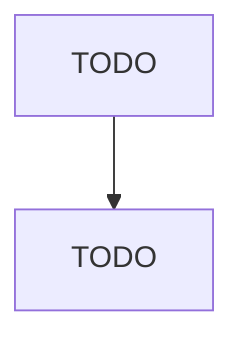

# Custom Architectural Woodwork and Millwork Manufacturing

> TODO: Business-as-Code definition

## Overview

This U.S. industry comprises establishments primarily engaged in manufacturing custom designed interiors consisting of architectural woodwork and fixtures utilizing wood, wood products, and plastics laminates. All of the industry output is made to individual order on a job shop basis and requires skilled craftsmen as a labor input. A job might include custom manufacturing of display fixtures, gondolas, wall shelving units, entrance and window architectural detail, sales and reception counters, w

## Actors

| Actor | Description |
|-------|-------------|
| TODO | TODO |

## Roles

| Role | Description |
|------|-------------|
| TODO | TODO |

## Entities

| Entity | Description |
|--------|-------------|
| TODO | TODO |

## Actions

| Action | Description |
|--------|-------------|
| TODO | TODO |

## Events

| Event | Description |
|-------|-------------|
| TODO | TODO |

## Searches

| Search | Description |
|--------|-------------|
| TODO | TODO |

## Workflow

## Actor Relationships

