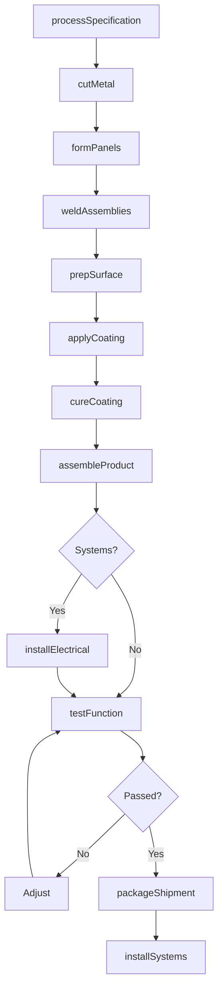
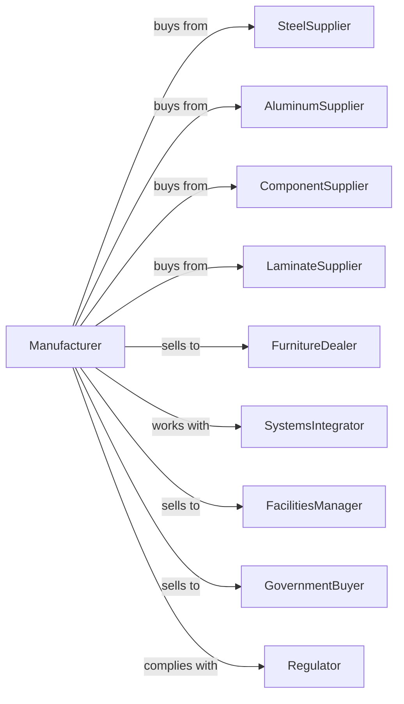

# Office Furniture (except Wood) Manufacturing

> Business-as-Code definition for nonwood office furniture manufacturing operations. Models the complete production lifecycle for metal desks, filing cabinets, and systems furniture.

## Overview

Nonwood office furniture manufacturing involves producing metal desks, filing cabinets, systems furniture panels, and workstation components. This definition exposes actions for metal fabrication, powder coating, assembly, and systems integration, events for workflow automation, and searches for specifications and order management.

## Actors

| Actor | Description |
|-------|-------------|
| SteelSupplier | Provides steel sheet, coil, and tubing |
| AluminumSupplier | Supplies aluminum extrusions and castings |
| ComponentSupplier | Provides drawer slides, hinges, and mechanisms |
| LaminateSupplier | Supplies work surface laminates and edge treatments |
| FurnitureDealer | Purchases for resale to commercial accounts |
| SystemsIntegrator | Specifies and configures workstation systems |
| FacilitiesManager | Manages corporate furniture procurement |
| GovernmentBuyer | Purchases through GSA schedule contracts |
| Regulator | Enforces ergonomic and environmental standards |

## Roles

| Role | Description |
|------|-------------|
| ProductionManager | Oversees manufacturing schedules and output |
| MetalFabricator | Operates press brakes, shears, and punch presses |
| Welder | Joins metal components using spot and MIG welding |
| PowderCoater | Applies and cures protective powder coatings |
| Assembler | Combines components into finished furniture |
| SystemsEngineer | Designs workstation configurations and connections |
| QualityInspector | Verifies dimensions and finish quality |
| InstallationTeam | Performs on-site assembly of systems furniture |

## Entities

| Entity | Description |
|--------|-------------|
| Desk | Metal frame work surface with storage options |
| FilingCabinet | Vertical or lateral drawer storage unit |
| Panel | Systems furniture partition with power and data |
| Workstation | Configured desk, storage, and panel assembly |
| Mechanism | Adjustable keyboard tray or monitor arm |
| Drawer | Sliding storage component with suspension system |
| Surface | Laminate or veneer work top |
| Hardware | Locks, handles, and adjustment mechanisms |
| Configuration | Specified arrangement of systems components |

## Actions

| Action | Description |
|--------|-------------|
| processSpecification | Review customer requirements and configurations |
| cutMetal | Shear or laser cut steel to required shapes |
| formPanels | Bend and shape metal using press brakes |
| weldAssemblies | Join components using spot or MIG welding |
| prepSurface | Clean and prepare metal for coating |
| applyCoating | Apply powder coat in specified color |
| cureCoating | Bake coating to achieve full hardness |
| assembleProduct | Combine metal, surfaces, and mechanisms |
| installElectrical | Add power and data components to panels |
| testFunction | Verify drawers, locks, and adjustments work |
| packageShipment | Prepare for transport or flat-pack delivery |
| installSystems | Assemble workstations at customer site |

## Events

| Event | Description |
|-------|-------------|
| specificationReceived | Customer order and configuration confirmed |
| metalCut | Steel components cut to shape |
| panelsFormed | Sheet metal bent to required profiles |
| assembliesWelded | Structural welding completed |
| coatingApplied | Powder coat layer applied |
| coatingCured | Finish baked and hardened |
| productAssembled | All components joined |
| electricalComplete | Power and data installed in panels |
| functionVerified | All mechanisms tested and adjusted |
| orderShipped | Product dispatched to customer |
| installationComplete | Systems furniture assembled on site |

## Searches

| Search | Description |
|--------|-------------|
| findOrders | List work orders by status or customer |
| getMetalInventory | Query steel coil and sheet stock levels |
| getCoatingColors | View available powder coat color options |
| findConfigurations | Search standard workstation layouts |
| getProductionSchedule | View manufacturing capacity by week |
| trackOrder | Monitor project progress through production |
| getGSAPricing | Access government contract pricing schedules |

## Workflow

## Actor Relationships

