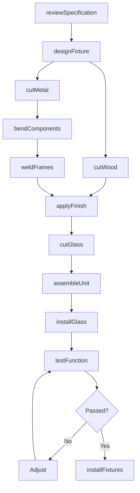
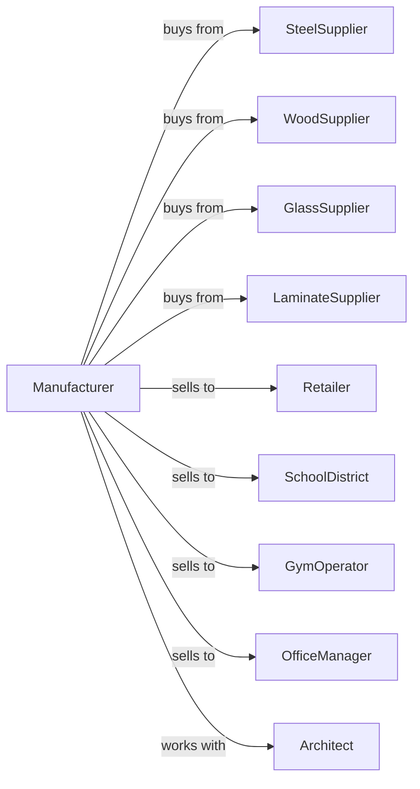

# Showcase, Partition, Shelving, and Locker Manufacturing

> Business-as-Code definition for showcase, partition, shelving, and locker manufacturing operations. Models the complete production lifecycle for retail fixtures, office partitions, and storage systems.

## Overview

Showcase, partition, shelving, and locker manufacturing involves producing display cases, store fixtures, office partitions, commercial shelving systems, and lockers using wood, metal, and plastics. Products may be stock or custom, assembled or knockdown.

## Actors

| Actor | Description |
|-------|-------------|
| SteelSupplier | Provides steel sheet, tubing, and wire |
| WoodSupplier | Supplies lumber, plywood, and MDF panels |
| GlassSupplier | Provides tempered glass for showcases |
| LaminateSupplier | Supplies decorative surfaces and edge treatments |
| Retailer | Purchases fixtures for store buildouts |
| SchoolDistrict | Orders lockers for educational facilities |
| GymOperator | Purchases lockers for fitness facilities |
| OfficeManager | Orders partitions and shelving for workspaces |
| Architect | Specifies fixtures for new construction projects |

## Roles

| Role | Description |
|------|-------------|
| ProjectManager | Coordinates custom fixture orders and installations |
| MetalFabricator | Produces steel shelving and locker components |
| Woodworker | Fabricates wood showcases and display units |
| PowderCoater | Applies protective finishes to metal parts |
| GlassInstaller | Fits tempered glass panels into showcases |
| Assembler | Combines components into finished units |
| QualityInspector | Verifies dimensions and finish quality |
| InstallationCrew | Mounts fixtures and systems at customer sites |

## Entities

| Entity | Description |
|--------|-------------|
| Showcase | Glass-fronted display cabinet |
| Partition | Room divider or cubicle panel |
| Shelving | Adjustable storage rack system |
| Locker | Personal storage compartment with lock |
| Gondola | Double-sided retail display unit |
| Frame | Structural support component |
| Panel | Wall or divider surface element |
| Hardware | Hinges, locks, shelf clips, and brackets |
| Specification | Customer requirements and configuration |

## Actions

| Action | Description |
|--------|-------------|
| reviewSpecification | Analyze customer requirements and site conditions |
| designFixture | Create drawings for custom fixtures |
| cutMetal | Shear or laser cut steel components |
| bendComponents | Form metal using press brakes |
| weldFrames | Join metal parts into frame assemblies |
| cutWood | Machine wood panels and trim pieces |
| applyFinish | Powder coat metal or finish wood surfaces |
| cutGlass | Size tempered glass panels for showcases |
| assembleUnit | Combine frame, panels, and hardware |
| installGlass | Mount glass panels in showcase frames |
| testFunction | Verify doors, locks, and adjustments |
| installFixtures | Mount and level at customer location |

## Events

| Event | Description |
|-------|-------------|
| specificationApproved | Customer requirements confirmed |
| designComplete | Fixture drawings finalized |
| metalCut | Steel components cut to size |
| framesWelded | Metal assemblies completed |
| woodComplete | Wood components machined and finished |
| finishApplied | Coating cured and ready |
| glassCut | Glass panels sized and polished |
| unitAssembled | All components joined |
| qualityApproved | Inspection passed |
| orderShipped | Product dispatched to customer |
| installationComplete | Fixtures mounted on site |

## Searches

| Search | Description |
|--------|-------------|
| findOrders | List projects by status or customer type |
| getMetalInventory | Query steel stock levels by gauge |
| getWoodStock | Check panel and lumber inventory |
| getGlassInventory | View available tempered glass sizes |
| findDesigns | Search past fixture specifications |
| getProductionSchedule | View manufacturing capacity |
| trackProject | Monitor order progress through production |

## Workflow

## Actor Relationships

