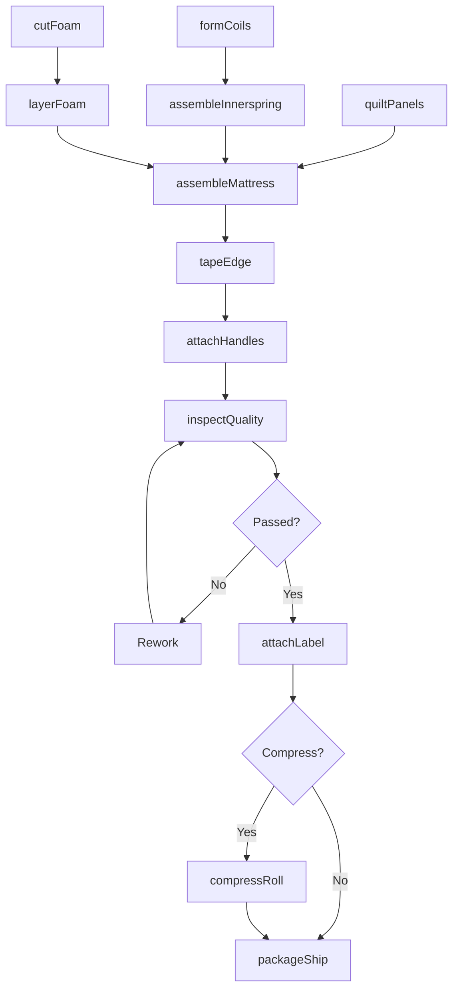
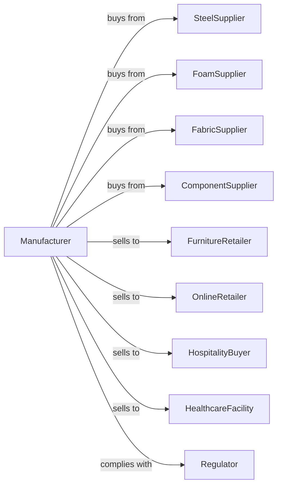

# Mattress Manufacturing

> Business-as-Code definition for mattress manufacturing operations. Models the complete production lifecycle for innerspring, foam, and hybrid mattresses.

## Overview

Mattress manufacturing involves producing innerspring, box spring, memory foam, latex, and hybrid mattresses for residential and hospitality markets. This definition exposes actions for coil assembly, foam layering, quilting, and packaging, events for workflow automation, and searches for materials and order management.

## Actors

| Actor | Description |
|-------|-------------|
| SteelSupplier | Provides wire for innerspring coil units |
| FoamSupplier | Supplies polyurethane, memory, and latex foam |
| FabricSupplier | Provides ticking, quilting fabrics, and fire barriers |
| ComponentSupplier | Supplies edge supports, handles, and vents |
| FurnitureRetailer | Purchases mattresses for showroom sales |
| OnlineRetailer | Sells direct-to-consumer via e-commerce |
| HospitalityBuyer | Orders for hotels, resorts, and cruise lines |
| HealthcareFacility | Purchases specialty mattresses for medical use |
| Regulator | Enforces flammability and labeling standards |

## Roles

| Role | Description |
|------|-------------|
| ProductionManager | Oversees manufacturing schedules and output |
| CoilAssembler | Operates machinery forming and joining spring units |
| FoamCutter | Cuts foam layers to size using CNC or manual methods |
| QuiltOperator | Runs quilting machines joining fabric layers |
| TapeEdgeOperator | Sews mattress borders and attaches panels |
| Assembler | Combines springs, foam, and covers into mattresses |
| Compressor | Operates roll-pack machinery for bed-in-box shipping |
| QualityInspector | Tests firmness, durability, and compliance |

## Entities

| Entity | Description |
|--------|-------------|
| InnerSpring | Coil unit providing core support |
| FoamLayer | Polyurethane, memory, or latex comfort layer |
| Ticking | Decorative and functional cover fabric |
| QuiltPanel | Quilted top or bottom surface |
| FireBarrier | Flame-resistant material layer |
| BoxSpring | Foundation unit with wood frame and springs |
| EdgeSupport | Perimeter reinforcement system |
| Label | Required law tag with content information |
| SKU | Product configuration identifier |

## Actions

| Action | Description |
|--------|-------------|
| formCoils | Shape steel wire into individual springs |
| assembleInnerspring | Join coils into full mattress support unit |
| cutFoam | Size foam layers to mattress dimensions |
| layerFoam | Stack comfort layers in specified order |
| quiltPanels | Join fabric layers with foam in quilted pattern |
| assembleMattress | Combine springs, foam, and quilted cover |
| tapeEdge | Sew border panels to top and bottom |
| attachHandles | Install handles and air vents |
| inspectQuality | Test firmness, alignment, and appearance |
| attachLabel | Affix required law tags and brand labels |
| compressRoll | Compress and roll mattress for box shipping |
| packageShip | Box or wrap for delivery |

## Events

| Event | Description |
|-------|-------------|
| coilsFormed | Individual springs manufactured |
| innerspringAssembled | Full coil unit completed |
| foamCut | Comfort layers sized to specification |
| foamLayered | Layers stacked in correct sequence |
| panelsQuilted | Top and bottom quilted covers completed |
| mattressAssembled | All components combined |
| edgeTaped | Border sewing completed |
| qualityApproved | Inspection and testing passed |
| labelAttached | Law tags and labels affixed |
| mattressCompressed | Roll-packed for bed-in-box |
| orderShipped | Mattress dispatched to customer |

## Searches

| Search | Description |
|--------|-------------|
| findOrders | List work orders by status or retailer |
| getCoilInventory | Query spring unit stock by type and size |
| getFoamStock | Check foam inventory by density and thickness |
| getFabricInventory | View available ticking patterns and colors |
| findSKUs | Search product configurations by features |
| getProductionSchedule | View manufacturing capacity by line |
| trackOrder | Monitor order progress through production |

## Workflow

## Actor Relationships

