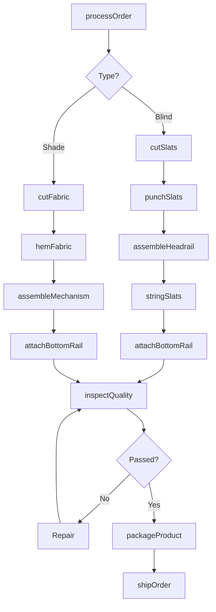
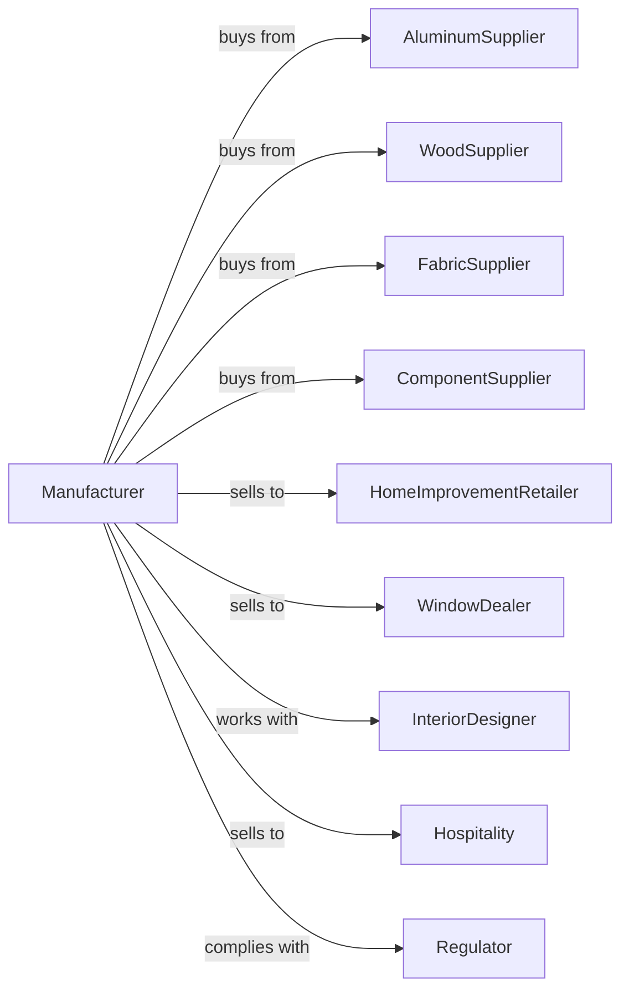

# Blind and Shade Manufacturing

> Business-as-Code definition for blind and shade manufacturing operations. Models the complete production lifecycle for venetian blinds, roller shades, and drapery hardware.

## Overview

Blind and shade manufacturing involves producing venetian blinds, vertical blinds, roller shades, cellular shades, and drapery rods and fixtures. Products may be stock or custom-cut, made from aluminum, wood, fabric, or vinyl materials.

## Actors

| Actor | Description |
|-------|-------------|
| AluminumSupplier | Provides aluminum slats and headrail components |
| WoodSupplier | Supplies basswood and faux wood slat materials |
| FabricSupplier | Provides shade fabrics and blackout materials |
| ComponentSupplier | Supplies cords, mechanisms, and mounting hardware |
| HomeImprovementRetailer | Sells through big-box store channels |
| WindowDealer | Specializes in custom window treatment sales |
| InteriorDesigner | Specifies window treatments for projects |
| Hospitality | Orders for hotels and commercial properties |
| Regulator | Enforces child safety cord standards |

## Roles

| Role | Description |
|------|-------------|
| ProductionManager | Oversees manufacturing schedules and workflow |
| SlatCutter | Cuts aluminum or wood slats to specified widths |
| FabricCutter | Cuts shade materials to custom dimensions |
| Assembler | Strings slats, attaches mechanisms, and tests |
| SewingOperator | Hems and finishes fabric shade edges |
| PackagingTech | Boxes products with mounting hardware |
| QualityInspector | Verifies dimensions and operation |
| CustomOrderProcessor | Handles made-to-measure specifications |

## Entities

| Entity | Description |
|--------|-------------|
| Slat | Individual horizontal or vertical blind element |
| Headrail | Top mounting component housing mechanism |
| Cord | Lift and tilt control system |
| Shade | Fabric or vinyl window covering |
| Mechanism | Clutch, spring, or motorized control system |
| ValanceReturn | Decorative cover for headrail |
| MountingBracket | Hardware for wall or ceiling installation |
| DraperyRod | Pole for hanging curtains and drapes |
| Specification | Custom order dimensions and options |

## Actions

| Action | Description |
|--------|-------------|
| processOrder | Enter custom dimensions and options |
| cutSlats | Size aluminum or wood slats to width |
| cutFabric | Size shade material to specified dimensions |
| punchSlats | Create cord routing holes in slats |
| assembleHeadrail | Install mechanism and tilt components |
| stringSlats | Thread cords through slats and ladder tape |
| assembleMechanism | Install clutch or spring lift system |
| hemFabric | Finish fabric edges and attach hardware |
| attachBottomRail | Secure weighted bottom component |
| inspectQuality | Test operation and verify dimensions |
| packageProduct | Box with mounting hardware and instructions |
| shipOrder | Dispatch to retailer or direct customer |

## Events

| Event | Description |
|-------|-------------|
| orderReceived | Custom specifications entered in system |
| slatsCut | Slats sized to order width |
| fabricCut | Shade material cut to dimensions |
| headrailAssembled | Mechanism installed in headrail |
| slatsStrung | Blind fully assembled and strung |
| mechanismComplete | Lift system operational |
| fabricHemmed | Shade edges finished |
| qualityApproved | Inspection and testing passed |
| productPackaged | Ready for shipment |
| orderShipped | Product dispatched to customer |

## Searches

| Search | Description |
|--------|-------------|
| findOrders | List custom orders by status or customer |
| getSlatInventory | Query slat stock by material and color |
| getFabricStock | Check available shade fabrics and colors |
| getComponentInventory | View mechanism and hardware availability |
| findSpecifications | Search past orders by dimensions |
| getProductionSchedule | View cutting and assembly capacity |
| trackOrder | Monitor order progress through production |

## Workflow

## Actor Relationships

