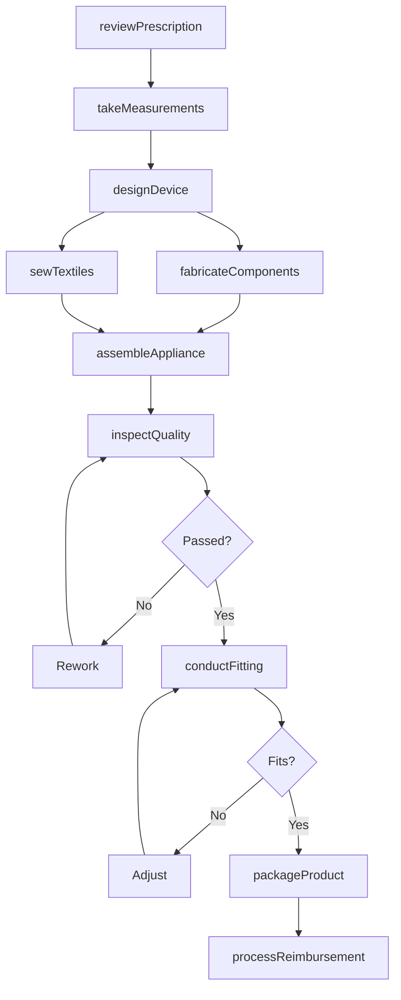
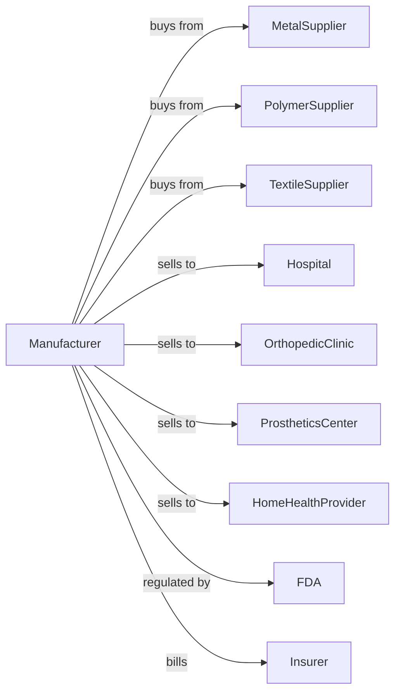

# Surgical Appliance and Supplies Manufacturing

> Business-as-Code definition for surgical appliance and supplies manufacturing operations. Models the complete production lifecycle for orthopedic devices, prosthetics, and medical supplies.

## Overview

Surgical appliance and supplies manufacturing involves producing orthopedic devices, prosthetic limbs, surgical dressings, crutches, sutures, hospital beds, and personal safety devices. This definition exposes actions for fabrication, fitting, and quality control, events for workflow automation, and searches for patient specifications and inventory.

## Actors

| Actor | Description |
|-------|-------------|
| MetalSupplier | Provides titanium, stainless steel, and aluminum |
| PolymerSupplier | Supplies medical-grade plastics and silicones |
| TextileSupplier | Provides bandage fabrics and elastic materials |
| Hospital | Purchases supplies for patient care and surgery |
| OrthopedicClinic | Orders braces, supports, and mobility devices |
| ProstheticsCenter | Purchases components for custom prosthetics |
| HomeHealthProvider | Orders durable medical equipment for home use |
| FDA | Regulates device safety and manufacturing practices |
| Insurer | Reimburses for covered medical devices |

## Roles

| Role | Description |
|------|-------------|
| ProductionManager | Oversees manufacturing operations and schedules |
| Prosthetist | Designs and fits custom prosthetic devices |
| Orthotist | Creates and adjusts orthopedic braces and supports |
| Fabricator | Manufactures device components and assemblies |
| Sewer | Produces textile-based dressings and supports |
| QualityTechnician | Inspects products for compliance |
| RegulatorySpecialist | Manages FDA registrations and listings |
| PatientFitter | Adjusts devices for individual patients |

## Entities

| Entity | Description |
|--------|-------------|
| Prosthetic | Artificial limb or body part replacement |
| Orthotic | Brace or support device for body alignment |
| Dressing | Wound covering and bandage materials |
| Suture | Surgical thread for wound closure |
| Crutch | Mobility assistance device |
| HospitalBed | Adjustable patient bed with safety features |
| SafetyDevice | Personal protective equipment for industrial use |
| Prescription | Medical order specifying device requirements |
| Fitting | Patient measurement and adjustment session |

## Actions

| Action | Description |
|--------|-------------|
| reviewPrescription | Analyze medical requirements for custom device |
| takeMeasurements | Capture patient dimensions for custom fitting |
| designDevice | Create specifications for custom appliance |
| fabricateComponents | Manufacture metal and plastic parts |
| sewTextiles | Produce fabric-based supports and dressings |
| assembleAppliance | Combine components into finished device |
| conductFitting | Adjust device to patient body |
| inspectQuality | Verify compliance with specifications |
| packageProduct | Prepare for sterile or non-sterile distribution |
| processReimbursement | Submit documentation for insurance payment |
| trackSerial | Record device serial for traceability |
| handleWarranty | Process repair or replacement claims |

## Events

| Event | Description |
|-------|-------------|
| prescriptionReceived | Medical order obtained for custom device |
| measurementsTaken | Patient dimensions captured |
| designComplete | Device specifications finalized |
| componentsReady | All parts manufactured |
| applianceAssembled | Device construction completed |
| fittingComplete | Device adjusted to patient |
| qualityApproved | Inspection passed |
| deviceDelivered | Product shipped or dispensed to patient |
| reimbursementSubmitted | Insurance claim filed |
| warrantyClaimProcessed | Repair or replacement authorized |

## Searches

| Search | Description |
|--------|-------------|
| findOrders | List prescriptions by status or patient |
| getComponentInventory | Query parts and materials stock |
| findPatientRecords | Search device history by patient |
| getSpecifications | Retrieve design requirements |
| trackSerialNumbers | Locate devices by serial number |
| getReimbursementStatus | Check insurance claim progress |
| findWarrantyClaims | View open and closed warranty cases |

## Workflow

## Actor Relationships

