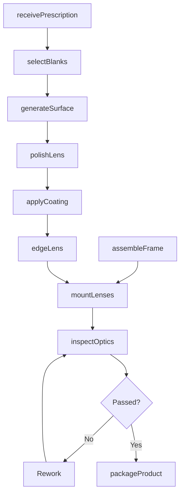
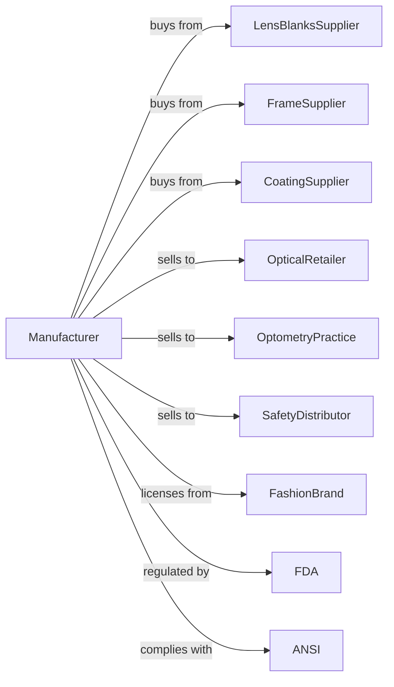

# Ophthalmic Goods Manufacturing

> Business-as-Code definition for ophthalmic goods manufacturing operations. Models the complete production lifecycle for eyeglasses, contact lenses, and protective eyewear.

## Overview

Ophthalmic goods manufacturing involves producing prescription eyeglasses, contact lenses, sunglasses, eyeglass frames, reading glasses, and protective eyewear. This definition exposes actions for lens fabrication, frame production, and quality control, events for workflow automation, and searches for prescriptions and inventory.

## Actors

| Actor | Description |
|-------|-------------|
| LensBlanksSupplier | Provides glass and plastic lens blanks |
| FrameSupplier | Supplies metal and plastic frame components |
| CoatingSupplier | Provides anti-reflective and scratch-resistant coatings |
| OpticalRetailer | Purchases finished goods for consumer sales |
| OptometryPractice | Orders prescription lenses for patients |
| SafetyDistributor | Purchases protective eyewear for industrial markets |
| FashionBrand | Licenses designs for branded eyewear |
| FDA | Regulates contact lenses and lens treatments |
| ANSI | Sets standards for safety eyewear |

## Roles

| Role | Description |
|------|-------------|
| ProductionManager | Oversees manufacturing operations and schedules |
| OpticalEngineer | Designs lens prescriptions and coatings |
| LensGenerator | Operates surfacing equipment for prescription lenses |
| LensEdger | Shapes lenses to fit frames |
| FrameAssembler | Produces and assembles eyeglass frames |
| CoatingTechnician | Applies optical coatings in vacuum chamber |
| QualityInspector | Verifies optical accuracy and finish |
| ContactLensTech | Manufactures and inspects contact lenses |

## Entities

| Entity | Description |
|--------|-------------|
| Lens | Optical element providing vision correction |
| Frame | Structure holding lenses in position |
| ContactLens | Vision correction worn directly on eye |
| Coating | Surface treatment for glare, scratch, or UV protection |
| Prescription | Optical specifications for vision correction |
| LensBlank | Unfinished lens material for surfacing |
| Edging | Process of shaping lens to fit frame |
| Case | Protective storage for eyewear |
| SKU | Product configuration identifier |

## Actions

| Action | Description |
|--------|-------------|
| receivePrescription | Enter optical specifications into system |
| selectBlanks | Choose appropriate lens blank material and index |
| generateSurface | Grind lens to prescription curvature |
| polishLens | Smooth lens surface to optical clarity |
| applyCoating | Add anti-reflective or protective coatings |
| edgeLens | Shape lens to fit specified frame |
| assembleFrame | Construct frame from components |
| mountLenses | Insert finished lenses into frame |
| inspectOptics | Verify prescription accuracy and quality |
| packageProduct | Prepare with case and cleaning materials |
| manufactureContacts | Produce soft or rigid contact lenses |
| sterilizeContacts | Process contact lenses for sterile packaging |

## Events

| Event | Description |
|-------|-------------|
| prescriptionReceived | Optical specifications entered |
| blanksSelected | Lens materials allocated to order |
| surfaceGenerated | Prescription curvature achieved |
| lensPolished | Optical clarity achieved |
| coatingApplied | Surface treatment completed |
| lensEdged | Lens shaped to frame dimensions |
| frameAssembled | Frame construction completed |
| lensesMounted | Finished product assembled |
| opticsApproved | Quality inspection passed |
| productPackaged | Ready for shipment |
| contactsSterilized | Contact lenses ready for distribution |

## Searches

| Search | Description |
|--------|-------------|
| findOrders | List prescription orders by status or customer |
| getBlankInventory | Query lens blank stock by material and power |
| getFrameStock | Check frame inventory by style and size |
| findPrescriptions | Search past orders by patient or prescription |
| getCoatingOptions | View available lens coating types |
| getProductionSchedule | View lab capacity and turnaround times |
| trackOrder | Monitor order progress through production |

## Workflow

## Actor Relationships

