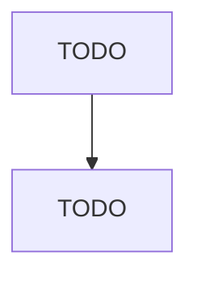

# Jewelry and Silverware Manufacturing

> TODO: Business-as-Code definition

## Overview

This industry comprises establishments primarily engaged in one or more of the following: (1) manufacturing, engraving, chasing, or etching fine and costume jewelry; (2) manufacturing, engraving, chasing, or etching metal personal goods (i.e., small articles carried on or about the person, such as compacts or cigarette cases); (3) manufacturing, engraving, chasing, or etching precious metal solid, precious metal clad, or pewter flatware and other hollowware; (4) stamping coins; (5) manufacturing

## Actors

| Actor | Description |
|-------|-------------|
| TODO | TODO |

## Roles

| Role | Description |
|------|-------------|
| TODO | TODO |

## Entities

| Entity | Description |
|--------|-------------|
| TODO | TODO |

## Actions

| Action | Description |
|--------|-------------|
| TODO | TODO |

## Events

| Event | Description |
|-------|-------------|
| TODO | TODO |

## Searches

| Search | Description |
|--------|-------------|
| TODO | TODO |

## Workflow

## Actor Relationships

