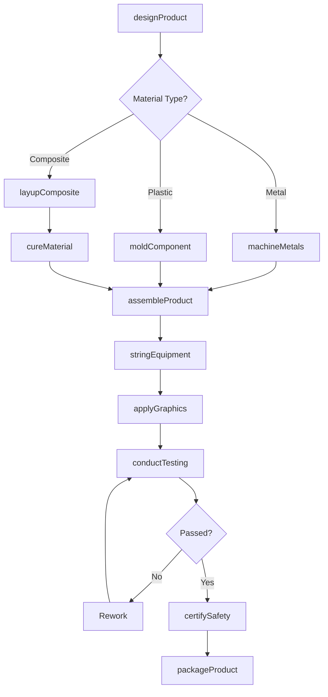
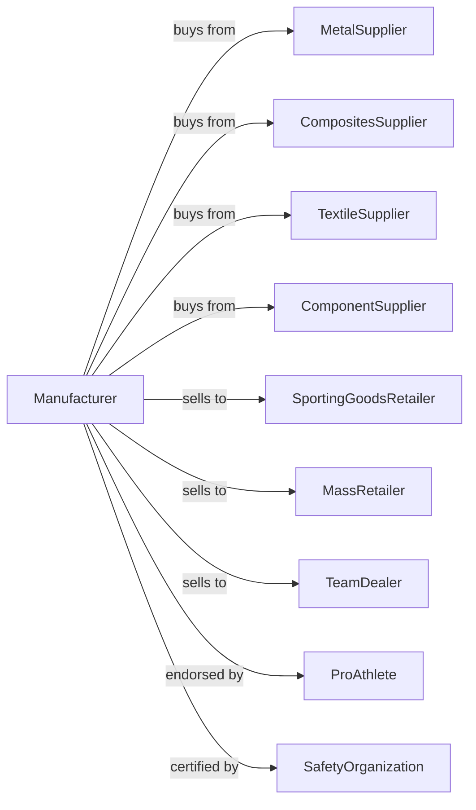

# Sporting and Athletic Goods Manufacturing

> Business-as-Code definition for sporting and athletic goods manufacturing operations. Models the complete production lifecycle for sports equipment, fitness gear, and outdoor recreation products.

## Overview

Sporting and athletic goods manufacturing involves producing equipment for team sports, individual athletics, fitness, hunting, fishing, and outdoor recreation. This definition exposes actions for fabrication, assembly, and quality testing, events for workflow automation, and searches for specifications and inventory.

## Actors

| Actor | Description |
|-------|-------------|
| MetalSupplier | Provides aluminum, steel, and titanium materials |
| CompositesSupplier | Supplies carbon fiber, fiberglass, and resins |
| TextileSupplier | Provides technical fabrics and webbing |
| ComponentSupplier | Supplies wheels, bearings, and mechanisms |
| SportingGoodsRetailer | Purchases for consumer showroom sales |
| MassRetailer | Buys for big-box store distribution |
| TeamDealer | Supplies schools, clubs, and professional teams |
| ProAthlete | Endorses products and requires custom equipment |
| SafetyOrganization | Sets standards and certifies equipment safety |

## Roles

| Role | Description |
|------|-------------|
| ProductManager | Oversees product development and launches |
| DesignEngineer | Creates equipment specifications and prototypes |
| CompositeTechnician | Lays up and cures carbon fiber components |
| Assembler | Combines components into finished products |
| StringTechnician | Strings racquets, bows, and similar equipment |
| QualityTester | Conducts performance and durability testing |
| Customizer | Modifies equipment for professional athletes |
| PackagingTech | Prepares products for retail presentation |

## Entities

| Entity | Description |
|--------|-------------|
| Ball | Spherical or oval equipment for various sports |
| Racquet | Strung frame for tennis, badminton, or squash |
| Club | Golf club, hockey stick, or similar striking implement |
| Bat | Baseball, softball, or cricket batting equipment |
| Ski | Snow or water skiing equipment |
| Bike | Bicycle or cycling equipment |
| FitnessEquipment | Weights, machines, and training gear |
| ProtectiveGear | Helmets, pads, and safety equipment |
| Specification | Product requirements and performance targets |

## Actions

| Action | Description |
|--------|-------------|
| designProduct | Create specifications and prototype designs |
| layupComposite | Build carbon fiber or fiberglass structures |
| cureMaterial | Harden composite materials under heat and pressure |
| moldComponent | Form plastic or rubber parts |
| machineMetals | CNC produce aluminum or steel components |
| assembleProduct | Combine components into finished goods |
| stringEquipment | String racquets, bows, or similar products |
| applyGraphics | Add logos, decals, and decorative elements |
| conductTesting | Verify performance against specifications |
| certifySafety | Obtain safety certifications and approvals |
| customizePro | Modify equipment for professional athletes |
| packageProduct | Prepare for retail or team distribution |

## Events

| Event | Description |
|-------|-------------|
| designApproved | Product specifications finalized |
| compositeLayedUp | Carbon fiber structure formed |
| materialCured | Composite hardened |
| componentMolded | Plastic parts produced |
| metalsMachined | Metal components finished |
| productAssembled | All parts combined |
| equipmentStrung | Stringing completed |
| graphicsApplied | Branding and decoration finished |
| testingPassed | Performance verification approved |
| safetyCertified | Standards compliance achieved |
| productPackaged | Ready for distribution |

## Searches

| Search | Description |
|--------|-------------|
| findOrders | List orders by status or customer type |
| getMaterialInventory | Query raw material stock levels |
| getComponentStock | Check available parts and components |
| findSpecifications | Search product designs by sport or category |
| getProductionSchedule | View manufacturing capacity |
| trackOrder | Monitor order progress through production |
| getTestResults | Access performance testing records |

## Workflow

## Actor Relationships

