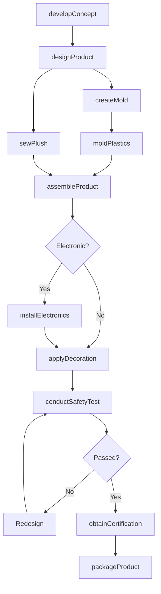
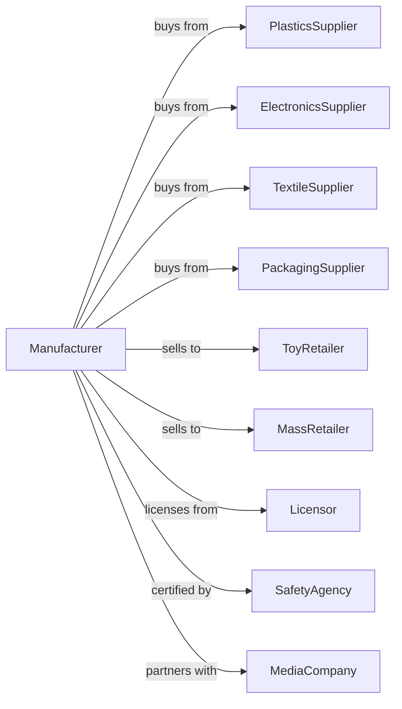

# Doll, Toy, and Game Manufacturing

> Business-as-Code definition for doll, toy, and game manufacturing operations. Models the complete production lifecycle from design through retail-ready packaging.

## Overview

Doll, toy, and game manufacturing involves producing dolls, action figures, toys, board games, electronic games, hobby kits, and children's vehicles. This definition exposes actions for design, molding, assembly, and safety testing, events for workflow automation, and searches for specifications and inventory.

## Actors

| Actor | Description |
|-------|-------------|
| PlasticsSupplier | Provides resin pellets for injection molding |
| ElectronicsSupplier | Supplies circuits, batteries, and components |
| TextileSupplier | Provides fabrics for doll clothing and plush |
| PackagingSupplier | Supplies boxes, blister packs, and displays |
| ToyRetailer | Purchases for consumer showroom sales |
| MassRetailer | Buys for big-box and discount store distribution |
| Licensor | Grants character and brand licensing rights |
| SafetyAgency | Certifies toy safety compliance |
| MediaCompany | Partners for entertainment tie-ins |

## Roles

| Role | Description |
|------|-------------|
| ProductManager | Oversees toy development and market launch |
| ToyDesigner | Creates concepts, prototypes, and specifications |
| MoldMaker | Produces injection molds for plastic parts |
| InjectionOperator | Runs molding machines for plastic components |
| Assembler | Combines parts into finished toys |
| SewingOperator | Produces doll clothes and plush toys |
| ElectronicsAssembler | Installs circuits and electronic components |
| SafetyTester | Conducts compliance testing for regulations |
| PackagingDesigner | Creates retail packaging and displays |

## Entities

| Entity | Description |
|--------|-------------|
| Doll | Human or character figure toy |
| ActionFigure | Articulated character collectible |
| Plush | Soft stuffed toy |
| BoardGame | Tabletop game with board and pieces |
| VideoGame | Electronic gaming device or cartridge |
| HobbyKit | Assembly model or craft set |
| Vehicle | Ride-on or push toy for children |
| License | Rights to use character or brand |
| Mold | Tool for injection molding plastic parts |

## Actions

| Action | Description |
|--------|-------------|
| developConcept | Create toy idea and target market analysis |
| designProduct | Produce detailed specifications and prototypes |
| createMold | Engineer and manufacture injection molds |
| moldPlastics | Injection mold plastic components |
| assembleProduct | Combine parts into finished toys |
| sewPlush | Produce soft toys and doll clothing |
| installElectronics | Add circuits, sounds, and lights |
| applyDecoration | Paint, print, or apply graphics |
| conductSafetyTest | Verify compliance with CPSC and ASTM standards |
| obtainCertification | Secure safety certifications |
| designPackaging | Create retail-ready packaging |
| packageProduct | Assemble product in final packaging |

## Events

| Event | Description |
|-------|-------------|
| conceptApproved | Toy idea greenlit for development |
| designFinalized | Specifications and prototypes completed |
| moldCreated | Injection tooling ready |
| plasticsMolded | Components produced |
| productAssembled | Toy construction completed |
| plushSewn | Soft toy finished |
| electronicsInstalled | Interactive features functional |
| decorationApplied | Visual finishing completed |
| safetyTestPassed | Compliance verified |
| certificationReceived | Safety approval granted |
| productPackaged | Ready for retail distribution |

## Searches

| Search | Description |
|--------|-------------|
| findOrders | List orders by status or retailer |
| getMaterialInventory | Query plastic resin and component stock |
| getTextileStock | Check fabric and stuffing inventory |
| findDesigns | Search toy specifications by category |
| getLicenseStatus | View licensed property agreements |
| getProductionSchedule | View manufacturing capacity |
| getSafetyRecords | Access testing and certification documents |

## Workflow

## Actor Relationships

