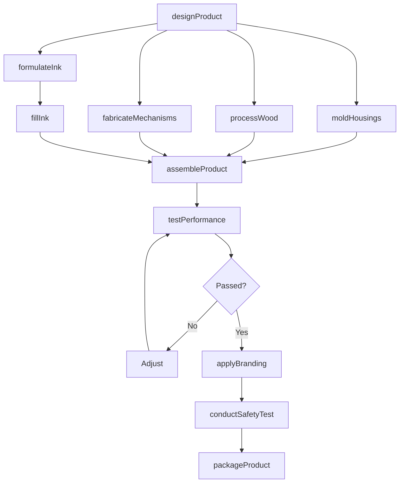
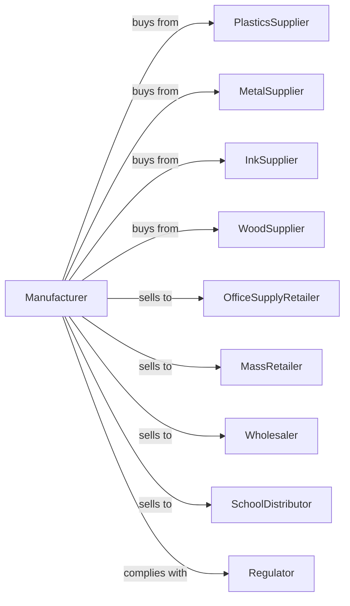

# Office Supplies (except Paper) Manufacturing

> Business-as-Code definition for office supplies manufacturing operations. Models the complete production lifecycle for pens, pencils, markers, and desktop accessories.

## Overview

Office supplies manufacturing involves producing pens, pencils, felt tip markers, crayons, chalk, pencil sharpeners, staplers, modeling clay, stamps, and inked ribbons. This definition exposes actions for component production, assembly, and packaging, events for workflow automation, and searches for specifications and inventory.

## Actors

| Actor | Description |
|-------|-------------|
| PlasticsSupplier | Provides resin for housings and components |
| MetalSupplier | Supplies steel and aluminum for mechanisms |
| InkSupplier | Provides writing and stamping inks |
| WoodSupplier | Supplies cedar and other woods for pencils |
| OfficeSupplyRetailer | Purchases for business customer sales |
| MassRetailer | Buys for big-box store distribution |
| Wholesaler | Distributes to office dealers and resellers |
| SchoolDistributor | Supplies educational institutions |
| Regulator | Enforces product safety and labeling standards |

## Roles

| Role | Description |
|------|-------------|
| ProductManager | Oversees product development and market strategy |
| DesignEngineer | Creates product specifications and prototypes |
| MoldOperator | Produces plastic components via injection molding |
| InkFormulator | Develops and tests ink compositions |
| Assembler | Combines components into finished products |
| WoodworkerOperator | Processes wood slats and pencil blanks |
| QualityTester | Verifies product performance and safety |
| PackagingTech | Prepares retail and bulk packaging |

## Entities

| Entity | Description |
|--------|-------------|
| Pen | Ballpoint, rollerball, or gel writing instrument |
| Pencil | Graphite or colored marking implement |
| Marker | Felt tip or permanent marking instrument |
| Highlighter | Fluorescent marking pen |
| Stapler | Device for fastening papers |
| Sharpener | Tool for sharpening pencils |
| Stamp | Hand device for impression marking |
| Ink | Writing or marking fluid |
| Cartridge | Replaceable ink reservoir |

## Actions

| Action | Description |
|--------|-------------|
| designProduct | Create specifications for new products |
| formulateInk | Develop ink compositions and colors |
| moldHousings | Injection mold plastic pen and marker bodies |
| processWood | Cut and shape pencil slats and blanks |
| fabricateMechanisms | Produce metal springs and clips |
| assembleProduct | Combine components into finished items |
| fillInk | Dispense ink into cartridges and reservoirs |
| testPerformance | Verify writing smoothness and longevity |
| applyBranding | Print or emboss logos and product info |
| packageProduct | Assemble in retail or bulk packaging |
| conductSafetyTest | Verify compliance with CPSC standards |
| fulfillOrder | Pick, pack, and ship customer orders |

## Events

| Event | Description |
|-------|-------------|
| designApproved | Product specifications finalized |
| inkFormulated | Ink composition validated |
| housingsMolded | Plastic components produced |
| woodProcessed | Pencil materials prepared |
| mechanismsFabricated | Metal parts manufactured |
| productAssembled | All components combined |
| inkFilled | Reservoirs charged with ink |
| performanceVerified | Testing passed quality standards |
| brandingApplied | Visual elements completed |
| productPackaged | Ready for distribution |
| safetyTestPassed | Compliance verified |

## Searches

| Search | Description |
|--------|-------------|
| findOrders | List orders by status or customer |
| getMaterialInventory | Query plastic and metal stock |
| getInkInventory | Check ink formulations and quantities |
| findSpecifications | Search product designs by category |
| getProductionSchedule | View manufacturing capacity |
| trackOrder | Monitor order progress through production |
| getQualityRecords | Access testing and inspection data |

## Workflow

## Actor Relationships

