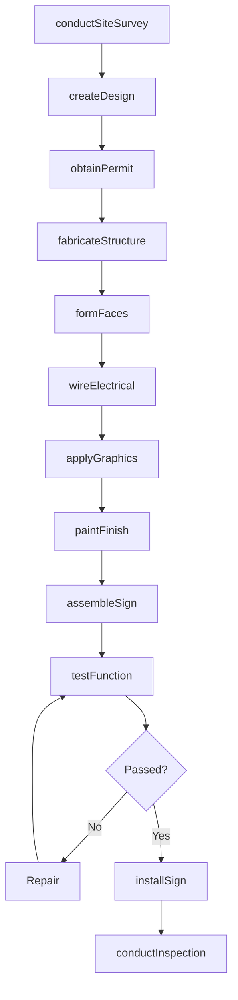
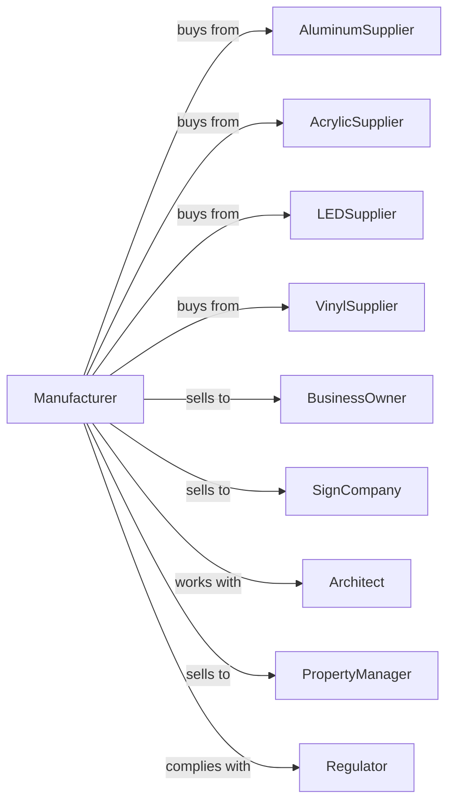

# Sign Manufacturing

> Business-as-Code definition for sign manufacturing operations. Models the complete production lifecycle from design through installation of commercial and industrial signage.

## Overview

Sign manufacturing involves producing signs and displays of all materials including illuminated, non-illuminated, digital, and directional signage. This definition exposes actions for design, fabrication, electrical assembly, and installation, events for workflow automation, and searches for specifications and project tracking.

## Actors

| Actor | Description |
|-------|-------------|
| AluminumSupplier | Provides sheet and extruded aluminum |
| AcrylicSupplier | Supplies plastic sheets and faces |
| LEDSupplier | Provides LED modules and power supplies |
| VinylSupplier | Supplies graphics films and laminates |
| BusinessOwner | Purchases signage for commercial identity |
| SignCompany | Resells or subcontracts sign fabrication |
| Architect | Specifies signage for building projects |
| PropertyManager | Orders wayfinding and tenant signage |
| Regulator | Enforces sign codes and electrical standards |

## Roles

| Role | Description |
|------|-------------|
| ProjectManager | Coordinates sign projects from design to install |
| GraphicDesigner | Creates sign layouts and visual designs |
| Fabricator | Cuts, forms, and welds sign structures |
| ElectricalTech | Wires LED modules and power systems |
| VinylGraphicTech | Applies cut vinyl and printed graphics |
| Painter | Applies paint finishes to sign components |
| Installer | Mounts signs at customer locations |
| PermitCoordinator | Obtains sign permits and variance approvals |

## Entities

| Entity | Description |
|--------|-------------|
| ChannelLetter | Individual illuminated letter |
| Monument | Ground-mounted freestanding sign |
| Pylon | Tall pole-mounted sign structure |
| Cabinet | Box sign with internal illumination |
| Digital | Electronic message display |
| Wayfinding | Directional and informational signage |
| Awning | Fabric canopy with graphics |
| Face | Translucent panel for illuminated signs |
| Permit | Government authorization for sign installation |

## Actions

| Action | Description |
|--------|-------------|
| conductSiteSurvey | Measure location and assess installation requirements |
| createDesign | Develop sign layouts and specifications |
| obtainPermit | Apply for and secure sign permits |
| fabricateStructure | Cut, bend, and weld sign frames |
| formFaces | Vacuum form or route acrylic faces |
| wireElectrical | Install LED modules and power supplies |
| applyGraphics | Apply vinyl lettering and printed wraps |
| paintFinish | Apply protective and decorative coatings |
| assembleSign | Combine all components into complete sign |
| testFunction | Verify illumination and electrical safety |
| installSign | Mount sign at customer location |
| conductInspection | Obtain final approval from authorities |

## Events

| Event | Description |
|-------|-------------|
| surveyCompleted | Site measurements and photos obtained |
| designApproved | Customer sign-off on design |
| permitObtained | Government approval received |
| structureFabricated | Metal framework completed |
| facesFormed | Acrylic components ready |
| electricalWired | Illumination system installed |
| graphicsApplied | Visual elements completed |
| paintCured | Finish dried and ready |
| signAssembled | All components joined |
| functionVerified | Testing passed |
| signInstalled | Mounted at customer site |
| inspectionPassed | Final approval granted |

## Searches

| Search | Description |
|--------|-------------|
| findProjects | List projects by status or customer |
| getMaterialInventory | Query aluminum and acrylic stock |
| getLEDInventory | Check LED module availability |
| findDesigns | Search past sign designs by type |
| getPermitStatus | Track permit applications |
| getInstallSchedule | View installation crew availability |
| trackProject | Monitor project progress through production |

## Workflow

## Actor Relationships

