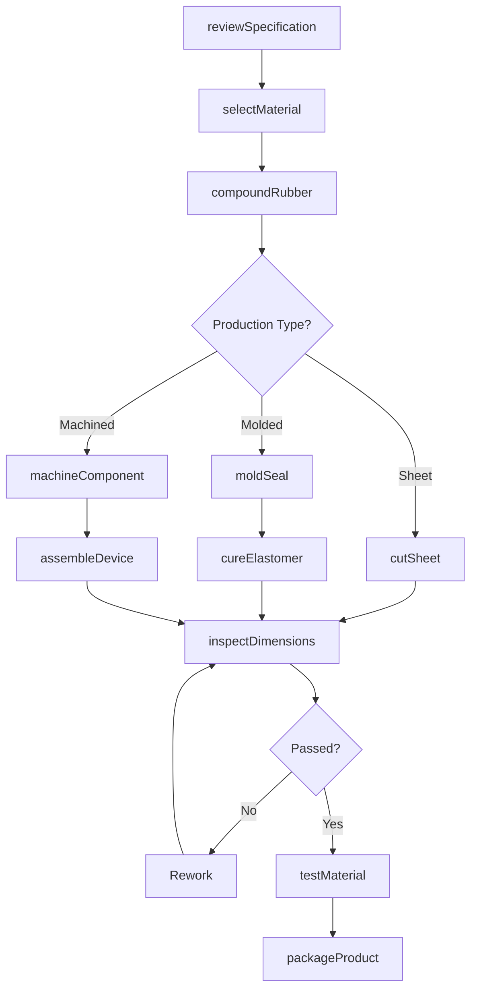
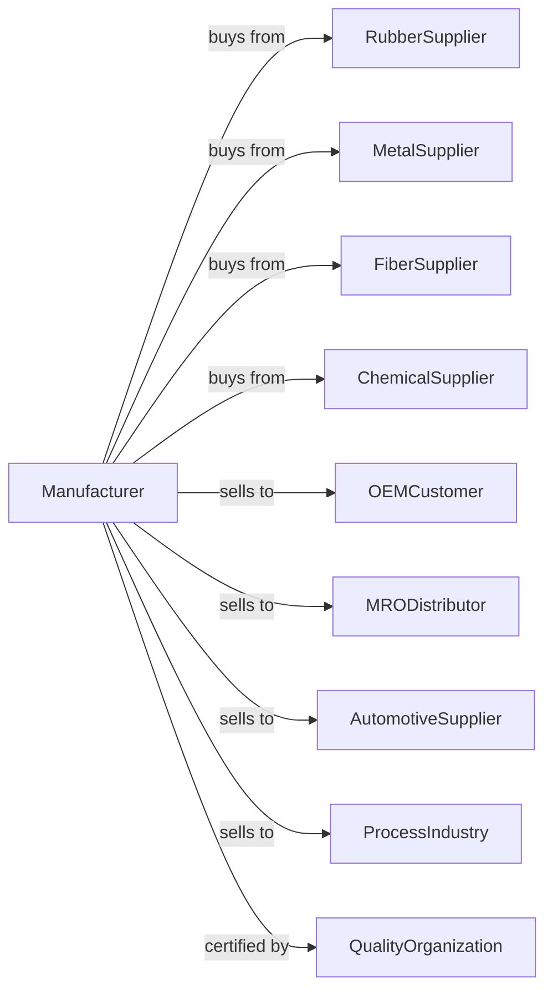

# Gasket, Packing, and Sealing Device Manufacturing

> Business-as-Code definition for gasket, packing, and sealing device manufacturing operations. Models the complete production lifecycle for industrial sealing products.

## Overview

Gasket, packing, and sealing device manufacturing involves producing gaskets, packings, and mechanical seals from rubber, cork, fiber, metal, and composite materials. This definition exposes actions for die cutting, molding, and quality control, events for workflow automation, and searches for specifications and inventory.

## Actors

| Actor | Description |
|-------|-------------|
| RubberSupplier | Provides elastomer compounds and sheets |
| MetalSupplier | Supplies steel, copper, and specialty alloys |
| FiberSupplier | Provides compressed fiber and PTFE materials |
| ChemicalSupplier | Supplies adhesives and bonding agents |
| OEMCustomer | Orders seals for equipment manufacturing |
| MRODistributor | Purchases for maintenance and repair markets |
| AutomotiveSupplier | Orders gaskets for vehicle production |
| ProcessIndustry | Purchases seals for chemical and refinery use |
| QualityOrganization | Certifies products to industry standards |

## Roles

| Role | Description |
|------|-------------|
| ProductionManager | Oversees manufacturing operations and schedules |
| ApplicationEngineer | Designs seals for specific customer applications |
| DieCutter | Operates die cutting equipment for gaskets |
| MoldOperator | Runs injection and compression molding |
| MixerOperator | Compounds rubber and elastomer materials |
| MachinistOperator | Machines metal sealing components |
| QualityInspector | Tests material properties and dimensions |
| PackagingTech | Prepares products for shipment |

## Entities

| Entity | Description |
|--------|-------------|
| Gasket | Flat sealing element between flanges |
| ORing | Circular cross-section elastomer seal |
| Packing | Compression sealing material for shafts |
| MechanicalSeal | Rotating shaft sealing device |
| OilSeal | Lip seal for shaft applications |
| Compound | Rubber or elastomer material formulation |
| Die | Cutting tool for gasket shapes |
| Mold | Tool for forming molded seals |
| Specification | Material and dimensional requirements |

## Actions

| Action | Description |
|--------|-------------|
| reviewSpecification | Analyze application requirements |
| selectMaterial | Choose appropriate compound for application |
| compoundRubber | Mix elastomer formulation to specification |
| cutSheet | Die cut gaskets from sheet material |
| moldSeal | Form seals in compression or injection molds |
| machineComponent | CNC produce metal seal components |
| cureElastomer | Vulcanize rubber to achieve properties |
| assembleDevice | Combine components into mechanical seals |
| inspectDimensions | Verify measurements against specifications |
| testMaterial | Verify compound properties and performance |
| packageProduct | Prepare for shipment to customer |
| provideEngineering | Support customer application requirements |

## Events

| Event | Description |
|-------|-------------|
| specificationReceived | Application requirements obtained |
| materialSelected | Compound chosen for application |
| rubberCompounded | Elastomer batch mixed |
| gasketsCut | Die cutting completed |
| sealsMolded | Formed seals removed from mold |
| componentsMachined | Metal parts finished |
| elastomerCured | Vulcanization completed |
| deviceAssembled | Mechanical seal constructed |
| dimensionsVerified | Inspection passed |
| materialTestPassed | Properties verified |
| productPackaged | Ready for shipment |

## Searches

| Search | Description |
|--------|-------------|
| findOrders | List orders by status or customer |
| getMaterialInventory | Query elastomer and metal stock |
| getCompoundFormulas | Access rubber formulation specifications |
| findSpecifications | Search seal designs by application |
| getDieInventory | View available cutting dies |
| getProductionSchedule | View manufacturing capacity |
| trackOrder | Monitor order progress through production |

## Workflow

## Actor Relationships

