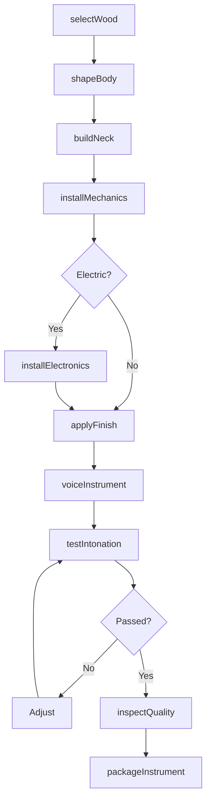
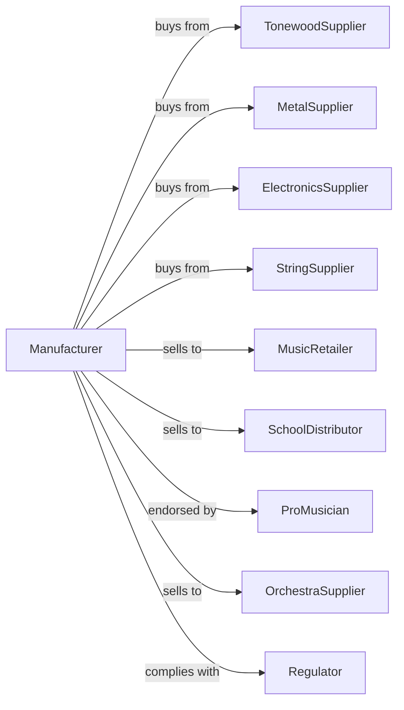

# Musical Instrument Manufacturing

> Business-as-Code definition for musical instrument manufacturing operations. Models the complete production lifecycle from raw materials through professional-grade instruments.

## Overview

Musical instrument manufacturing involves producing acoustic and electronic instruments including guitars, pianos, drums, brass, woodwinds, and electronic synthesizers. This definition exposes actions for crafting, assembly, voicing, and quality control, events for workflow automation, and searches for specifications and inventory.

## Actors

| Actor | Description |
|-------|-------------|
| TonewoodSupplier | Provides select woods for acoustic instruments |
| MetalSupplier | Supplies brass, nickel, and steel for components |
| ElectronicsSupplier | Provides pickups, circuits, and amplification |
| StringSupplier | Supplies strings for guitars, pianos, and orchestral instruments |
| MusicRetailer | Purchases for consumer and pro gear sales |
| SchoolDistributor | Supplies educational band and orchestra programs |
| ProMusician | Endorses products and requires custom instruments |
| OrchestraSupplier | Provides instruments to professional ensembles |
| Regulator | Enforces environmental and material restrictions |

## Roles

| Role | Description |
|------|-------------|
| MasterLuthier | Designs and builds premium stringed instruments |
| WoodworkerCraftsman | Shapes bodies, necks, and acoustic components |
| BrassTechnician | Fabricates and assembles brass instruments |
| ElectronicsInstaller | Wires pickups and electronic systems |
| Voicer | Adjusts tone and playability characteristics |
| Finisher | Applies lacquer, polish, and decorative elements |
| QualityInspector | Tests playability, intonation, and finish |
| CustomBuilder | Creates bespoke instruments to artist specifications |

## Entities

| Entity | Description |
|--------|-------------|
| Guitar | Fretted stringed instrument |
| Piano | Keyboard percussion instrument |
| Drum | Percussion instrument with struck membrane |
| Brass | Trumpet, trombone, horn, or tuba |
| Woodwind | Flute, clarinet, saxophone, or oboe |
| Violin | Bowed stringed instrument |
| Synthesizer | Electronic keyboard instrument |
| Tonewood | Select lumber for acoustic properties |
| Pickup | Electromagnetic transducer for electric instruments |

## Actions

| Action | Description |
|--------|-------------|
| selectWood | Choose and grade tonewoods for acoustic properties |
| shapeBody | Carve or bend instrument body components |
| buildNeck | Construct fretted or fingerboard neck assembly |
| assembleBrass | Form and solder brass tubing and bells |
| installMechanics | Mount tuning machines and keys |
| installElectronics | Wire pickups, controls, and output jacks |
| applyFinish | Spray lacquer or apply hand-rubbed finish |
| voiceInstrument | Adjust setup for optimal tone and playability |
| testIntonation | Verify pitch accuracy across range |
| inspectQuality | Check craftsmanship and playability |
| buildCustom | Create bespoke instrument to artist specification |
| packageInstrument | Prepare with case for shipment |

## Events

| Event | Description |
|-------|-------------|
| woodSelected | Tonewoods graded and allocated |
| bodyShaped | Main structure formed |
| neckBuilt | Neck assembly completed |
| brassAssembled | Brass components joined |
| mechanicsInstalled | Tuning systems mounted |
| electronicsWired | Pickup and control systems functional |
| finishApplied | Surface coating completed |
| instrumentVoiced | Setup and adjustment completed |
| intonationVerified | Pitch accuracy confirmed |
| qualityApproved | Inspection passed |
| instrumentPackaged | Ready for distribution |

## Searches

| Search | Description |
|--------|-------------|
| findOrders | List orders by status or customer type |
| getWoodInventory | Query tonewood stock by species and grade |
| getComponentStock | Check hardware and electronics availability |
| findSpecifications | Search instrument models by type |
| getProductionSchedule | View craftsman and shop capacity |
| trackOrder | Monitor instrument progress through production |
| getArtistRequirements | Access custom order specifications |

## Workflow

## Actor Relationships

