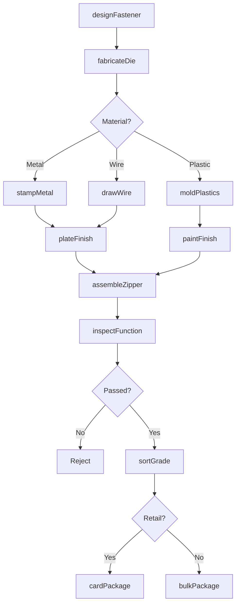
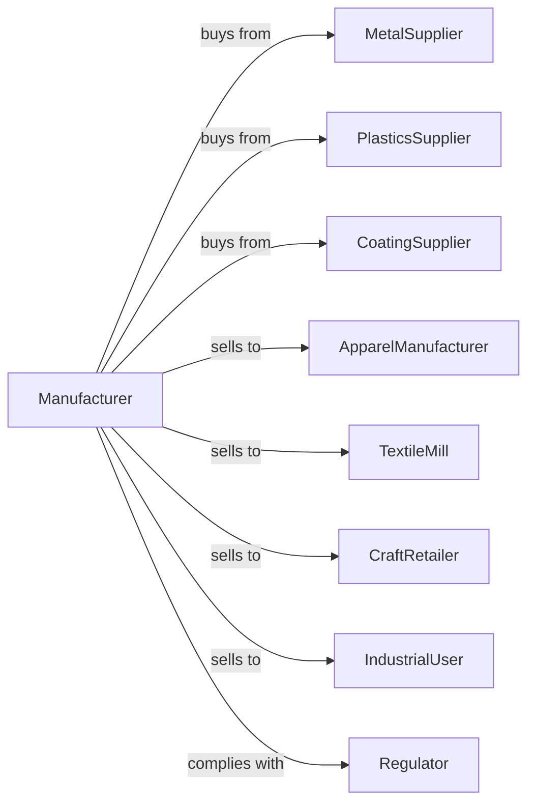

# Fastener, Button, Needle, and Pin Manufacturing

> Business-as-Code definition for fastener, button, needle, and pin manufacturing operations. Models the complete production lifecycle for small metal and plastic notions.

## Overview

Fastener, button, needle, and pin manufacturing involves producing zippers, buttons, snaps, hooks and eyes, sewing needles, straight pins, safety pins, and buckles. This definition exposes actions for metal forming, plastic molding, and assembly, events for workflow automation, and searches for specifications and inventory.

## Actors

| Actor | Description |
|-------|-------------|
| MetalSupplier | Provides steel, brass, and aluminum wire and strip |
| PlasticsSupplier | Supplies resin pellets for molded components |
| CoatingSupplier | Provides plating solutions and paint finishes |
| ApparelManufacturer | Orders fasteners for clothing production |
| TextileMill | Purchases notions for fabric finishing |
| CraftRetailer | Sells to home sewers and crafters |
| IndustrialUser | Orders fasteners for non-apparel applications |
| Regulator | Enforces product safety and material standards |

## Roles

| Role | Description |
|------|-------------|
| ProductionManager | Oversees manufacturing operations and schedules |
| ToolMaker | Creates dies and molds for component production |
| PressOperator | Runs stamping presses for metal parts |
| MoldOperator | Operates injection molding equipment |
| PlatingTechnician | Applies metal plating and finishes |
| Assembler | Combines components into finished fasteners |
| QualityInspector | Tests function and appearance |
| PackagingTech | Cards, bags, or boxes finished products |

## Entities

| Entity | Description |
|--------|-------------|
| Zipper | Interlocking tooth fastener |
| Button | Disc fastener with holes or shank |
| Snap | Two-part press fastener |
| HookAndEye | Wire hook and loop closure |
| Needle | Pointed sewing implement |
| Pin | Straight or safety pin fastener |
| Buckle | Frame fastener with prong or clasp |
| Slider | Zipper pull component |
| Die | Tool for stamping metal shapes |

## Actions

| Action | Description |
|--------|-------------|
| designFastener | Create specifications for new fastener designs |
| fabricateDie | Produce stamping and forming dies |
| stampMetal | Form metal components using presses |
| drawWire | Reduce wire diameter for needles and pins |
| moldPlastics | Injection mold plastic buttons and components |
| assembleZipper | Combine tape, teeth, and slider |
| plateFinish | Apply nickel, brass, or other plating |
| paintFinish | Apply colored paint or lacquer |
| inspectFunction | Test fastening operation and durability |
| sortGrade | Classify by quality and appearance |
| cardPackage | Mount on display cards for retail |
| bulkPackage | Prepare large quantities for industrial shipment |

## Events

| Event | Description |
|-------|-------------|
| designApproved | Fastener specifications finalized |
| dieFabricated | Tooling ready for production |
| metalStamped | Components formed |
| wireDrawn | Needle and pin blanks produced |
| plasticsMolded | Button components formed |
| zipperAssembled | Complete zipper ready |
| platingComplete | Metal finish applied |
| paintCured | Color coating dried |
| functionVerified | Testing passed |
| productSorted | Quality grades assigned |
| productPackaged | Ready for distribution |

## Searches

| Search | Description |
|--------|-------------|
| findOrders | List orders by status or customer |
| getMetalInventory | Query wire and strip stock |
| getPlasticsStock | Check resin and color inventory |
| findSpecifications | Search fastener designs by type |
| getDieInventory | View available tooling |
| getProductionSchedule | View manufacturing capacity |
| trackOrder | Monitor order progress through production |

## Workflow

## Actor Relationships

