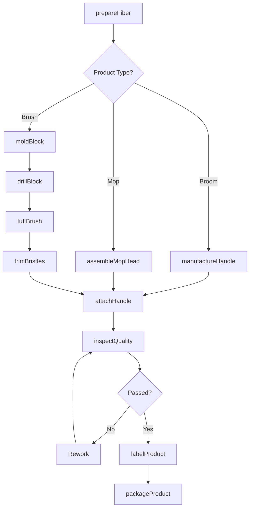
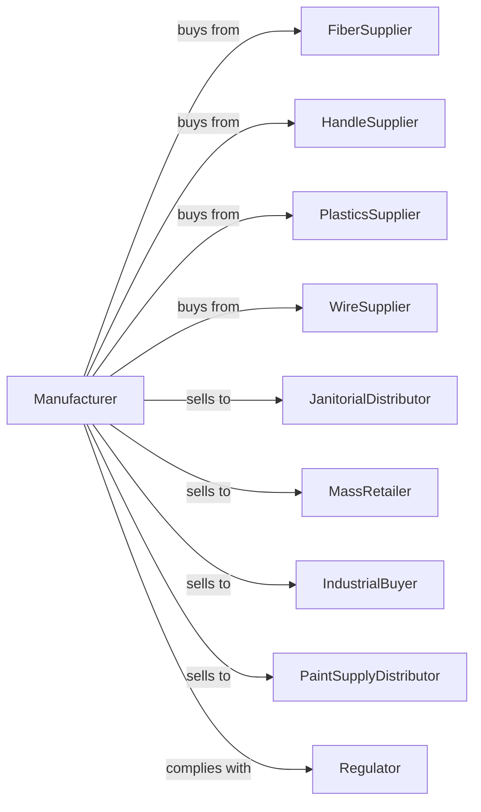

# Broom, Brush, and Mop Manufacturing

> Business-as-Code definition for broom, brush, and mop manufacturing operations. Models the complete production lifecycle for cleaning tools and industrial brushes.

## Overview

Broom, brush, and mop manufacturing involves producing household and industrial cleaning tools including brooms, mops, scrub brushes, paint brushes, and specialized industrial brushes. This definition exposes actions for fiber processing, handle production, and assembly, events for workflow automation, and searches for specifications and inventory.

## Actors

| Actor | Description |
|-------|-------------|
| FiberSupplier | Provides natural and synthetic bristle materials |
| HandleSupplier | Supplies wood, metal, and plastic handles |
| PlasticsSupplier | Provides injection molded blocks and components |
| WireSupplier | Supplies wire for brush construction |
| JanitorialDistributor | Purchases for commercial cleaning markets |
| MassRetailer | Buys for big-box store distribution |
| IndustrialBuyer | Orders specialized brushes for manufacturing |
| PaintSupplyDistributor | Purchases paint applicators |
| Regulator | Enforces product safety standards |

## Roles

| Role | Description |
|------|-------------|
| ProductionManager | Oversees manufacturing operations and schedules |
| FiberProcessor | Prepares and blends bristle materials |
| TuftingOperator | Inserts bristles into brush blocks |
| HandleOperator | Produces and finishes handles |
| Assembler | Combines heads and handles |
| MopMaker | Constructs cotton and synthetic mop heads |
| QualityInspector | Tests durability and function |
| PackagingTech | Wraps and labels finished products |

## Entities

| Entity | Description |
|--------|-------------|
| Broom | Sweeping tool with long handle |
| Brush | Bristled cleaning or application tool |
| Mop | Floor cleaning tool with absorbent head |
| Bristle | Individual fiber or filament |
| Block | Base into which bristles are set |
| Handle | Staff or grip component |
| Ferrule | Metal band joining head to handle |
| Tuft | Bundle of bristles inserted together |
| Fill | Bristle material blend specification |

## Actions

| Action | Description |
|--------|-------------|
| prepareFiber | Cut, blend, and condition bristle materials |
| moldBlock | Injection mold plastic brush blocks |
| drillBlock | Create holes for bristle insertion |
| tuftBrush | Insert bristle tufts into drilled blocks |
| manufactureHandle | Produce wood or plastic handles |
| assembleMopHead | Construct cotton or microfiber mop head |
| attachHandle | Join head to handle with ferrule or thread |
| trimBristles | Cut bristle ends to uniform length |
| inspectQuality | Test durability and sweep performance |
| labelProduct | Apply branding and usage information |
| packageProduct | Prepare for retail or bulk shipment |
| fulfillOrder | Pick, pack, and ship customer orders |

## Events

| Event | Description |
|-------|-------------|
| fiberPrepared | Bristle materials ready |
| blockMolded | Plastic bases formed |
| blockDrilled | Tuft holes created |
| brushTufted | Bristles inserted |
| handleManufactured | Handle components completed |
| mopHeadAssembled | Mop head constructed |
| handleAttached | Final assembly completed |
| bristlesTrimmed | Uniform cut achieved |
| qualityApproved | Testing passed |
| productLabeled | Branding applied |
| productPackaged | Ready for distribution |

## Searches

| Search | Description |
|--------|-------------|
| findOrders | List orders by status or customer |
| getFiberInventory | Query bristle material stock |
| getHandleStock | Check handle inventory by type |
| getBlockInventory | View available brush blocks |
| findSpecifications | Search product designs by type |
| getProductionSchedule | View manufacturing capacity |
| trackOrder | Monitor order progress through production |

## Workflow

## Actor Relationships

