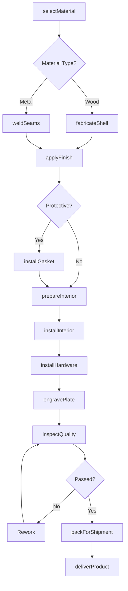
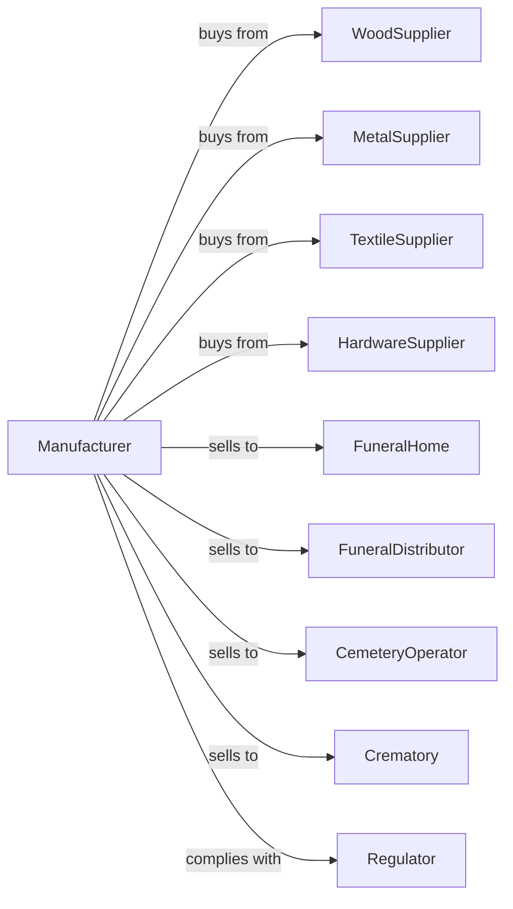

# Burial Casket Manufacturing

> Business-as-Code definition for burial casket manufacturing operations. Models the complete production lifecycle for caskets, cases, and vaults.

## Overview

Burial casket manufacturing involves producing wood, metal, and alternative material caskets, cremation containers, and burial vaults for the funeral industry. This definition exposes actions for fabrication, finishing, and interior preparation, events for workflow automation, and searches for specifications and inventory.

## Actors

| Actor | Description |
|-------|-------------|
| WoodSupplier | Provides hardwoods and veneers for wood caskets |
| MetalSupplier | Supplies steel, bronze, and copper sheet and coil |
| TextileSupplier | Provides lining fabrics, bedding, and pillows |
| HardwareSupplier | Supplies handles, hinges, and locking mechanisms |
| FuneralHome | Purchases caskets for family selection |
| FuneralDistributor | Wholesales to multiple funeral homes |
| CemeteryOperator | Orders burial vaults and grave liners |
| Crematory | Purchases cremation containers |
| Regulator | Enforces FTC funeral rule compliance |

## Roles

| Role | Description |
|------|-------------|
| ProductionManager | Oversees manufacturing operations and schedules |
| Woodworker | Constructs wood casket shells and lids |
| MetalFabricator | Forms and welds metal casket bodies |
| Finisher | Applies stains, paints, and protective coatings |
| InteriorSpecialist | Installs linings, bedding, and accessories |
| QualityInspector | Verifies construction and appearance |
| Engraver | Adds personalized nameplates and trim |
| ShippingCoordinator | Manages delivery to funeral homes |

## Entities

| Entity | Description |
|--------|-------------|
| Casket | Burial container with hinged lid |
| Shell | Main body of casket |
| Lid | Hinged cover component |
| Interior | Lining, bedding, and pillow assembly |
| Handle | Carrying and pallbearer hardware |
| Vault | Outer burial container for casket |
| Nameplate | Personalized identification plate |
| GasketSeal | Sealing mechanism for protective caskets |
| Finish | Surface coating and color |

## Actions

| Action | Description |
|--------|-------------|
| selectMaterial | Choose wood species or metal gauge for order |
| fabricateShell | Construct casket body from wood or metal |
| weldSeams | Join metal panels using welding |
| applyFinish | Stain, paint, or polish exterior surfaces |
| installGasket | Add sealing gasket for protective models |
| prepareInterior | Cut and fit lining fabric and bedding |
| installInterior | Attach interior components to shell |
| installHardware | Mount handles, hinges, and closures |
| engravePlate | Personalize nameplate for deceased |
| inspectQuality | Verify construction and appearance |
| packForShipment | Prepare casket for delivery |
| deliverProduct | Transport to funeral home |

## Events

| Event | Description |
|-------|-------------|
| materialSelected | Wood or metal allocated to order |
| shellFabricated | Casket body completed |
| seamsWelded | Metal joints finished |
| finishApplied | Exterior coating completed |
| gasketInstalled | Seal system in place |
| interiorPrepared | Lining and bedding cut |
| interiorInstalled | Interior assembly completed |
| hardwareInstalled | Handles and closures attached |
| plateEngraved | Personalization completed |
| qualityApproved | Inspection passed |
| casketShipped | Product delivered to funeral home |

## Searches

| Search | Description |
|--------|-------------|
| findOrders | List orders by funeral home or status |
| getWoodInventory | Query hardwood and veneer stock |
| getMetalStock | Check steel and bronze inventory |
| getTextileInventory | View available lining fabrics |
| findSpecifications | Search casket models by style and material |
| getProductionSchedule | View manufacturing capacity |
| trackOrder | Monitor order progress through production |

## Workflow

## Actor Relationships

