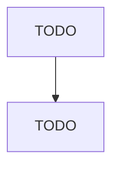

# All Other Miscellaneous Manufacturing

> TODO: Business-as-Code definition

## Overview

This U.S. industry comprises establishments primarily engaged in miscellaneous manufacturing (except medical equipment and supplies, jewelry and silverware, sporting and athletic goods, dolls, toys, games, office supplies, signs, gaskets, packing, and sealing devices, musical instruments, fasteners, buttons, needles, pins, brooms, brushes, mops, and burial caskets). Illustrative Examples: Artificial Christmas trees manufacturing Candles manufacturing Christmas tree ornaments (except glass and el

## Actors

| Actor | Description |
|-------|-------------|
| TODO | TODO |

## Roles

| Role | Description |
|------|-------------|
| TODO | TODO |

## Entities

| Entity | Description |
|--------|-------------|
| TODO | TODO |

## Actions

| Action | Description |
|--------|-------------|
| TODO | TODO |

## Events

| Event | Description |
|-------|-------------|
| TODO | TODO |

## Searches

| Search | Description |
|--------|-------------|
| TODO | TODO |

## Workflow

## Actor Relationships

