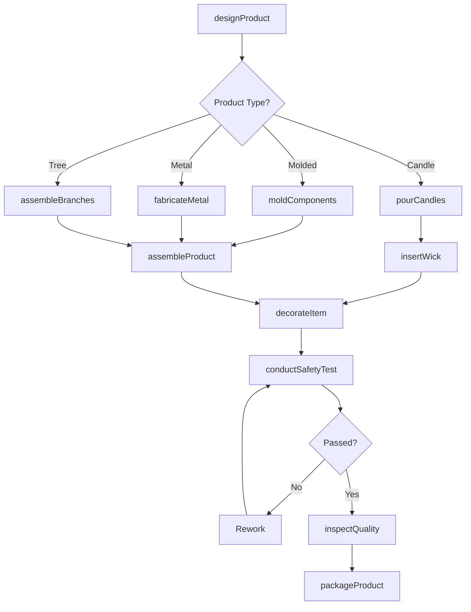
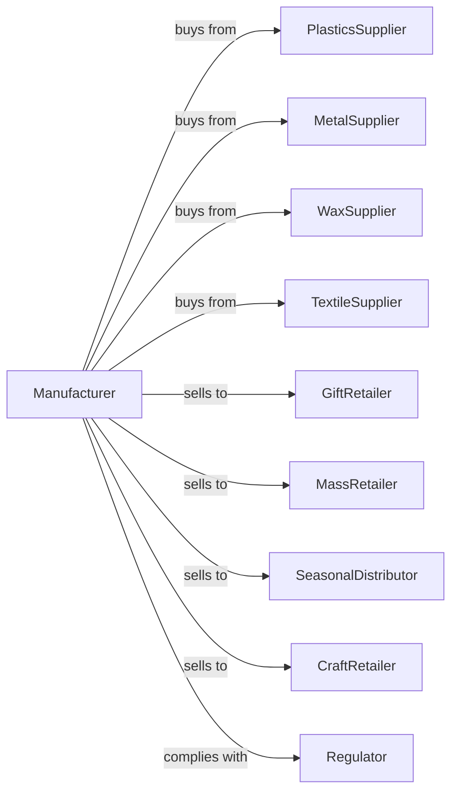

# All Other Miscellaneous Manufacturing

> Business-as-Code definition for all other miscellaneous manufacturing operations. Models the complete production lifecycle for diverse specialty products not classified elsewhere.

## Overview

All other miscellaneous manufacturing covers diverse products including artificial Christmas trees, candles, ornaments, umbrellas, cigarette lighters, hair accessories, and other specialty items. This definition exposes actions for varied production methods, events for workflow automation, and searches for specifications and inventory.

## Actors

| Actor | Description |
|-------|-------------|
| PlasticsSupplier | Provides resin pellets and molded components |
| MetalSupplier | Supplies wire, sheet, and fabricated parts |
| WaxSupplier | Provides paraffin and soy wax for candles |
| TextileSupplier | Supplies fabrics and trimmings |
| GiftRetailer | Purchases decorative and gift items |
| MassRetailer | Buys for big-box and discount store distribution |
| SeasonalDistributor | Specializes in holiday merchandise |
| CraftRetailer | Sells to hobbyists and crafters |
| Regulator | Enforces product safety and flammability standards |

## Roles

| Role | Description |
|------|-------------|
| ProductionManager | Oversees manufacturing operations and schedules |
| ProductDesigner | Creates specifications for specialty products |
| MoldOperator | Runs injection molding equipment |
| CandleMaker | Produces wax candles and related products |
| Assembler | Combines components into finished goods |
| Decorator | Applies paints, glitters, and decorative elements |
| QualityInspector | Tests safety and appearance |
| PackagingTech | Prepares products for retail presentation |

## Entities

| Entity | Description |
|--------|-------------|
| ArtificialTree | Synthetic Christmas or decorative tree |
| Candle | Wax illumination product |
| Ornament | Decorative holiday or display item |
| Umbrella | Portable rain or sun protection |
| Lighter | Cigarette or utility lighter |
| HairAccessory | Clips, bands, and decorative hair items |
| Wax | Paraffin, soy, or beeswax material |
| Wick | Candle burning element |
| Mold | Tool for shaping products |

## Actions

| Action | Description |
|--------|-------------|
| designProduct | Create specifications for specialty items |
| moldComponents | Injection mold plastic parts |
| fabricateMetal | Form wire and sheet metal components |
| pourCandles | Cast wax into molds with wicks |
| assembleBranches | Construct artificial tree sections |
| assembleProduct | Combine components into finished goods |
| decorateItem | Apply paint, glitter, or decorative finish |
| insertWick | Place and secure candle wicks |
| conductSafetyTest | Verify flammability and safety compliance |
| inspectQuality | Check appearance and function |
| packageProduct | Prepare for retail or bulk distribution |
| fulfillOrder | Pick, pack, and ship customer orders |

## Events

| Event | Description |
|-------|-------------|
| designApproved | Product specifications finalized |
| componentsMolded | Plastic parts produced |
| metalFabricated | Wire and sheet components formed |
| candlesPoured | Wax products cast |
| branchesAssembled | Tree sections completed |
| productAssembled | Final assembly completed |
| itemDecorated | Decorative elements applied |
| wickInserted | Candle ready for curing |
| safetyTestPassed | Compliance verified |
| qualityApproved | Inspection passed |
| productPackaged | Ready for distribution |

## Searches

| Search | Description |
|--------|-------------|
| findOrders | List orders by status or customer |
| getMaterialInventory | Query plastic, metal, and wax stock |
| getTextileStock | Check fabric and trim inventory |
| findSpecifications | Search product designs by category |
| getProductionSchedule | View manufacturing capacity |
| trackOrder | Monitor order progress through production |
| getSeasonalForecast | View seasonal demand projections |

## Workflow

## Actor Relationships

