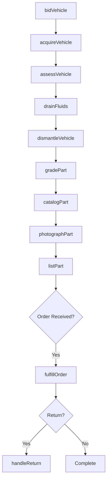
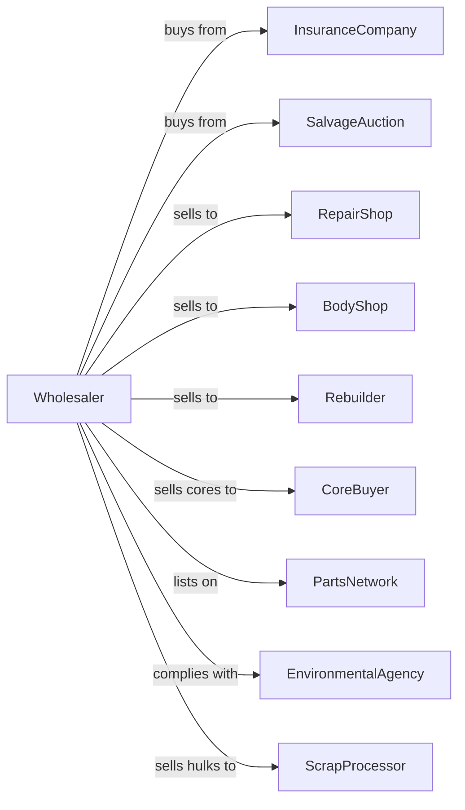

# Motor Vehicle Parts (Used) Merchant Wholesalers

> Business-as-Code definition for used automotive parts wholesale distribution. Models vehicle acquisition, dismantling operations, parts inventory, and resale.

## Overview

Used motor vehicle parts wholesalers acquire salvage vehicles, dismantle them, and distribute recycled parts to repair shops, dealers, and rebuilders. This definition exposes actions for vehicle procurement, dismantling operations, parts grading, inventory management, and interchangeable parts lookup with events for demand-driven salvage acquisition.

## Actors

| Actor | Description |
|-------|-------------|
| InsuranceCompany | Sells totaled vehicles to salvage market |
| SalvageAuction | Auctions damaged and totaled vehicles |
| RepairShop | Purchases used parts for repairs |
| BodyShop | Buys used body panels and components |
| Rebuilder | Acquires parts for vehicle reconstruction |
| CoreBuyer | Purchases cores for remanufacturing |
| PartsNetwork | Locator service connecting used parts suppliers |
| EnvironmentalAgency | Regulates hazardous material handling |
| ScrapProcessor | Purchases hulks and scrap metal |

## Roles

| Role | Description |
|------|-------------|
| VehicleBuyer | Acquires salvage vehicles at auction |
| DismantlingTech | Removes and processes parts from vehicles |
| PartsGrader | Assesses condition and assigns grades |
| InventorySpecialist | Manages parts catalog and stock |
| SalesAgent | Handles customer orders and inquiries |
| YardManager | Oversees facility operations |

## Entities

| Entity | Description |
|--------|-------------|
| SalvageVehicle | Acquired vehicle for dismantling |
| Part | Individual recycled component |
| PartGrade | Condition rating (A, B, C grades) |
| Inventory | Available parts with condition and price |
| Interchange | Cross-reference for compatible parts |
| Core | Rebuildable component for exchange |
| HazardousMaterial | Fluids and materials requiring disposal |
| Hulk | Remaining vehicle shell after dismantling |
| SalesOrder | Customer order for parts |
| Warranty | Part condition guarantee |
| Yard | Dismantling and storage facility |

## Actions

| Action | Description |
|--------|-------------|
| bidVehicle | Submit bid at salvage auction |
| acquireVehicle | Complete purchase of salvage vehicle |
| assessVehicle | Evaluate parts value and viability |
| dismantleVehicle | Remove sellable parts from vehicle |
| gradePart | Assign condition grade to part |
| catalogPart | Add part to inventory with details |
| photographPart | Capture images for listing |
| listPart | Post part to network or marketplace |
| fulfillOrder | Process and ship customer order |
| handleReturn | Process part return and refund |
| collectCore | Receive core exchange from customer |
| drainFluids | Remove hazardous materials safely |
| crushHulk | Process remaining shell for scrap |
| lookupInterchange | Find compatible parts across vehicles |

## Events

| Event | Description |
|-------|-------------|
| vehicleAcquired | Salvage vehicle purchased |
| vehicleAssessed | Parts value evaluation completed |
| partDismantled | Component removed from vehicle |
| partGraded | Condition grade assigned |
| partCataloged | Added to searchable inventory |
| partListed | Posted to marketplace or network |
| orderReceived | Customer placed parts order |
| orderShipped | Parts dispatched to customer |
| returnRequested | Customer initiated return |
| coreReceived | Core exchange received |
| fluidsDrained | Hazardous materials removed |
| hulkCrushed | Shell processed for scrap |
| partRequested | Network query for specific part |

## Searches

| Search | Description |
|--------|-------------|
| findParts | Search by part type, vehicle, and grade |
| getInterchange | Find compatible parts across models |
| getInventory | Check available stock and locations |
| getVehicleStatus | Track salvage vehicle processing |
| findCores | Search available rebuildable cores |
| getOrders | Retrieve customer orders |
| getNetworkParts | Query partner network for parts |

## Workflow



## Actor Relationships



## Usage

### Calling Actions

```typescript
import { wholesaleMotorVehicle } from '@headlessly/wholesale-motor-vehicle'

const wholesaler = wholesaleMotorVehicle()

// Search for used part with interchange
const parts = await wholesaler.findParts({
  partType: 'transmission',
  year: 2018,
  make: 'Honda',
  model: 'Accord',
  minGrade: 'B'
})

// Include interchange options
const allOptions = await wholesaler.getInterchange({
  partNumber: parts[0].partNumber,
  yearRange: [2016, 2022]
})

// Process customer order
await wholesaler.fulfillOrder({
  customerId: 'body-shop-123',
  items: [
    { partId: 'P-2018-ACC-TRANS-01', warranty: '90-day' }
  ],
  coreExchange: true
})
```

### Event-Driven Automation

```typescript
// Auto-list dismantled parts
wholesaler.partGraded(async ({ partId, grade, partType }) => {
  await wholesaler.photographPart({ partId })

  await wholesaler.listPart({
    partId,
    marketplaces: ['car-part', 'ebay-motors'],
    price: calculatePrice(partType, grade)
  })
})

// Process incoming network requests
wholesaler.partRequested(async ({ partType, vehicle, requestorId }) => {
  const match = await wholesaler.findParts({ partType, ...vehicle })

  if (match.length > 0) {
    await respondToNetwork({
      requestorId,
      parts: match,
      availability: 'in-stock'
    })
  }
})
```
