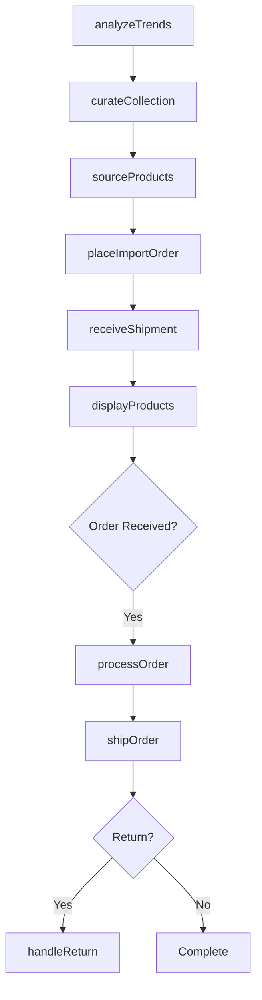
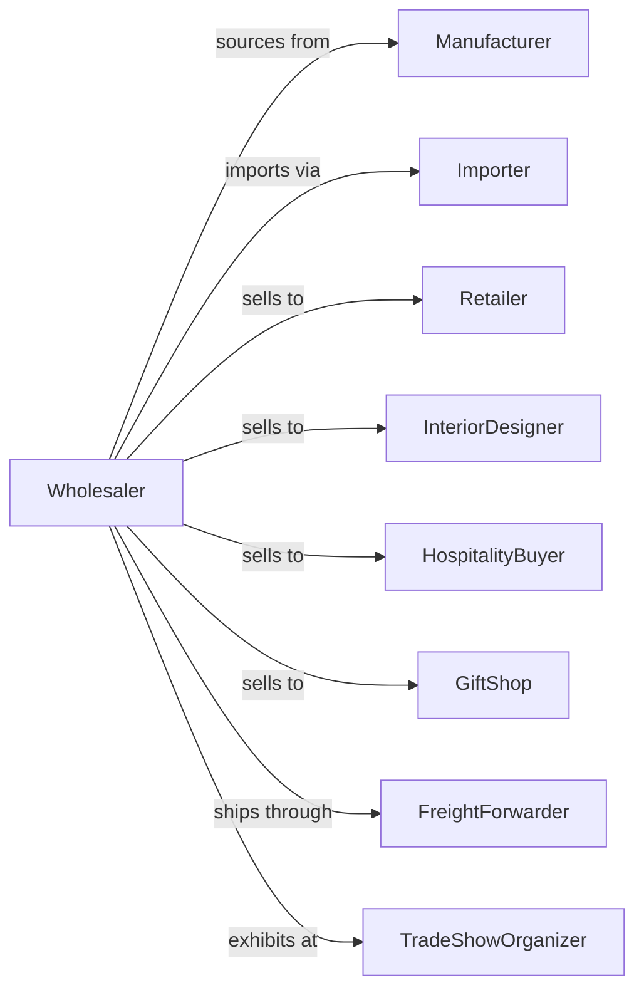

# Home Furnishing Merchant Wholesalers

> Business-as-Code definition for home furnishings wholesale distribution. Models product sourcing, showroom operations, and retailer fulfillment for housewares and decor.

## Overview

Home furnishing wholesalers distribute carpets, floor coverings, draperies, lamps, glassware, kitchenware, and decorative items to retailers, designers, and hospitality buyers. This definition exposes actions for product curation, showroom management, order fulfillment, and trend forecasting with events for seasonal collections and inventory management.

## Actors

| Actor | Description |
|-------|-------------|
| Manufacturer | Produces home furnishing products |
| Importer | Sources products from overseas factories |
| Retailer | Home goods store or department store |
| InteriorDesigner | Specifies products for client projects |
| HospitalityBuyer | Purchases for hotels and restaurants |
| GiftShop | Specialty retailer for decor items |
| FreightForwarder | Handles international shipping |
| TradeShowOrganizer | Hosts gift and home markets |

## Roles

| Role | Description |
|------|-------------|
| BuyingDirector | Curates product assortment and vendors |
| ShowroomManager | Manages product displays and presentations |
| AccountExecutive | Serves retail and design accounts |
| ImportCoordinator | Manages overseas sourcing and shipping |
| TrendAnalyst | Tracks market trends and styles |

## Entities

| Entity | Description |
|--------|-------------|
| Product | Home furnishing item with SKU and specs |
| Collection | Coordinated product grouping or line |
| Inventory | Stock levels across locations |
| PurchaseOrder | Order to manufacturer or importer |
| SalesOrder | Customer order for products |
| Showroom | Display facility for buyer visits |
| Catalog | Product catalog with images and pricing |
| CustomerAccount | Retailer or designer profile |
| Shipment | Inbound or outbound delivery |
| ImportOrder | International purchase with customs |
| TrendReport | Market trend analysis |

## Actions

| Action | Description |
|--------|-------------|
| curateCollection | Select products for seasonal offering |
| sourceProducts | Identify and qualify vendors |
| placeImportOrder | Submit overseas purchase order |
| receiveShipment | Check in arriving inventory |
| displayProducts | Arrange showroom presentations |
| processOrder | Fulfill customer order |
| shipOrder | Dispatch delivery to customer |
| handleReturn | Process customer returns |
| attendMarket | Exhibit at trade show |
| analyzeTrends | Research market direction |
| updatePricing | Adjust product pricing |
| clearInventory | Discount slow-moving stock |
| forecastDemand | Project product requirements |
| manageCatalog | Maintain product information |

## Events

| Event | Description |
|-------|-------------|
| orderReceived | Customer placed order |
| shipmentReceived | Inventory arrived at warehouse |
| orderShipped | Products dispatched to customer |
| orderDelivered | Customer received products |
| returnProcessed | Return completed and credited |
| newCollectionReleased | Seasonal line launched |
| trendIdentified | New market trend detected |
| priceAdjusted | Product pricing changed |
| stockLow | Inventory below threshold |
| marketScheduled | Trade show dates set |
| vendorOnboarded | New supplier activated |
| productDiscontinued | Item removed from line |

## Searches

| Search | Description |
|--------|-------------|
| findProducts | Search by category, style, or color |
| getInventory | Check stock and availability |
| getOrders | Retrieve orders by status |
| getCustomers | Search retailer accounts |
| getImports | Track international shipments |
| getCollections | Browse seasonal offerings |
| getTrends | Access trend reports |

## Workflow



## Actor Relationships



## Usage

### Calling Actions

```typescript
import { wholesaleHomeFurnishing } from '@headlessly/wholesale-home-furnishing'

const wholesaler = wholesaleHomeFurnishing()

// Search product catalog
const products = await wholesaler.findProducts({
  category: 'table-lamps',
  style: 'contemporary',
  colorFamily: 'neutral'
})

// Process retailer order
const order = await wholesaler.processOrder({
  customerId: 'home-store-789',
  items: [
    { sku: 'TL-CONT-BRS-01', quantity: 12 },
    { sku: 'TL-CONT-BLK-01', quantity: 8 }
  ],
  shipComplete: true
})

// Place import order for new collection
await wholesaler.placeImportOrder({
  vendorId: 'asia-decor-ltd',
  items: [
    { sku: 'VAS-CER-BLU-LG', quantity: 500 },
    { sku: 'VAS-CER-WHT-MD', quantity: 750 }
  ],
  shipDate: '2024-04-01',
  incoterms: 'FOB'
})
```

### Event-Driven Automation

```typescript
// Alert sales team on trend shifts
wholesaler.trendIdentified(async ({ trend, category, confidence }) => {
  if (confidence > 0.8) {
    await wholesaler.curateCollection({
      theme: trend,
      category,
      season: 'fall-2024'
    })
  }
})

// Auto-clear slow inventory
wholesaler.stockLow(async ({ sku, velocity, daysOnHand }) => {
  if (velocity < 0.5 && daysOnHand > 180) {
    await wholesaler.clearInventory({
      sku,
      discountPercent: 40,
      channels: ['closeout-buyers']
    })
  }
})
```
