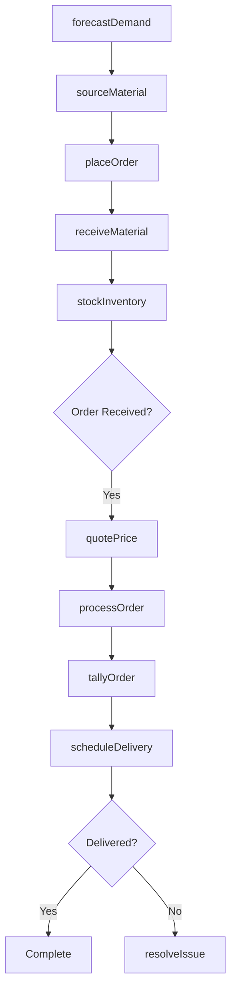
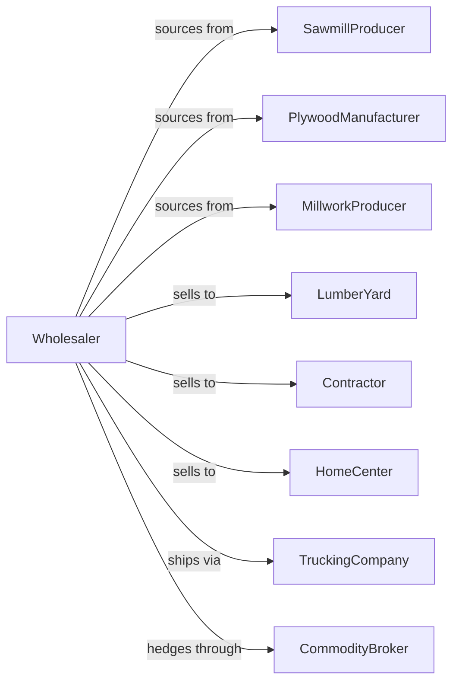

# Lumber, Plywood, Millwork, and Wood Panel Merchant Wholesalers

> Business-as-Code definition for lumber and wood products wholesale distribution. Models procurement, inventory management, and contractor fulfillment.

## Overview

Lumber wholesalers distribute dimensional lumber, plywood, engineered wood products, millwork, doors, and windows to contractors, lumber yards, and building material retailers. This definition exposes actions for product sourcing, commodity pricing, inventory management, and jobsite delivery with events for market fluctuations and demand planning.

## Actors

| Actor | Description |
|-------|-------------|
| SawmillProducer | Produces dimensional lumber and timbers |
| PlywoodManufacturer | Produces plywood and engineered panels |
| MillworkProducer | Manufactures doors, windows, and trim |
| LumberYard | Retail lumber dealer purchasing stock |
| Contractor | Builder or tradesperson buying materials |
| HomeCenter | Big-box retailer purchasing lumber |
| TruckingCompany | Provides flatbed delivery services |
| CommodityBroker | Trades lumber futures and contracts |

## Roles

| Role | Description |
|------|-------------|
| BuyingManager | Sources products and negotiates contracts |
| InventoryManager | Manages stock levels and yard operations |
| SalesRepresentative | Serves contractor and dealer accounts |
| LogisticsCoordinator | Schedules deliveries and manages fleet |
| CommodityTrader | Monitors markets and manages price risk |

## Entities

| Entity | Description |
|--------|-------------|
| Product | Lumber item with species, grade, and dimensions |
| Inventory | Stock levels by product and location |
| PurchaseOrder | Order placed with producer |
| SalesOrder | Customer order for materials |
| PriceList | Current pricing by product and volume |
| Delivery | Scheduled material shipment |
| Yard | Warehouse and storage facility |
| Tally | Detailed count of shipped materials |
| CommodityContract | Futures or forward pricing agreement |
| Certificate | Chain of custody or grading certification |
| Quote | Customer price quotation |

## Actions

| Action | Description |
|--------|-------------|
| sourceMaterial | Identify and contract with producers |
| placeOrder | Submit purchase order to supplier |
| receiveMaterial | Check in incoming shipment |
| stockInventory | Store material in yard locations |
| quotePrice | Generate customer price quotation |
| processOrder | Fulfill customer material order |
| scheduleDelivery | Arrange jobsite or yard delivery |
| tallyOrder | Create detailed material count |
| hedgePrice | Lock in pricing through futures |
| adjustPricing | Update prices based on market |
| certifyChain | Maintain forest certification |
| returnMaterial | Process customer returns |
| transferStock | Move inventory between locations |
| forecastDemand | Project material requirements |

## Events

| Event | Description |
|-------|-------------|
| orderReceived | Customer placed material order |
| materialReceived | Supplier shipment arrived |
| orderShipped | Materials dispatched for delivery |
| orderDelivered | Customer received materials |
| priceChanged | Market pricing shifted |
| stockLow | Inventory below reorder point |
| contractExecuted | Commodity hedge completed |
| quoteExpired | Price quotation no longer valid |
| certificationRenewed | Chain of custody updated |
| returnProcessed | Customer return completed |
| marketAlerted | Significant price movement detected |
| demandForecasted | Seasonal projection updated |

## Searches

| Search | Description |
|--------|-------------|
| findProducts | Search by species, grade, dimensions |
| getInventory | Check stock levels and locations |
| getOrders | Retrieve orders by status |
| getDeliveries | Track scheduled shipments |
| getMarketPrices | View current commodity prices |
| getQuotes | List active quotations |
| getCertifications | Check chain of custody status |

## Workflow



## Actor Relationships



## Usage

### Calling Actions

```typescript
import { wholesaleLumber } from '@headlessly/wholesale-lumber'

const wholesaler = wholesaleLumber()

// Check lumber inventory
const inventory = await wholesaler.getInventory({
  species: 'douglas-fir',
  grade: '#2',
  dimensions: '2x6'
})

// Generate quote for contractor
const quote = await wholesaler.quotePrice({
  customerId: 'contractor-456',
  items: [
    { product: 'DF-2x6-16', quantity: 500, unit: 'pieces' },
    { product: 'OSB-7/16-4x8', quantity: 100, unit: 'sheets' }
  ],
  validDays: 7
})

// Schedule jobsite delivery
await wholesaler.scheduleDelivery({
  orderId: 'order-789',
  address: '1234 Construction Ave',
  date: '2024-03-20',
  liftgateRequired: false,
  flatbed: true
})
```

### Event-Driven Automation

```typescript
// Auto-hedge on price volatility
wholesaler.marketAlerted(async ({ product, priceChange }) => {
  if (Math.abs(priceChange) > 0.05) {
    await wholesaler.hedgePrice({
      product,
      quantity: calculateHedgeAmount(product),
      direction: priceChange > 0 ? 'sell' : 'buy'
    })
  }
})

// Auto-reorder on low stock
wholesaler.stockLow(async ({ product, currentQty, reorderPoint }) => {
  const forecast = await wholesaler.forecastDemand({ product })

  await wholesaler.placeOrder({
    product,
    quantity: forecast.recommended,
    priority: currentQty < reorderPoint / 2 ? 'rush' : 'standard'
  })
})
```
