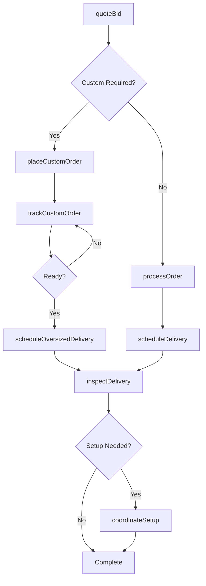
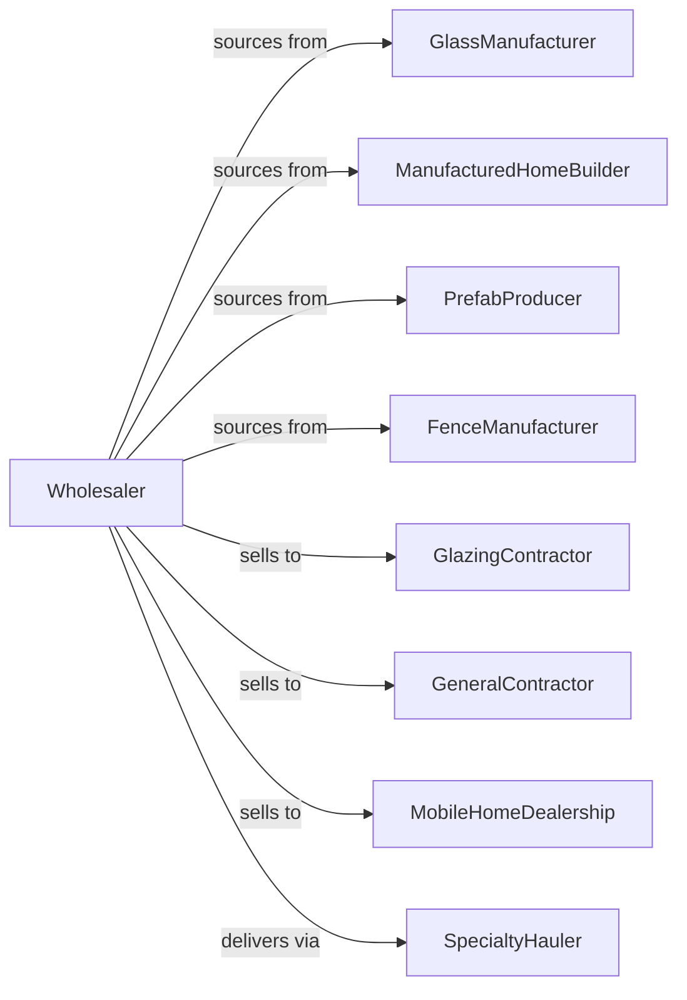

# Other Construction Material Merchant Wholesalers

> Business-as-Code definition for specialty construction materials wholesale distribution. Models procurement, delivery, and contractor fulfillment for glass, prefab buildings, and specialty products.

## Overview

Other construction material wholesalers distribute flat glass, manufactured homes, prefabricated buildings, fencing materials, and specialty construction products to contractors, dealers, and installers. This definition exposes actions for product sourcing, custom ordering, and specialized delivery with events for project scheduling and inventory management.

## Actors

| Actor | Description |
|-------|-------------|
| GlassManufacturer | Produces flat glass and glazing products |
| ManufacturedHomeBuilder | Produces modular and mobile homes |
| PrefabProducer | Manufactures prefabricated structures |
| FenceManufacturer | Produces fencing materials and systems |
| GlazingContractor | Installs glass and glazing |
| GeneralContractor | Purchases materials for construction |
| MobileHomeDealership | Retails manufactured homes |
| SpecialtyHauler | Transports oversized materials |

## Roles

| Role | Description |
|------|-------------|
| ProductSpecialist | Sources specialty construction products |
| SalesManager | Manages contractor and dealer accounts |
| OrderCoordinator | Processes custom and special orders |
| LogisticsManager | Coordinates specialized deliveries |
| InstallationCoordinator | Schedules setup and installation |

## Entities

| Entity | Description |
|--------|-------------|
| Product | Construction material with specs |
| Inventory | Stock levels by product and location |
| CustomOrder | Made-to-order product specification |
| PurchaseOrder | Order placed with manufacturer |
| SalesOrder | Customer order for materials |
| Delivery | Scheduled material shipment |
| ManufacturedHome | Complete home unit for delivery |
| PrefabStructure | Prefabricated building component |
| GlassPanel | Custom or stock glass product |
| Warranty | Product warranty documentation |
| InstallationSchedule | Setup appointment details |

## Actions

| Action | Description |
|--------|-------------|
| sourceProduct | Identify specialty suppliers |
| placeCustomOrder | Submit made-to-order specifications |
| placeStockOrder | Order standard inventory items |
| receiveMaterial | Check in incoming shipment |
| stockInventory | Store materials in warehouse |
| processOrder | Fulfill customer material order |
| scheduleDelivery | Arrange standard delivery |
| scheduleOversizedDelivery | Arrange specialty transport |
| coordinateSetup | Schedule on-site installation |
| inspectDelivery | Verify condition at delivery |
| processWarranty | Handle warranty registration |
| handleClaim | Process damage or defect claim |
| trackCustomOrder | Monitor special order status |
| quoteBid | Prepare project bid quotation |

## Events

| Event | Description |
|-------|-------------|
| orderReceived | Customer placed order |
| customOrderPlaced | Special order submitted to manufacturer |
| materialReceived | Shipment arrived at warehouse |
| orderShipped | Materials dispatched for delivery |
| orderDelivered | Customer received materials |
| setupCompleted | Installation finished on-site |
| inspectionPassed | Delivery condition verified |
| claimFiled | Damage claim submitted |
| warrantyRegistered | Product warranty activated |
| stockLow | Inventory below threshold |
| customOrderReady | Made-to-order item completed |
| bidRequested | Customer requested quotation |

## Searches

| Search | Description |
|--------|-------------|
| findProducts | Search by type, specs, or application |
| getInventory | Check stock levels and locations |
| getOrders | Retrieve orders by status |
| getCustomOrders | Track special order progress |
| getDeliveries | Monitor scheduled shipments |
| getBids | List active quotations |
| getWarranties | Access warranty registrations |

## Workflow



## Actor Relationships



## Usage

### Calling Actions

```typescript
import { wholesaleConstructionMaterial } from '@headlessly/wholesale-construction-material'

const wholesaler = wholesaleConstructionMaterial()

// Search specialty products
const glass = await wholesaler.findProducts({
  type: 'tempered-glass',
  thickness: '1/4-inch',
  tint: 'clear'
})

// Place custom glass order
const customOrder = await wholesaler.placeCustomOrder({
  productType: 'insulated-glass-unit',
  specs: {
    width: 72,
    height: 96,
    glass: 'low-e',
    spacer: 'warm-edge'
  },
  quantity: 25
})

// Schedule manufactured home delivery
await wholesaler.scheduleOversizedDelivery({
  orderId: 'mh-order-789',
  unitType: 'double-wide',
  destination: '1234 Lot Road',
  permitNumber: 'PERM-2024-001',
  escortRequired: true
})
```

### Event-Driven Automation

```typescript
// Notify on custom order completion
wholesaler.customOrderReady(async ({ orderId, customerId }) => {
  await notifyCustomer({
    customerId,
    message: `Your custom order ${orderId} is ready for delivery`
  })

  await wholesaler.scheduleDelivery({
    orderId,
    priority: 'customer-ready'
  })
})

// Handle delivery inspections
wholesaler.orderDelivered(async ({ orderId, requiresSetup }) => {
  await wholesaler.inspectDelivery({ orderId })

  if (requiresSetup) {
    await wholesaler.coordinateSetup({
      orderId,
      scheduleDays: 3
    })
  }
})
```
