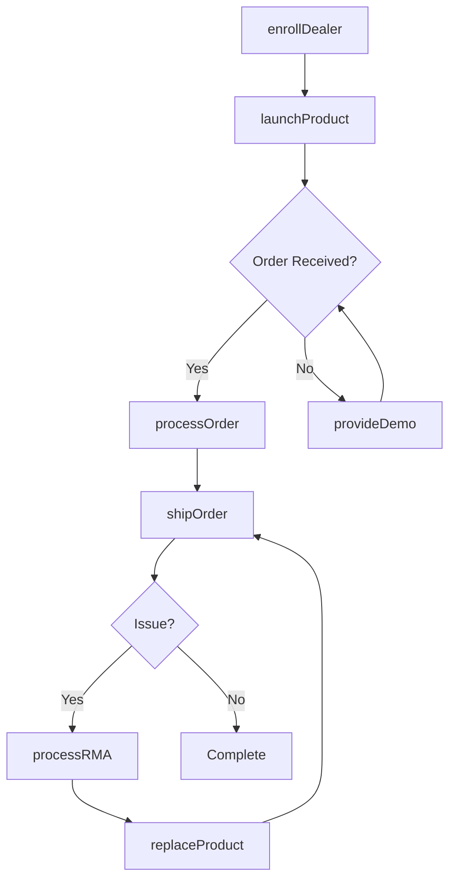
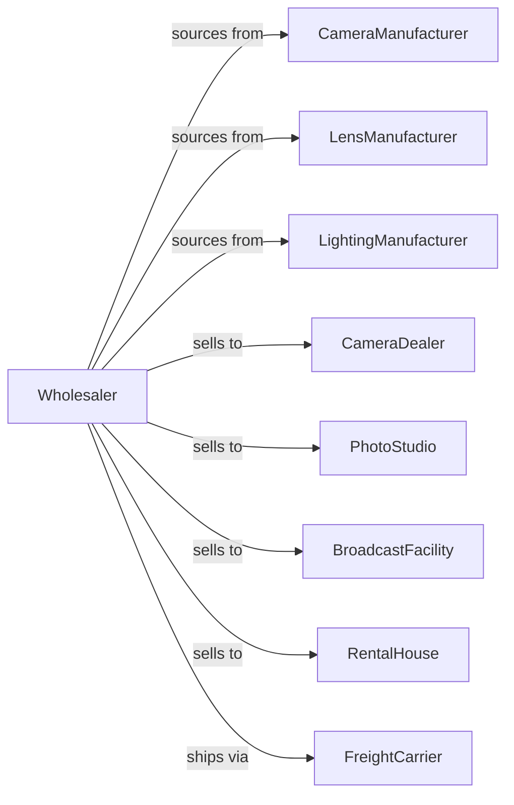

# Photographic Equipment and Supplies Merchant Wholesalers

> Business-as-Code definition for professional imaging equipment wholesale distribution. Models procurement, dealer programs, and technical support for cameras and video equipment.

## Overview

Photographic equipment wholesalers distribute professional cameras, lenses, video equipment, lighting systems, and imaging supplies to camera dealers, studios, and broadcast facilities. This definition exposes actions for product sourcing, dealer program management, and technical support with events for product launches and inventory optimization.

## Actors

| Actor | Description |
|-------|-------------|
| CameraManufacturer | Produces cameras and imaging equipment |
| LensManufacturer | Produces professional optics |
| LightingManufacturer | Makes studio and video lighting |
| CameraDealer | Retail camera store |
| PhotoStudio | Professional photography business |
| BroadcastFacility | Television and video production |
| RentalHouse | Equipment rental company |
| FreightCarrier | Provides insured shipping |

## Roles

| Role | Description |
|------|-------------|
| ProductManager | Manages manufacturer relationships |
| SalesRepresentative | Serves dealer and studio accounts |
| TechnicalSpecialist | Provides product expertise and support |
| WarehouseManager | Oversees inventory and fulfillment |
| MarketingCoordinator | Manages dealer promotions and events |

## Entities

| Entity | Description |
|--------|-------------|
| Product | Camera, lens, or accessory item |
| Inventory | Stock levels across locations |
| PurchaseOrder | Order placed with manufacturer |
| SalesOrder | Dealer or customer order |
| DealerProgram | Authorized dealer agreement |
| Promotion | Manufacturer rebate or incentive |
| Demo | Demonstration unit for evaluation |
| Warranty | Product warranty information |
| TechnicalBulletin | Product update or advisory |
| TrainingEvent | Dealer education session |
| RMA | Return merchandise authorization |

## Actions

| Action | Description |
|--------|-------------|
| sourceProduct | Identify and onboard new products |
| placeOrder | Submit purchase order to manufacturer |
| receiveInventory | Check in incoming shipment |
| stockWarehouse | Store products in locations |
| enrollDealer | Authorize dealer for brand |
| processOrder | Fulfill dealer or customer order |
| shipOrder | Dispatch with insured carrier |
| provideDemo | Send demonstration equipment |
| runPromotion | Execute manufacturer incentive |
| provideTechSupport | Answer technical questions |
| processRMA | Handle defective returns |
| scheduleTraining | Organize dealer education |
| launchProduct | Introduce new product to dealers |
| forecastDemand | Project product requirements |

## Events

| Event | Description |
|-------|-------------|
| orderReceived | Dealer placed order |
| inventoryReceived | Manufacturer shipment arrived |
| orderShipped | Products dispatched to dealer |
| orderDelivered | Dealer received shipment |
| dealerEnrolled | New dealer authorized |
| promotionStarted | Incentive program began |
| promotionEnded | Incentive program concluded |
| demoRequested | Dealer requested demo unit |
| rmaIssued | Return authorization created |
| productLaunched | New product available |
| bulletinIssued | Technical update released |
| stockLow | Inventory below threshold |

## Searches

| Search | Description |
|--------|-------------|
| findProducts | Search by category, brand, specs |
| getInventory | Check stock levels |
| getOrders | Retrieve orders by status |
| getDealers | Search authorized dealers |
| getPromotions | List active incentives |
| getDemos | Track demo equipment |
| getRMAs | Access return authorizations |

## Workflow



## Actor Relationships



## Usage

### Calling Actions

```typescript
import { wholesalePhotographicEquipment } from '@headlessly/wholesale-photographic-equipment'

const wholesaler = wholesalePhotographicEquipment()

// Search professional cameras
const cameras = await wholesaler.findProducts({
  category: 'mirrorless-camera',
  brand: 'sony',
  sensorSize: 'full-frame'
})

// Enroll new dealer
const dealer = await wholesaler.enrollDealer({
  businessName: 'Pro Camera Shop',
  contactEmail: 'orders@procamera.com',
  brands: ['sony', 'canon', 'profoto'],
  tier: 'authorized'
})

// Process dealer order
await wholesaler.processOrder({
  dealerId: dealer.id,
  items: [
    { sku: 'SONY-A7RV-BODY', quantity: 5 },
    { sku: 'SONY-2470GM2', quantity: 3 }
  ],
  promotionCode: 'Q1-DEALER-SPIFF'
})
```

### Event-Driven Automation

```typescript
// Announce product launches
wholesaler.productLaunched(async ({ productId, category }) => {
  const dealers = await wholesaler.getDealers({
    status: 'active',
    categories: [category]
  })

  for (const dealer of dealers) {
    await sendProductAnnouncement({
      dealerId: dealer.id,
      productId
    })
  }
})

// Process demo requests
wholesaler.demoRequested(async ({ dealerId, productId }) => {
  await wholesaler.provideDemo({
    dealerId,
    productId,
    durationDays: 14,
    followUp: true
  })
})
```
