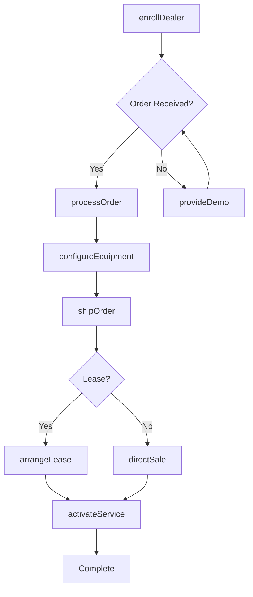
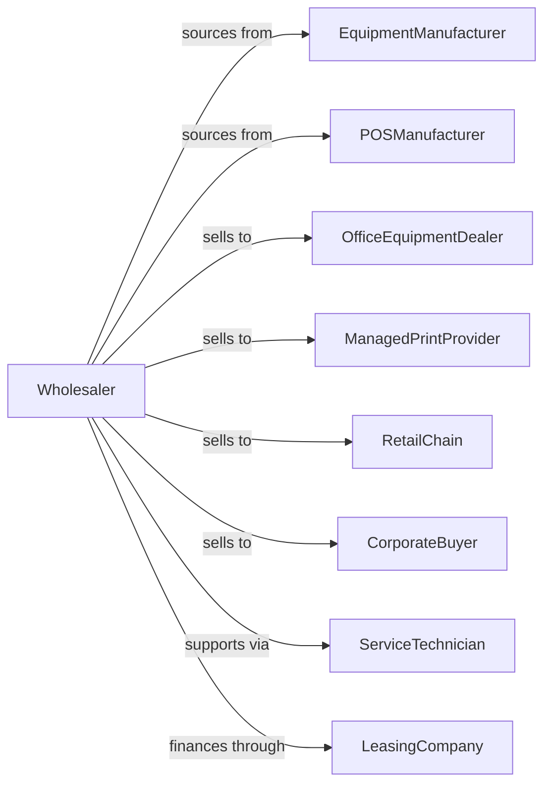

# Office Equipment Merchant Wholesalers

> Business-as-Code definition for office equipment wholesale distribution. Models procurement, dealer programs, and service support for copiers, POS systems, and business machines.

## Overview

Office equipment wholesalers distribute copiers, printers, point-of-sale terminals, cash registers, shredders, and related business machines to dealers, resellers, and direct accounts. This definition exposes actions for product sourcing, dealer program management, and service contract administration with events for equipment lifecycle and inventory optimization.

## Actors

| Actor | Description |
|-------|-------------|
| EquipmentManufacturer | Produces copiers, printers, and business machines |
| POSManufacturer | Makes point-of-sale and payment terminals |
| OfficeEquipmentDealer | Resells and services equipment |
| ManagedPrintProvider | Offers print fleet management |
| RetailChain | End customer for POS equipment |
| CorporateBuyer | Large enterprise purchasing equipment |
| ServiceTechnician | Provides equipment repair and maintenance |
| LeasingCompany | Finances equipment leases |

## Roles

| Role | Description |
|------|-------------|
| ProductManager | Manages manufacturer lines and programs |
| SalesRepresentative | Serves dealer and direct accounts |
| TechnicalConsultant | Provides pre-sales support and design |
| ServiceManager | Oversees warranty and repair programs |
| ChannelManager | Manages dealer recruitment and development |

## Entities

| Entity | Description |
|--------|-------------|
| Product | Office machine or equipment item |
| Inventory | Stock levels across warehouses |
| PurchaseOrder | Order placed with manufacturer |
| SalesOrder | Dealer or customer order |
| DealerAgreement | Authorized dealer contract |
| ServiceContract | Warranty or maintenance agreement |
| Lease | Equipment financing arrangement |
| Demo | Demonstration unit for evaluation |
| RMA | Return merchandise authorization |
| SpiffProgram | Sales incentive program |
| TechnicalSpec | Product configuration details |

## Actions

| Action | Description |
|--------|-------------|
| sourceProduct | Identify and onboard equipment lines |
| placeOrder | Submit purchase order to manufacturer |
| receiveInventory | Check in incoming equipment |
| stockWarehouse | Store equipment in locations |
| enrollDealer | Authorize new dealer partner |
| configureEquipment | Set up equipment per specifications |
| processOrder | Fulfill dealer or direct order |
| shipOrder | Dispatch equipment to customer |
| arrangeLease | Set up equipment financing |
| activateService | Start warranty or maintenance contract |
| processRMA | Handle defective equipment return |
| runSpiff | Execute dealer incentive program |
| provideDemo | Send demonstration equipment |
| forecastDemand | Project equipment requirements |

## Events

| Event | Description |
|-------|-------------|
| orderReceived | Customer placed equipment order |
| inventoryReceived | Manufacturer shipment arrived |
| equipmentConfigured | Setup completed per specs |
| orderShipped | Equipment dispatched |
| orderDelivered | Customer received equipment |
| leaseActivated | Financing agreement executed |
| serviceActivated | Support contract began |
| rmaIssued | Return authorization created |
| dealerEnrolled | New dealer authorized |
| spiffEarned | Dealer qualified for incentive |
| stockLow | Inventory below threshold |
| productEndOfLife | Equipment discontinued |

## Searches

| Search | Description |
|--------|-------------|
| findProducts | Search by category, brand, specs |
| getInventory | Check stock levels |
| getOrders | Retrieve orders by status |
| getDealers | Search authorized partners |
| getServiceContracts | List active service agreements |
| getLeases | Track equipment leases |
| getRMAs | Access return authorizations |

## Workflow



## Actor Relationships



## Usage

### Calling Actions

```typescript
import { wholesaleOfficeEquipment } from '@headlessly/wholesale-office-equipment'

const wholesaler = wholesaleOfficeEquipment()

// Search office equipment
const copiers = await wholesaler.findProducts({
  category: 'multifunction-printer',
  brand: 'canon',
  speedPpm: { min: 40 }
})

// Configure equipment for deployment
const configured = await wholesaler.configureEquipment({
  productId: copiers[0].id,
  config: {
    paperTrays: 4,
    finisher: 'staple-punch',
    network: 'wifi-direct'
  }
})

// Process dealer order with lease
await wholesaler.processOrder({
  dealerId: 'dealer-456',
  items: [{ productId: configured.id, quantity: 3 }],
  leaseTermMonths: 60,
  serviceLevel: 'platinum'
})
```

### Event-Driven Automation

```typescript
// Activate service on delivery
wholesaler.orderDelivered(async ({ orderId, serviceLevel }) => {
  await wholesaler.activateService({
    orderId,
    level: serviceLevel,
    startDate: new Date()
  })
})

// Process dealer spiffs
wholesaler.spiffEarned(async ({ dealerId, productId, amount }) => {
  await processIncentivePayment({
    dealerId,
    amount,
    reason: `Spiff for ${productId}`
  })
})
```
