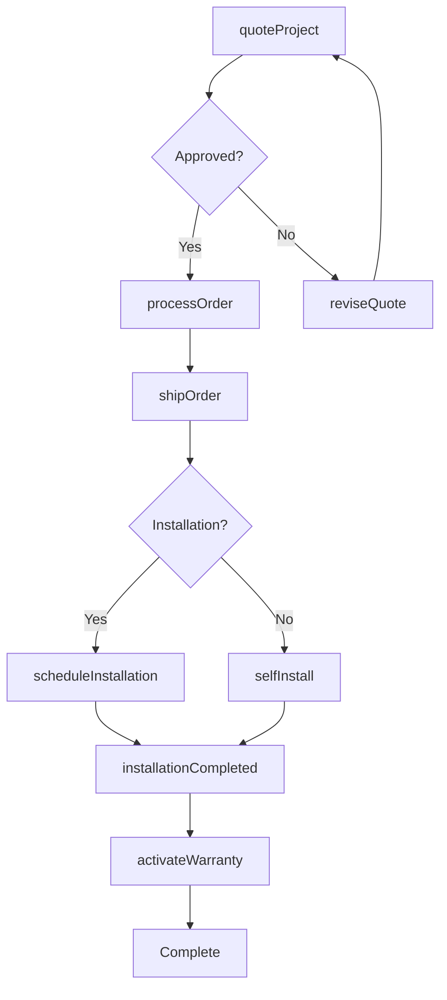
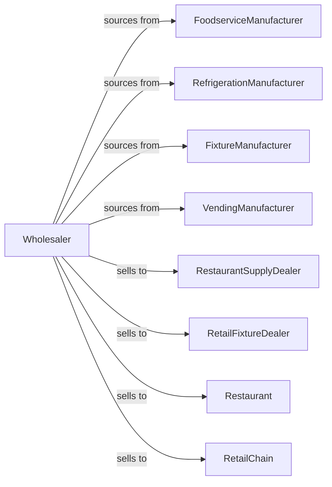

# Other Commercial Equipment Merchant Wholesalers

> Business-as-Code definition for commercial equipment wholesale distribution. Models procurement, dealer programs, and fulfillment for restaurant, retail, and vending equipment.

## Overview

Commercial equipment wholesalers distribute food service equipment, commercial shelving, scales, vending machines, and store fixtures to restaurants, retailers, and hospitality operators. This definition exposes actions for product sourcing, dealer management, and installation coordination with events for equipment lifecycle and inventory optimization.

## Actors

| Actor | Description |
|-------|-------------|
| FoodserviceManufacturer | Produces commercial kitchen equipment |
| RefrigerationManufacturer | Makes commercial refrigeration units |
| FixtureManufacturer | Produces store fixtures and shelving |
| VendingManufacturer | Makes vending and merchandising machines |
| RestaurantSupplyDealer | Resells food service equipment |
| RetailFixtureDealer | Supplies store equipment |
| Restaurant | End customer for kitchen equipment |
| RetailChain | End customer for fixtures and displays |

## Roles

| Role | Description |
|------|-------------|
| ProductManager | Manages manufacturer relationships |
| SalesRepresentative | Serves dealer and direct accounts |
| ProjectCoordinator | Manages large installation projects |
| ServiceManager | Oversees equipment service programs |
| DesignConsultant | Assists with layout and planning |

## Entities

| Entity | Description |
|--------|-------------|
| Product | Commercial equipment item |
| Inventory | Stock levels across warehouses |
| PurchaseOrder | Order placed with manufacturer |
| SalesOrder | Dealer or customer order |
| Project | Multi-item installation job |
| Installation | Equipment setup appointment |
| ServiceContract | Warranty or maintenance agreement |
| Quote | Price quotation for equipment |
| Warranty | Manufacturer product warranty |
| Layout | Floor plan or design drawing |
| RMA | Return merchandise authorization |

## Actions

| Action | Description |
|--------|-------------|
| sourceProduct | Identify and onboard equipment lines |
| placeOrder | Submit purchase order to manufacturer |
| receiveInventory | Check in incoming equipment |
| stockWarehouse | Store equipment in locations |
| enrollDealer | Authorize new dealer partner |
| quoteProject | Price multi-item project |
| createLayout | Design equipment placement |
| processOrder | Fulfill equipment order |
| shipOrder | Dispatch equipment |
| scheduleInstallation | Arrange equipment setup |
| activateWarranty | Register manufacturer warranty |
| handleService | Process service or repair request |
| processRMA | Handle defective returns |
| forecastDemand | Project equipment requirements |

## Events

| Event | Description |
|-------|-------------|
| orderReceived | Customer placed order |
| inventoryReceived | Manufacturer shipment arrived |
| orderShipped | Equipment dispatched |
| orderDelivered | Customer received equipment |
| installationScheduled | Setup appointment confirmed |
| installationCompleted | Equipment installed and tested |
| warrantyActivated | Product registered for warranty |
| serviceRequested | Customer needs repair |
| projectApproved | Multi-item quote accepted |
| dealerEnrolled | New dealer authorized |
| stockLow | Inventory below threshold |
| rmaIssued | Return authorization created |

## Searches

| Search | Description |
|--------|-------------|
| findProducts | Search by category, type, capacity |
| getInventory | Check stock levels |
| getOrders | Retrieve orders by status |
| getDealers | Search authorized partners |
| getProjects | Track multi-item jobs |
| getInstallations | List scheduled setups |
| getServiceRequests | Access open service tickets |

## Workflow



## Actor Relationships



## Usage

### Calling Actions

```typescript
import { wholesaleCommercialEquipment } from '@headlessly/wholesale-commercial-equipment'

const wholesaler = wholesaleCommercialEquipment()

// Search commercial refrigeration
const refrigerators = await wholesaler.findProducts({
  category: 'reach-in-refrigerator',
  doors: 2,
  capacity: { min: 40 }
})

// Quote restaurant project
const project = await wholesaler.quoteProject({
  customerId: 'restaurant-123',
  items: [
    { productId: 'FRIDGE-2DR-49', quantity: 2 },
    { productId: 'GRIDDLE-36', quantity: 1 },
    { productId: 'FRYER-DBL-50', quantity: 1 }
  ],
  installation: true,
  designLayout: true
})

// Schedule installation
await wholesaler.scheduleInstallation({
  projectId: project.id,
  date: '2024-04-15',
  crew: 2,
  gasHookup: true,
  electricalWork: true
})
```

### Event-Driven Automation

```typescript
// Activate warranty after installation
wholesaler.installationCompleted(async ({ projectId, items }) => {
  for (const item of items) {
    await wholesaler.activateWarranty({
      productId: item.productId,
      serialNumber: item.serialNumber,
      installDate: new Date()
    })
  }
})

// Schedule preventive maintenance
wholesaler.warrantyActivated(async ({ productId, customerId }) => {
  await schedulePreventiveMaintenance({
    customerId,
    productId,
    intervalMonths: 6
  })
})
```
