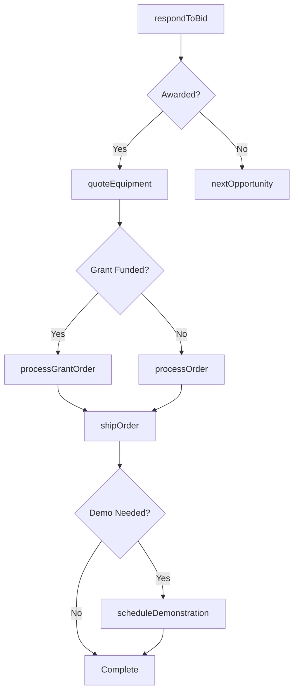
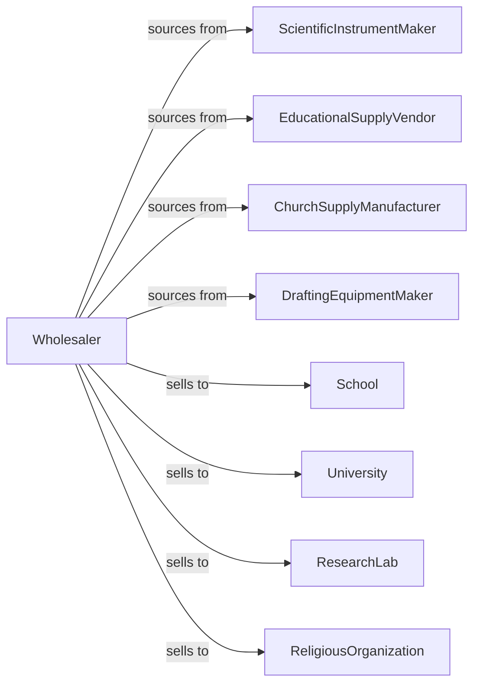

# Other Professional Equipment and Supplies Merchant Wholesalers

> Business-as-Code definition for specialty professional equipment wholesale distribution. Models procurement, institutional sales, and fulfillment for scientific, educational, and religious supplies.

## Overview

Other professional equipment wholesalers distribute scientific instruments, laboratory equipment, school supplies, drafting tools, church supplies, and specialty professional products to institutions, schools, and specialized buyers. This definition exposes actions for product sourcing, bid management, and institutional fulfillment with events for grant cycles and inventory optimization.

## Actors

| Actor | Description |
|-------|-------------|
| ScientificInstrumentMaker | Produces laboratory and research equipment |
| EducationalSupplyVendor | Manufactures school supplies and equipment |
| ChurchSupplyManufacturer | Produces religious goods and supplies |
| DraftingEquipmentMaker | Makes drafting and design tools |
| School | K-12 educational institution |
| University | Higher education institution |
| ResearchLab | Scientific research facility |
| ReligiousOrganization | Church, temple, or religious institution |

## Roles

| Role | Description |
|------|-------------|
| ProductSpecialist | Expert in specific equipment categories |
| InstitutionalSalesRep | Serves schools and institutional accounts |
| BidCoordinator | Manages competitive bidding processes |
| TechnicalConsultant | Provides product expertise |
| OrderFulfillmentSpec | Handles complex institutional orders |

## Entities

| Entity | Description |
|--------|-------------|
| Product | Professional equipment or supply item |
| Inventory | Stock levels across locations |
| PurchaseOrder | Order placed with manufacturer |
| SalesOrder | Customer order for products |
| Bid | Competitive procurement response |
| Contract | Institutional purchase agreement |
| Grant | Funding source for purchase |
| Quote | Price quotation for equipment |
| Catalog | Product catalog for institution type |
| Demonstration | Equipment demonstration event |
| Certification | Product safety or compliance cert |

## Actions

| Action | Description |
|--------|-------------|
| sourceProduct | Identify and onboard product lines |
| placeOrder | Submit purchase order to manufacturer |
| receiveInventory | Check in incoming products |
| stockWarehouse | Store products in locations |
| respondToBid | Submit competitive bid response |
| quoteEquipment | Price equipment for customer |
| processOrder | Fulfill institutional order |
| shipOrder | Dispatch products to customer |
| scheduleDemonstration | Arrange product demonstration |
| processGrantOrder | Handle grant-funded purchase |
| trackCertification | Monitor product certifications |
| supportInstallation | Assist with equipment setup |
| handleReturn | Process returns and exchanges |
| forecastDemand | Project product requirements |

## Events

| Event | Description |
|-------|-------------|
| orderReceived | Customer placed order |
| inventoryReceived | Manufacturer shipment arrived |
| orderShipped | Products dispatched |
| orderDelivered | Customer received products |
| bidSubmitted | Competitive bid filed |
| bidAwarded | Won competitive procurement |
| grantApproved | Funding authorized |
| demonstrationScheduled | Product demo confirmed |
| certificationExpiring | Certification needs renewal |
| contractRenewed | Institutional agreement renewed |
| stockLow | Inventory below threshold |
| catalogUpdated | New product catalog available |

## Searches

| Search | Description |
|--------|-------------|
| findProducts | Search by category, application, specs |
| getInventory | Check stock levels |
| getOrders | Retrieve orders by status |
| getBids | Track bid opportunities |
| getContracts | List institutional agreements |
| getGrants | Track grant-funded orders |
| getDemonstrations | View scheduled demos |

## Workflow



## Actor Relationships



## Usage

### Calling Actions

```typescript
import { wholesaleProfessionalEquipment } from '@headlessly/wholesale-professional-equipment'

const wholesaler = wholesaleProfessionalEquipment()

// Search laboratory equipment
const microscopes = await wholesaler.findProducts({
  category: 'microscope',
  type: 'digital',
  magnification: { min: 1000 }
})

// Respond to school district bid
const bid = await wholesaler.respondToBid({
  bidId: 'RFP-2024-SCIENCE',
  institution: 'unified-school-district',
  items: [
    { productId: 'MICRO-DIG-1000', quantity: 50, unitPrice: 450 }
  ],
  deliveryWindow: '30-days',
  warranty: '3-years'
})

// Process grant-funded order
await wholesaler.processGrantOrder({
  customerId: 'university-chem-dept',
  grantId: 'NSF-2024-123',
  items: [
    { productId: 'SPEC-UV-VIS', quantity: 2 }
  ],
  complianceDocuments: true
})
```

### Event-Driven Automation

```typescript
// Track bid outcomes
wholesaler.bidAwarded(async ({ bidId, institutionId, amount }) => {
  await wholesaler.quoteEquipment({
    bidId,
    institutionId,
    finalPricing: true
  })

  await scheduleFollowUp({
    institutionId,
    type: 'order-confirmation',
    daysOut: 5
  })
})

// Alert on certification expiry
wholesaler.certificationExpiring(async ({ productId, certType, daysRemaining }) => {
  if (daysRemaining <= 30) {
    await wholesaler.trackCertification({
      productId,
      action: 'renew',
      priority: 'urgent'
    })
  }
})
```
