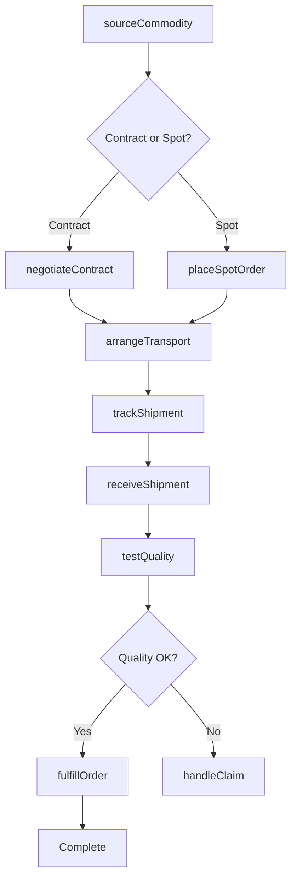
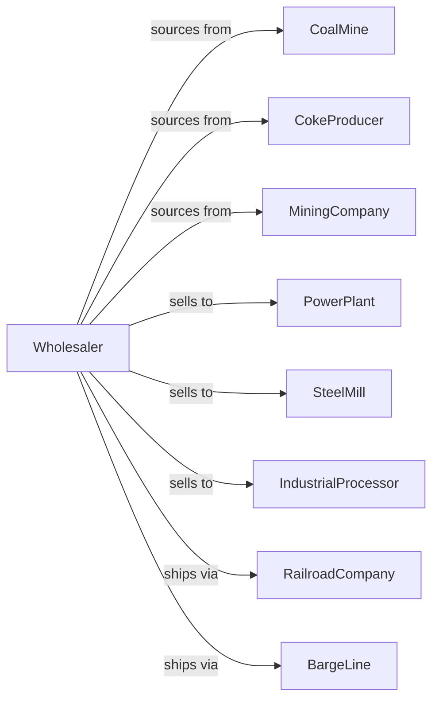

# Coal and Other Mineral and Ore Merchant Wholesalers

> Business-as-Code definition for coal and mineral wholesale distribution. Models procurement, logistics, and industrial buyer fulfillment for coal, coke, and mineral ores.

## Overview

Coal and mineral wholesalers distribute thermal coal, metallurgical coal, coke, metal ores, and industrial minerals to power plants, steel mills, manufacturers, and industrial processors. This definition exposes actions for commodity sourcing, logistics management, and bulk delivery with events for market pricing and contract optimization.

## Actors

| Actor | Description |
|-------|-------------|
| CoalMine | Produces thermal and metallurgical coal |
| CokeProducer | Manufactures coke for steelmaking |
| MiningCompany | Produces metal ores and minerals |
| PowerPlant | Utility consuming thermal coal |
| SteelMill | Consumes met coal and coke |
| IndustrialProcessor | Uses minerals in manufacturing |
| RailroadCompany | Provides bulk rail transportation |
| BargeLine | Provides river and lake shipping |

## Roles

| Role | Description |
|------|-------------|
| CommodityTrader | Sources minerals and manages contracts |
| LogisticsManager | Coordinates bulk transportation |
| SalesRepresentative | Serves industrial customer accounts |
| QualitySpecialist | Monitors mineral specifications |
| ContractAdministrator | Manages supply agreements |

## Entities

| Entity | Description |
|--------|-------------|
| Commodity | Coal, coke, ore, or mineral product |
| Inventory | Stock at terminals and transload facilities |
| SupplyContract | Long-term supply agreement |
| SpotOrder | Single delivery purchase |
| Shipment | Bulk transportation movement |
| QualityReport | Mineral analysis and specifications |
| Terminal | Storage and transload facility |
| RailCar | Unit train or rail shipment |
| Barge | River or lake transport vessel |
| PriceIndex | Market benchmark pricing |
| Certificate | Origin and quality certification |

## Actions

| Action | Description |
|--------|-------------|
| sourceCommodity | Identify and contract with mines |
| negotiateContract | Establish supply agreement |
| placeSpotOrder | Purchase for immediate delivery |
| arrangeTransport | Schedule rail or barge shipment |
| receiveShipment | Check in at terminal |
| storeInventory | Hold at terminal facility |
| testQuality | Analyze mineral specifications |
| fulfillOrder | Dispatch to customer |
| trackShipment | Monitor transport progress |
| manageContract | Administer supply agreements |
| hedgePrice | Lock in commodity pricing |
| certifyOrigin | Document source and quality |
| handleClaim | Process quality or quantity dispute |
| forecastDemand | Project customer requirements |

## Events

| Event | Description |
|-------|-------------|
| contractExecuted | Supply agreement signed |
| shipmentDispatched | Commodity left origin |
| shipmentReceived | Arrived at terminal |
| shipmentDelivered | Customer received commodity |
| qualityTested | Analysis results available |
| priceIndexChanged | Market benchmark shifted |
| hedgeExecuted | Price protection established |
| claimFiled | Quality dispute submitted |
| contractRenewalDue | Agreement approaching expiry |
| inventoryLow | Terminal stock below threshold |
| demandForecasted | Usage projection updated |
| transportDelayed | Shipment behind schedule |

## Searches

| Search | Description |
|--------|-------------|
| findCommodity | Search by type, grade, origin |
| getInventory | Check terminal stock levels |
| getContracts | List supply agreements |
| getShipments | Track transport movements |
| getQualityReports | Access analysis results |
| getPricing | View market index prices |
| getClaims | Track quality disputes |

## Workflow



## Actor Relationships



## Usage

### Calling Actions

```typescript
import { wholesaleCoal } from '@headlessly/wholesale-coal'

const wholesaler = wholesaleCoal()

// Search available coal
const coal = await wholesaler.findCommodity({
  type: 'thermal-coal',
  btu: { min: 12000 },
  sulfur: { max: 1.0 },
  origin: 'powder-river-basin'
})

// Negotiate supply contract
const contract = await wholesaler.negotiateContract({
  supplierId: 'prb-mine-123',
  commodity: coal[0].id,
  volume: 500000,
  unit: 'tons',
  term: '12-months',
  priceFormula: 'index-plus-5'
})

// Arrange unit train shipment
await wholesaler.arrangeTransport({
  contractId: contract.id,
  quantity: 12000,
  unit: 'tons',
  mode: 'unit-train',
  origin: 'mine-loadout',
  destination: 'power-plant-456'
})
```

### Event-Driven Automation

```typescript
// Hedge on price movements
wholesaler.priceIndexChanged(async ({ commodity, changePercent }) => {
  if (changePercent > 5) {
    await wholesaler.hedgePrice({
      commodity,
      action: 'sell-forward',
      volume: calculateHedgeVolume(commodity)
    })
  }
})

// Alert on transport delays
wholesaler.transportDelayed(async ({ shipmentId, hoursDelayed, customerId }) => {
  if (hoursDelayed > 24) {
    await notifyCustomer({
      customerId,
      shipmentId,
      newEta: calculateNewEta(shipmentId)
    })
  }
})
```
