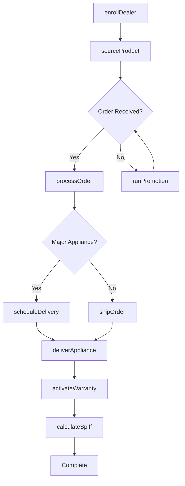
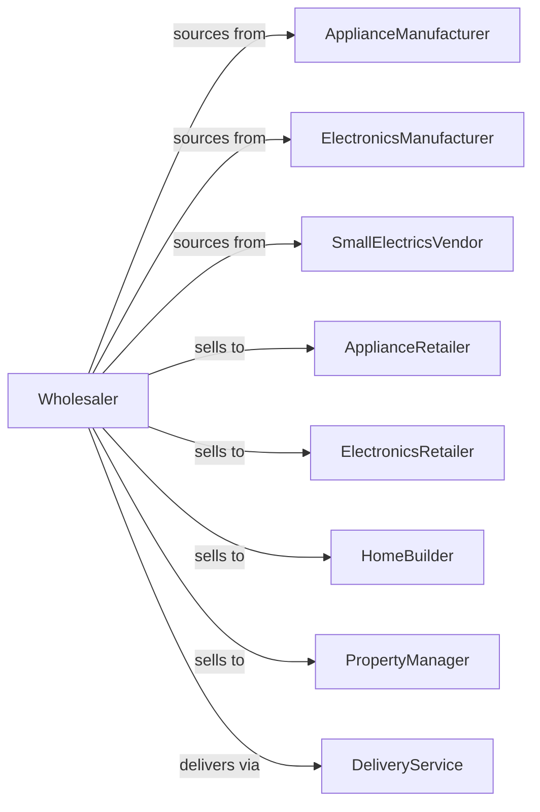

# Household Appliances, Electric Housewares, and Consumer Electronics Merchant Wholesalers

> Business-as-Code definition for consumer appliance wholesale distribution. Models procurement, dealer programs, and retail fulfillment for major appliances and consumer electronics.

## Overview

Household appliance wholesalers distribute major appliances, small electrics, audio/video equipment, and consumer electronics to retailers, builders, and property managers. This definition exposes actions for product sourcing, dealer program management, and delivery coordination with events for product launches and inventory optimization.

## Actors

| Actor | Description |
|-------|-------------|
| ApplianceManufacturer | Produces major home appliances |
| ElectronicsManufacturer | Makes consumer electronics |
| SmallElectricsVendor | Produces small kitchen appliances |
| ApplianceRetailer | Sells appliances to consumers |
| ElectronicsRetailer | Sells consumer electronics |
| HomeBuilder | Purchases appliances for new homes |
| PropertyManager | Buys appliances for rental units |
| DeliveryService | Provides white-glove delivery |

## Roles

| Role | Description |
|------|-------------|
| BrandManager | Manages manufacturer relationships |
| SalesRepresentative | Serves dealer and builder accounts |
| WarehouseManager | Oversees inventory and logistics |
| MarketingCoordinator | Manages promotions and programs |
| ServiceCoordinator | Handles warranty and service issues |

## Entities

| Entity | Description |
|--------|-------------|
| Product | Appliance or electronics item |
| Inventory | Stock levels across warehouses |
| PurchaseOrder | Order placed with manufacturer |
| SalesOrder | Dealer or customer order |
| DealerProgram | Retailer incentive agreement |
| Promotion | Manufacturer rebate or spiff |
| Delivery | Scheduled appliance delivery |
| Warranty | Product warranty information |
| Demo | Demonstration or display unit |
| RMA | Return merchandise authorization |
| SpiffPayment | Dealer incentive payment |

## Actions

| Action | Description |
|--------|-------------|
| sourceProduct | Identify and onboard brands |
| placeOrder | Submit purchase order to manufacturer |
| receiveInventory | Check in incoming products |
| stockWarehouse | Store products in locations |
| enrollDealer | Authorize new retail partner |
| processOrder | Fulfill dealer or builder order |
| scheduleDelivery | Arrange appliance delivery |
| shipOrder | Dispatch products to customer |
| runPromotion | Execute manufacturer incentive |
| processRMA | Handle defective returns |
| activateWarranty | Register product warranty |
| provideDemo | Send display or demo units |
| calculateSpiff | Compute dealer incentive |
| forecastDemand | Project product requirements |

## Events

| Event | Description |
|-------|-------------|
| orderReceived | Customer placed order |
| inventoryReceived | Manufacturer shipment arrived |
| orderShipped | Products dispatched |
| orderDelivered | Customer received products |
| deliveryScheduled | Appliance delivery confirmed |
| promotionStarted | Incentive program launched |
| promotionEnded | Incentive program concluded |
| spiffEarned | Dealer qualified for incentive |
| warrantyRegistered | Product warranty activated |
| rmaIssued | Return authorization created |
| newProductLaunched | New model available |
| stockLow | Inventory below threshold |

## Searches

| Search | Description |
|--------|-------------|
| findProducts | Search by category, brand, features |
| getInventory | Check stock levels |
| getOrders | Retrieve orders by status |
| getDealers | Search retail partners |
| getPromotions | List active incentives |
| getDeliveries | Track scheduled deliveries |
| getSpiffs | View dealer incentive status |

## Workflow



## Actor Relationships



## Usage

### Calling Actions

```typescript
import { wholesaleHouseholdAppliances } from '@headlessly/wholesale-household-appliances'

const wholesaler = wholesaleHouseholdAppliances()

// Search major appliances
const refrigerators = await wholesaler.findProducts({
  category: 'refrigerator',
  brand: 'lg',
  style: 'french-door',
  capacity: { min: 25 }
})

// Process builder order
const order = await wholesaler.processOrder({
  customerId: 'builder-456',
  projectName: 'Maple Ridge Phase 2',
  items: [
    { sku: 'LG-FD-26-SS', quantity: 20 },
    { sku: 'LG-DW-SS-FI', quantity: 20 },
    { sku: 'LG-RNG-SS-30', quantity: 20 }
  ],
  builderProgram: 'volume-plus'
})

// Schedule appliance delivery
await wholesaler.scheduleDelivery({
  orderId: order.id,
  address: '5678 New Home Lane, Unit 1-20',
  date: '2024-04-01',
  whiteGlove: true,
  haulaway: false
})
```

### Event-Driven Automation

```typescript
// Process dealer spiffs
wholesaler.spiffEarned(async ({ dealerId, amount, products }) => {
  await wholesaler.calculateSpiff({
    dealerId,
    products,
    period: getCurrentMonth()
  })

  await processPayment({
    dealerId,
    amount,
    type: 'spiff'
  })
})

// Announce new product launches
wholesaler.newProductLaunched(async ({ productId, brand, category }) => {
  const dealers = await wholesaler.getDealers({
    brands: [brand],
    status: 'active'
  })

  for (const dealer of dealers) {
    await sendProductAnnouncement({
      dealerId: dealer.id,
      productId
    })
  }
})
```
