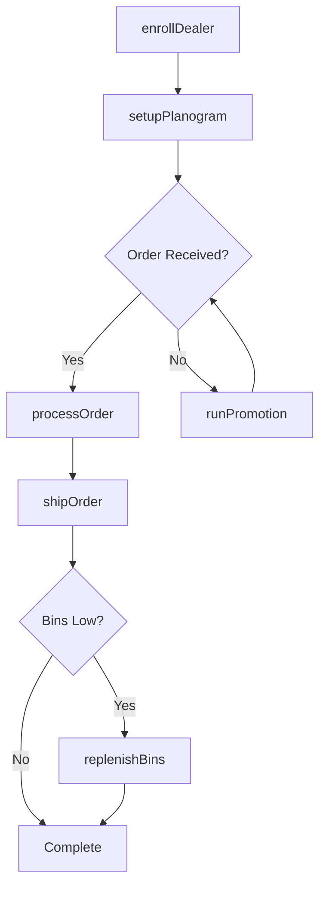
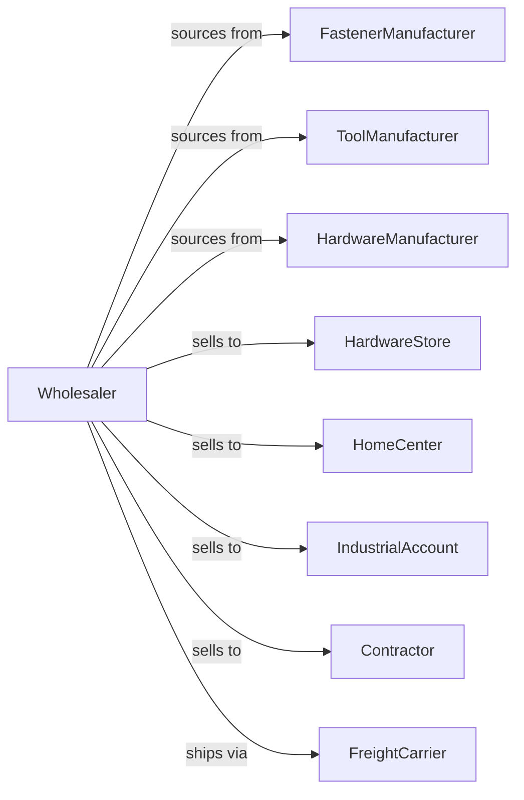

# Hardware Merchant Wholesalers

> Business-as-Code definition for hardware wholesale distribution. Models procurement, dealer programs, and fulfillment for fasteners, tools, and builders hardware.

## Overview

Hardware wholesalers distribute fasteners, hand tools, power tools, builders hardware, and cutlery to hardware stores, home centers, and industrial accounts. This definition exposes actions for product sourcing, dealer program management, and inventory replenishment with events for seasonal demand and stock optimization.

## Actors

| Actor | Description |
|-------|-------------|
| FastenerManufacturer | Produces screws, bolts, and fasteners |
| ToolManufacturer | Makes hand and power tools |
| HardwareManufacturer | Produces locks, hinges, and builders hardware |
| HardwareStore | Independent hardware retailer |
| HomeCenter | Big-box home improvement retailer |
| IndustrialAccount | Factory or manufacturer |
| Contractor | Professional tradesperson |
| FreightCarrier | Provides delivery services |

## Roles

| Role | Description |
|------|-------------|
| ProductManager | Manages manufacturer lines |
| SalesRepresentative | Serves dealer and industrial accounts |
| WarehouseManager | Oversees inventory and fulfillment |
| MerchandisingSpecialist | Supports retail planogram and displays |
| ProgramCoordinator | Manages dealer programs |

## Entities

| Entity | Description |
|--------|-------------|
| Product | Hardware item with SKU and specs |
| Inventory | Stock levels across warehouses |
| PurchaseOrder | Order placed with manufacturer |
| SalesOrder | Customer order for products |
| DealerProgram | Retailer buying group or program |
| Planogram | Retail display configuration |
| Catalog | Product catalog for dealers |
| Promotion | Manufacturer rebate or special |
| Bin | Retail bin stock item |
| Quote | Price quotation for products |
| Return | Customer return authorization |

## Actions

| Action | Description |
|--------|-------------|
| sourceProduct | Identify and onboard product lines |
| placeOrder | Submit purchase order to manufacturer |
| receiveInventory | Check in incoming products |
| stockWarehouse | Store products in locations |
| enrollDealer | Add dealer to buying program |
| processOrder | Fulfill dealer or industrial order |
| shipOrder | Dispatch products to customer |
| replenishBins | Restock dealer bin inventory |
| setupPlanogram | Configure retail display |
| runPromotion | Execute manufacturer special |
| processReturn | Handle customer returns |
| updateCatalog | Maintain product information |
| forecastSeasonal | Project seasonal demand |
| manageCoop | Administer cooperative advertising |

## Events

| Event | Description |
|-------|-------------|
| orderReceived | Customer placed order |
| inventoryReceived | Manufacturer shipment arrived |
| orderShipped | Products dispatched |
| orderDelivered | Customer received products |
| dealerEnrolled | New dealer joined program |
| binReplenished | Dealer bin stock refreshed |
| promotionStarted | Special pricing began |
| planogramUpdated | Display configuration changed |
| catalogReleased | New catalog published |
| seasonChanging | Seasonal demand shifting |
| stockLow | Inventory below threshold |
| coopClaimFiled | Advertising claim submitted |

## Searches

| Search | Description |
|--------|-------------|
| findProducts | Search by category, brand, specs |
| getInventory | Check stock levels |
| getOrders | Retrieve orders by status |
| getDealers | Search program members |
| getPromotions | List active specials |
| getPlanograms | Access display configurations |
| getCoopClaims | Track advertising claims |

## Workflow



## Actor Relationships



## Usage

### Calling Actions

```typescript
import { wholesaleHardware } from '@headlessly/wholesale-hardware'

const wholesaler = wholesaleHardware()

// Search fastener inventory
const screws = await wholesaler.findProducts({
  category: 'fastener',
  type: 'wood-screw',
  size: '#8x2',
  finish: 'zinc'
})

// Enroll dealer in program
const dealer = await wholesaler.enrollDealer({
  businessName: 'Main Street Hardware',
  programId: 'ace-hardware',
  creditLimit: 50000
})

// Setup retail planogram
await wholesaler.setupPlanogram({
  dealerId: dealer.id,
  department: 'fasteners',
  fixtureType: '4ft-gondola',
  bins: 120
})
```

### Event-Driven Automation

```typescript
// Auto-replenish dealer bins
wholesaler.binReplenished(async ({ dealerId, depletedBins }) => {
  for (const bin of depletedBins) {
    await wholesaler.processOrder({
      dealerId,
      items: [{ sku: bin.sku, quantity: bin.parLevel }],
      type: 'auto-replenish'
    })
  }
})

// Prepare for seasonal shift
wholesaler.seasonChanging(async ({ newSeason }) => {
  const forecast = await wholesaler.forecastSeasonal({ season: newSeason })

  await wholesaler.placeOrder({
    items: forecast.recommendedStock,
    priority: 'pre-season'
  })
})
```
