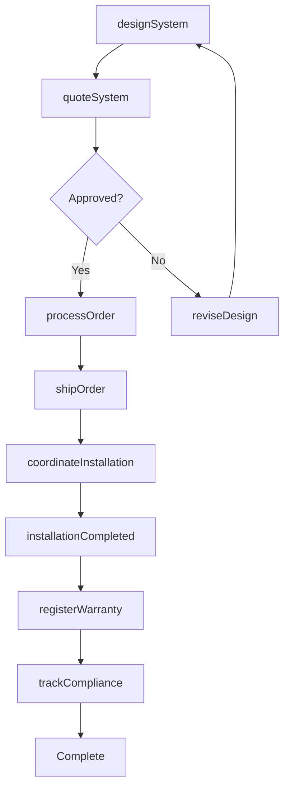
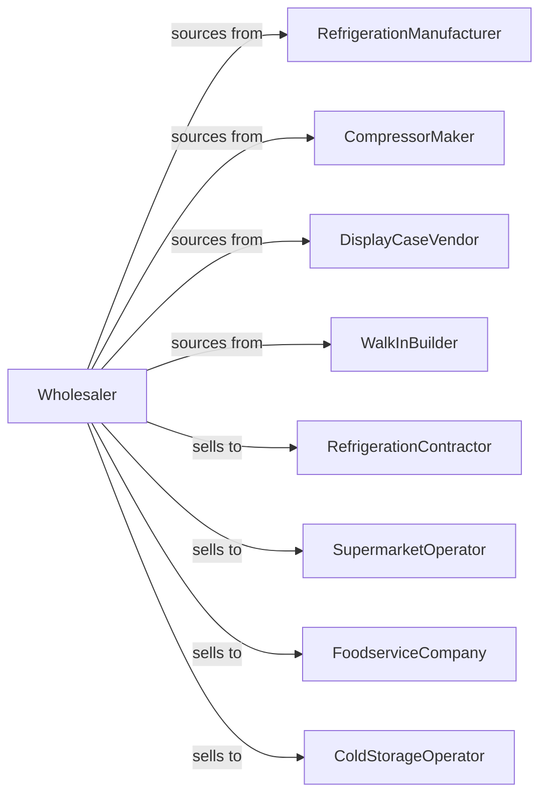

# Refrigeration Equipment and Supplies Merchant Wholesalers

> Business-as-Code definition for commercial refrigeration wholesale distribution. Models procurement, contractor support, and installation coordination for cold storage and display cases.

## Overview

Refrigeration equipment wholesalers distribute commercial refrigerators, freezers, walk-in coolers, display cases, and refrigeration components to foodservice contractors, supermarket installers, and cold storage operators. This definition exposes actions for equipment sourcing, system design support, and installation coordination with events for compliance and inventory optimization.

## Actors

| Actor | Description |
|-------|-------------|
| RefrigerationManufacturer | Produces commercial refrigeration units |
| CompressorMaker | Manufactures refrigeration compressors |
| DisplayCaseVendor | Produces retail display cases |
| WalkInBuilder | Manufactures walk-in coolers and freezers |
| RefrigerationContractor | Installs commercial refrigeration |
| SupermarketOperator | End user for retail refrigeration |
| FoodserviceCompany | Restaurant or food processor |
| ColdStorageOperator | Warehouse refrigeration user |

## Roles

| Role | Description |
|------|-------------|
| SalesEngineer | Provides technical sales support |
| SystemDesigner | Assists with refrigeration layout |
| AccountManager | Serves contractor and operator accounts |
| PartsSpecialist | Supports component and repair needs |
| ComplianceCoordinator | Tracks EPA and refrigerant regulations |

## Entities

| Entity | Description |
|--------|-------------|
| Equipment | Refrigeration unit with specs |
| Inventory | Stock levels across locations |
| PurchaseOrder | Order placed with manufacturer |
| SalesOrder | Customer order for equipment |
| SystemDesign | Refrigeration layout and specs |
| Installation | Equipment setup project |
| Refrigerant | Controlled refrigerant chemical |
| Compressor | Refrigeration compressor unit |
| Warranty | Equipment warranty registration |
| EPACompliance | Refrigerant handling documentation |
| Quote | Price quotation for system |

## Actions

| Action | Description |
|--------|-------------|
| sourceEquipment | Identify and onboard product lines |
| placeOrder | Submit purchase order to manufacturer |
| receiveInventory | Check in incoming equipment |
| stockWarehouse | Store equipment in locations |
| designSystem | Create refrigeration layout |
| quoteSystem | Price refrigeration system |
| processOrder | Fulfill equipment order |
| shipOrder | Dispatch equipment |
| coordinateInstallation | Schedule equipment setup |
| sellRefrigerant | Process controlled refrigerant sale |
| registerWarranty | Activate equipment warranty |
| trackCompliance | Monitor EPA documentation |
| supportService | Assist with parts and repair |
| forecastDemand | Project equipment requirements |

## Events

| Event | Description |
|-------|-------------|
| orderReceived | Customer placed order |
| inventoryReceived | Manufacturer shipment arrived |
| orderShipped | Equipment dispatched |
| orderDelivered | Customer received equipment |
| systemDesigned | Layout completed |
| installationScheduled | Setup appointment confirmed |
| installationCompleted | Equipment operational |
| warrantyRegistered | Warranty activated |
| refrigerantSold | Controlled sale completed |
| complianceAudit | EPA documentation reviewed |
| stockLow | Inventory below threshold |
| serviceRequested | Repair support needed |

## Searches

| Search | Description |
|--------|-------------|
| findEquipment | Search by type, capacity, application |
| getInventory | Check stock levels |
| getOrders | Retrieve orders by status |
| getDesigns | Access system layouts |
| getInstallations | Track setup projects |
| getWarranties | View warranty registrations |
| getCompliance | Access EPA documentation |

## Workflow



## Actor Relationships



## Usage

### Calling Actions

```typescript
import { wholesaleRefrigerationEquipment } from '@headlessly/wholesale-refrigeration-equipment'

const wholesaler = wholesaleRefrigerationEquipment()

// Search display cases
const displayCases = await wholesaler.findEquipment({
  type: 'display-case',
  application: 'deli',
  length: '8ft',
  remoteCondenser: true
})

// Design store refrigeration
const design = await wholesaler.designSystem({
  customerId: 'grocery-chain-123',
  storeName: 'Store #45',
  layout: {
    deli: { length: 16, sections: 2 },
    dairy: { length: 24, doors: 12 },
    frozen: { length: 32, doors: 16 }
  }
})

// Coordinate installation
await wholesaler.coordinateInstallation({
  designId: design.id,
  startDate: '2024-05-01',
  contractor: 'refrig-install-co',
  phases: ['cases', 'racks', 'startup']
})
```

### Event-Driven Automation

```typescript
// Track EPA compliance
wholesaler.refrigerantSold(async ({ customerId, refrigerantType, quantity }) => {
  await wholesaler.trackCompliance({
    customerId,
    refrigerantType,
    quantity,
    saleDate: new Date(),
    certificationVerified: true
  })
})

// Register warranty on installation
wholesaler.installationCompleted(async ({ orderId, equipment }) => {
  for (const unit of equipment) {
    await wholesaler.registerWarranty({
      serialNumber: unit.serialNumber,
      installDate: new Date(),
      contractorId: unit.installedBy
    })
  }
})
```
