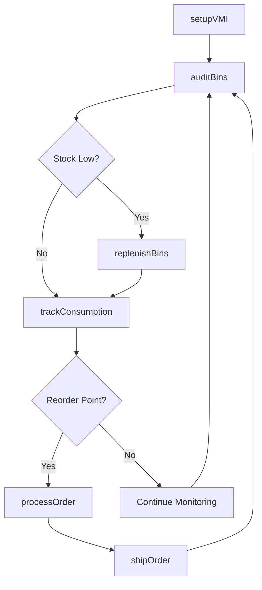

# Industrial Supplies Merchant Wholesalers

> Business-as-Code definition for industrial supplies wholesale distribution. Models MRO procurement, vendor-managed inventory, and technical support for consumables and production supplies.

## Overview

Industrial supplies wholesalers distribute abrasives, cutting tools, welding supplies, lubricants, safety equipment, and industrial chemicals to manufacturers, fabricators, and maintenance operations. This definition exposes actions for product sourcing, VMI programs, and technical application support with events for consumption tracking and inventory optimization.

## Actors

| Actor | Description |
|-------|-------------|
| AbrasivesManufacturer | Produces grinding wheels and abrasive products |
| CuttingToolMaker | Manufactures drills, end mills, and inserts |
| WeldingSupplier | Provides welding consumables and equipment |
| LubricantProducer | Manufactures industrial oils and fluids |
| SafetyEquipmentVendor | Produces PPE and safety products |
| Manufacturer | Produces goods requiring industrial supplies |
| MetalFabricator | Cuts, welds, and forms metal products |
| MaintenanceDept | Maintains plant equipment and facilities |

## Roles

| Role | Description |
|------|-------------|
| TechnicalSalesRep | Provides product application expertise |
| ProductSpecialist | Supports specific product categories |
| VMICoordinator | Manages vendor-managed inventory programs |
| InsideSalesRep | Handles phone and online orders |
| WarehouseManager | Oversees inventory and fulfillment |

## Entities

| Entity | Description |
|--------|-------------|
| Product | Industrial supply item with specs |
| Inventory | Stock levels across locations |
| PurchaseOrder | Order placed with manufacturer |
| SalesOrder | Customer order for supplies |
| VMIProgram | Vendor-managed inventory agreement |
| BinStock | Customer site inventory location |
| Consumption | Usage data for supplies |
| Quote | Price quotation for products |
| Contract | Pricing agreement with customer |
| SafetyData | SDS sheets and compliance docs |
| TechnicalData | Product specifications and guides |

## Actions

| Action | Description |
|--------|-------------|
| sourceProduct | Identify and onboard product lines |
| placeOrder | Submit purchase order to manufacturer |
| receiveInventory | Check in incoming products |
| stockWarehouse | Store products in locations |
| setupVMI | Establish vendor-managed inventory |
| replenishBins | Restock customer site inventory |
| quoteProducts | Price products for customer |
| processOrder | Fulfill customer supply order |
| shipOrder | Dispatch products to customer |
| trackConsumption | Monitor customer usage |
| provideTechnical | Supply application support |
| processReturn | Handle customer returns |
| maintainSDS | Manage safety data sheets |
| auditBins | Verify customer site inventory |

## Events

| Event | Description |
|-------|-------------|
| orderReceived | Customer placed order |
| inventoryReceived | Manufacturer shipment arrived |
| orderShipped | Products dispatched |
| orderDelivered | Customer received products |
| vmiSetup | VMI program established |
| binReplenished | Customer inventory restocked |
| consumptionTracked | Usage data recorded |
| stockLow | Inventory below threshold |
| contractRenewed | Pricing agreement extended |
| technicalRequestReceived | Application support needed |
| sdsUpdated | Safety data sheet revised |
| auditCompleted | Bin inventory verified |

## Searches

| Search | Description |
|--------|-------------|
| findProducts | Search by type, brand, specs |
| getInventory | Check stock levels |
| getOrders | Retrieve orders by status |
| getVMIPrograms | List managed inventory accounts |
| getConsumption | View usage reports |
| getContracts | Access pricing agreements |
| getSDS | Retrieve safety data sheets |

## Workflow



## Actor Relationships

```mermaid
graph LR
    W[Wholesaler]

    W -->|sources from| AbrasivesManufacturer
    W -->|sources from| CuttingToolMaker
    W -->|sources from| WeldingSupplier
    W -->|sources from| LubricantProducer
    W -->|sources from| SafetyEquipmentVendor
    W -->|sells to| Manufacturer
    W -->|sells to| MetalFabricator
    W -->|sells to| MaintenanceDept
```



## Usage

### Calling Actions

```typescript
import { wholesaleIndustrialSupplies } from '@headlessly/wholesale-industrial-supplies'

const wholesaler = wholesaleIndustrialSupplies()

// Search cutting tools
const endMills = await wholesaler.findProducts({
  category: 'cutting-tool',
  type: 'end-mill',
  diameter: 0.5,
  material: 'carbide',
  coating: 'TiAlN'
})

// Setup VMI program
const vmi = await wholesaler.setupVMI({
  customerId: 'fabricator-456',
  locations: [
    { name: 'tool-crib', bins: 50 },
    { name: 'welding-station', bins: 20 }
  ],
  replenishmentType: 'min-max',
  visitFrequency: 'weekly'
})

// Replenish customer bins
await wholesaler.replenishBins({
  vmiId: vmi.id,
  location: 'tool-crib',
  items: [
    { productId: endMills[0].id, quantity: 10 },
    { productId: 'DRILL-1/4-COBALT', quantity: 25 }
  ]
})
```

### Event-Driven Automation

```typescript
// Auto-replenish on low stock
wholesaler.stockLow(async ({ customerId, vmiId, location, products }) => {
  await wholesaler.replenishBins({
    vmiId,
    location,
    items: products.map(p => ({
      productId: p.id,
      quantity: p.maxLevel - p.currentLevel
    }))
  })
})

// Generate consumption reports
wholesaler.consumptionTracked(async ({ customerId, period }) => {
  const report = await generateConsumptionReport({
    customerId,
    period,
    includesTrends: true
  })

  await sendReport({ customerId, report })
})
```
