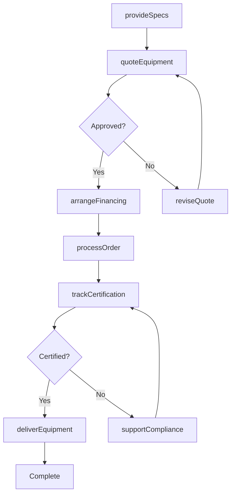
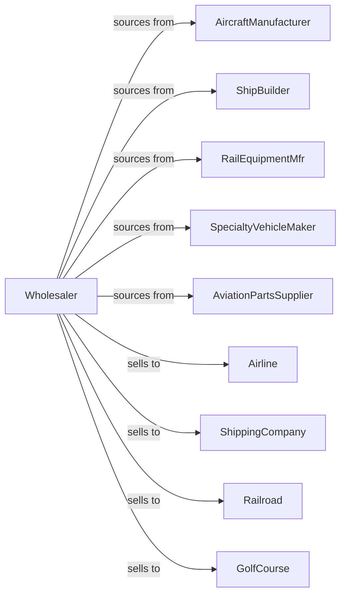

# Transportation Equipment and Supplies (except Motor Vehicle) Merchant Wholesalers

> Business-as-Code definition for transportation equipment wholesale distribution. Models procurement, technical sales, and support services for aircraft, marine vessels, railroad equipment, and specialty vehicles.

## Overview

Transportation equipment wholesalers distribute aircraft, helicopters, commercial vessels, railroad cars, locomotives, and specialty vehicles like golf carts to airlines, shipping companies, railroads, and recreation facilities. This definition exposes actions for equipment sourcing, technical specification support, and parts fulfillment with events for regulatory compliance and fleet management.

## Actors

| Actor | Description |
|-------|-------------|
| AircraftManufacturer | Produces fixed-wing aircraft and helicopters |
| ShipBuilder | Constructs commercial and industrial vessels |
| RailEquipmentMfr | Manufactures locomotives and rail cars |
| SpecialtyVehicleMaker | Produces golf carts and utility vehicles |
| AviationPartsSupplier | Provides aircraft components and spares |
| Airline | Operates passenger or cargo air service |
| ShippingCompany | Operates commercial marine vessels |
| Railroad | Operates freight or passenger rail service |
| GolfCourse | Uses golf carts for course operations |

## Roles

| Role | Description |
|------|-------------|
| AviationSalesRep | Sells aircraft and aviation equipment |
| MarineSpecialist | Provides vessel expertise |
| RailEquipmentMgr | Manages rail equipment accounts |
| TechnicalAdvisor | Supports equipment specifications |
| PartsManager | Manages parts inventory and fulfillment |

## Entities

| Entity | Description |
|--------|-------------|
| Equipment | Transportation asset with specifications |
| Inventory | Available new and used equipment |
| PurchaseOrder | Order placed with manufacturer |
| SalesOrder | Customer order for equipment |
| Part | Replacement component |
| Certification | Regulatory approval document |
| Specification | Technical equipment requirements |
| Warranty | Equipment warranty coverage |
| Financing | Loan or lease arrangement |
| Compliance | Regulatory compliance record |
| ServiceBulletin | Manufacturer service notice |

## Actions

| Action | Description |
|--------|-------------|
| sourceEquipment | Identify and order from manufacturers |
| receiveEquipment | Inspect and check in equipment |
| quoteEquipment | Price equipment with specifications |
| processOrder | Fulfill customer equipment order |
| deliverEquipment | Transport to customer location |
| provideSpecs | Supply technical specifications |
| orderParts | Procure replacement components |
| shipParts | Dispatch parts to customer |
| arrangeFinancing | Structure loan or lease |
| trackCertification | Monitor regulatory compliance |
| issueServiceBulletin | Distribute manufacturer notices |
| supportCompliance | Assist with regulatory requirements |
| appraiseEquipment | Value used equipment |
| brokerSale | Facilitate equipment transaction |

## Events

| Event | Description |
|-------|-------------|
| quoteRequested | Customer requested pricing |
| orderPlaced | Customer purchased equipment |
| equipmentShipped | Equipment dispatched |
| equipmentDelivered | Customer received equipment |
| certificationRequired | Regulatory approval needed |
| certificationObtained | Regulatory approval received |
| partOrdered | Component request received |
| partShipped | Replacement part dispatched |
| serviceBulletinIssued | Manufacturer notice released |
| complianceDue | Regulatory deadline approaching |
| financingApproved | Loan or lease approved |
| equipmentAppraised | Used equipment valued |

## Searches

| Search | Description |
|--------|-------------|
| findEquipment | Search by type, capacity, specs |
| getInventory | Check available equipment |
| getOrders | Retrieve orders by status |
| getParts | Search parts availability |
| getCertifications | View regulatory status |
| getServiceBulletins | List active notices |
| getCompliance | Track regulatory requirements |

## Workflow



## Actor Relationships



## Usage

### Calling Actions

```typescript
import { wholesaleTransportationEquipment } from '@headlessly/wholesale-transportation-equipment'

const wholesaler = wholesaleTransportationEquipment()

// Search aircraft inventory
const aircraft = await wholesaler.findEquipment({
  type: 'turboprop',
  seats: { min: 6, max: 12 },
  range: { min: 1000 },
  condition: 'used'
})

// Get specifications
const specs = await wholesaler.provideSpecs({
  equipmentId: aircraft[0].id,
  include: ['avionics', 'engines', 'maintenance-history']
})

// Quote with financing
const quote = await wholesaler.quoteEquipment({
  customerId: 'charter-ops-123',
  equipmentId: aircraft[0].id,
  financing: {
    type: 'lease',
    term: 60,
    residual: 45
  }
})
```

### Event-Driven Automation

```typescript
// Track certification requirements
wholesaler.certificationRequired(async ({ equipmentId, certificationType, deadline }) => {
  await wholesaler.supportCompliance({
    equipmentId,
    certificationType,
    documents: gatherDocuments(certificationType),
    submitBy: subDays(deadline, 30)
  })
})

// Distribute service bulletins
wholesaler.serviceBulletinIssued(async ({ bulletinId, affectedEquipment }) => {
  const customers = await getCustomersWithEquipment(affectedEquipment)

  for (const customer of customers) {
    await notifyCustomer({
      customerId: customer.id,
      subject: 'Service Bulletin Alert',
      bulletinId,
      affectedUnits: customer.equipment
    })
  }
})
```
