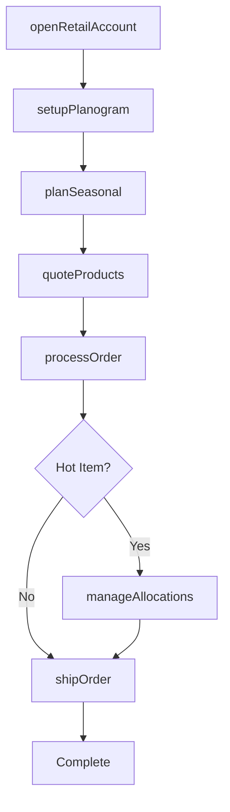
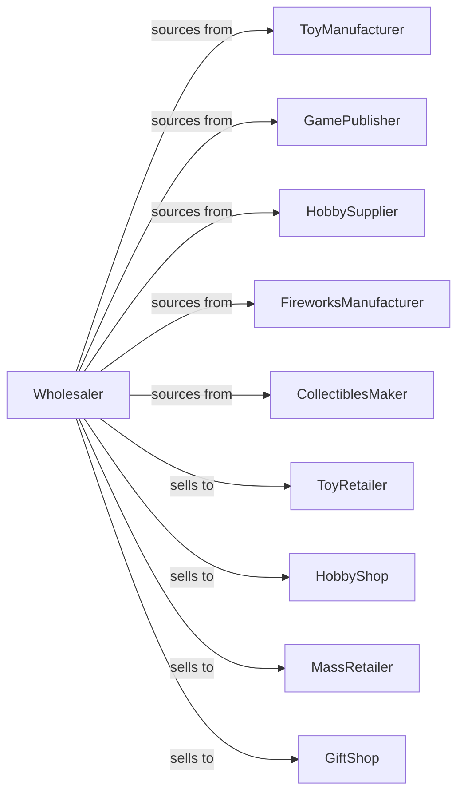

# Toy and Hobby Goods and Supplies Merchant Wholesalers

> Business-as-Code definition for toy and hobby wholesale distribution. Models procurement, seasonal planning, and retail support for toys, games, hobby supplies, and collectibles.

## Overview

Toy and hobby wholesalers distribute toys, games, puzzles, hobby kits, model supplies, fireworks, and collectibles to toy stores, hobby shops, and mass retailers. This definition exposes actions for product sourcing, seasonal inventory management, and retail merchandising support with events for holiday demand and product lifecycle.

## Actors

| Actor | Description |
|-------|-------------|
| ToyManufacturer | Produces toys and playthings |
| GamePublisher | Creates board games and puzzles |
| HobbySupplier | Makes model kits and craft supplies |
| FireworksManufacturer | Produces consumer fireworks |
| CollectiblesMaker | Creates trading cards and collectibles |
| ToyRetailer | Sells toys to consumers |
| HobbyShop | Specializes in hobby and craft supplies |
| MassRetailer | Large chain selling toys |
| GiftShop | Retails gifts and novelties |

## Roles

| Role | Description |
|------|-------------|
| CategoryManager | Manages toy and game categories |
| SalesRepresentative | Serves retail accounts |
| MerchandisingSpecialist | Supports retail displays |
| SeasonalPlanner | Coordinates holiday inventory |
| WarehouseManager | Oversees inventory and fulfillment |

## Entities

| Entity | Description |
|--------|-------------|
| Product | Toy, game, or hobby item |
| Inventory | Stock levels by location |
| PurchaseOrder | Order placed with manufacturer |
| SalesOrder | Customer order for products |
| Catalog | Product catalog for retailers |
| Planogram | Retail display configuration |
| SeasonalProgram | Holiday buying program |
| Promotion | Manufacturer rebate or special |
| Firework | Regulated consumer firework |
| Collectible | Trading card or limited item |
| Return | Customer return authorization |

## Actions

| Action | Description |
|--------|-------------|
| sourceProduct | Identify and onboard product lines |
| placeOrder | Submit purchase order to manufacturer |
| receiveInventory | Check in incoming products |
| stockWarehouse | Store products in locations |
| openRetailAccount | Set up new retail customer |
| quoteProducts | Price products for retailer |
| processOrder | Fulfill retailer order |
| shipOrder | Dispatch products to customer |
| setupPlanogram | Configure retail display |
| runPromotion | Execute manufacturer special |
| processReturn | Handle retailer returns |
| planSeasonal | Prepare holiday inventory |
| forecastDemand | Project product requirements |
| manageAllocations | Distribute limited products |

## Events

| Event | Description |
|-------|-------------|
| orderReceived | Retailer placed order |
| inventoryReceived | Manufacturer shipment arrived |
| orderShipped | Products dispatched |
| orderDelivered | Customer received products |
| accountOpened | New retailer authorized |
| planogramUpdated | Display configuration changed |
| promotionStarted | Special pricing began |
| holidayApproaching | Peak season coming |
| newProductLaunched | Hot item released |
| allocationIssued | Limited product distributed |
| stockLow | Inventory below threshold |
| returnProcessed | Return completed |

## Searches

| Search | Description |
|--------|-------------|
| findProducts | Search by category, age, brand |
| getInventory | Check stock levels |
| getOrders | Retrieve orders by status |
| getRetailers | List retail accounts |
| getPlanograms | Access display configurations |
| getPromotions | View active specials |
| getAllocations | Track limited product distribution |

## Workflow



## Actor Relationships



## Usage

### Calling Actions

```typescript
import { wholesaleToyHobby } from '@headlessly/wholesale-toy-hobby'

const wholesaler = wholesaleToyHobby()

// Search toys by age group
const toys = await wholesaler.findProducts({
  category: 'toy',
  ageGroup: '5-7',
  type: 'construction',
  brand: 'lego'
})

// Plan holiday inventory
const plan = await wholesaler.planSeasonal({
  season: 'christmas',
  categories: ['toys', 'games', 'puzzles'],
  retailerType: 'specialty',
  deliveryWindow: {
    start: '2024-10-01',
    end: '2024-11-15'
  }
})

// Manage hot item allocation
await wholesaler.manageAllocations({
  productId: 'HOT-TOY-2024',
  totalUnits: 5000,
  distribution: [
    { retailerId: 'toy-store-1', units: 100 },
    { retailerId: 'toy-store-2', units: 75 }
  ]
})
```

### Event-Driven Automation

```typescript
// Prepare for holiday rush
wholesaler.holidayApproaching(async ({ holiday, weeksOut }) => {
  if (holiday === 'christmas' && weeksOut === 12) {
    const forecast = await wholesaler.forecastDemand({ holiday })

    await wholesaler.placeOrder({
      items: forecast.recommendedStock,
      priority: 'holiday-rush'
    })
  }
})

// Notify on hot item release
wholesaler.newProductLaunched(async ({ productId, demand }) => {
  if (demand === 'high') {
    const retailers = await getRetailersWithInterest(productId)

    for (const retailer of retailers) {
      await notifyRetailer({
        retailerId: retailer.id,
        message: `Hot new product ${productId} now available - limited allocation`
      })
    }
  }
})
```
