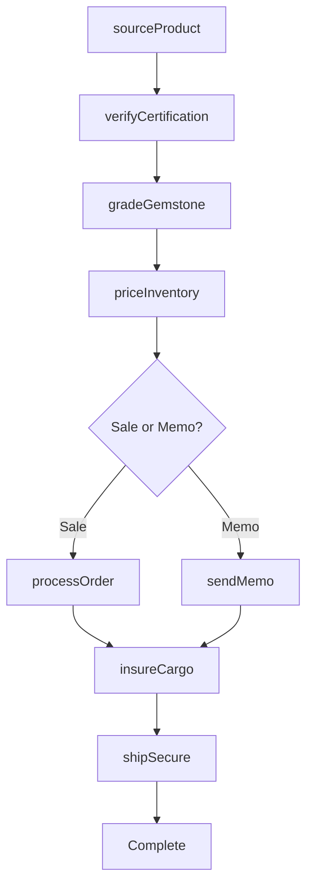
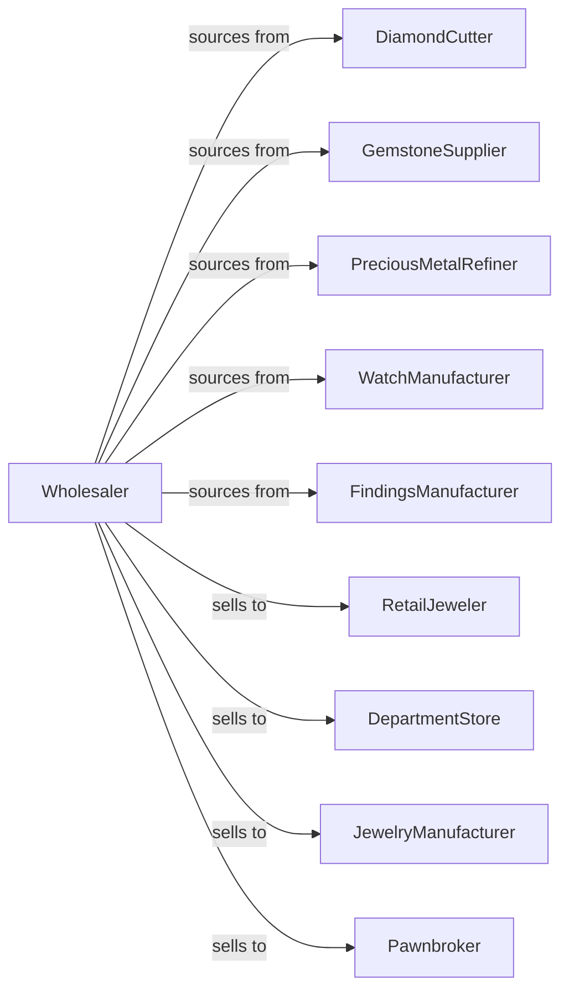

# Jewelry, Watch, Precious Stone, and Precious Metal Merchant Wholesalers

> Business-as-Code definition for jewelry wholesale distribution. Models procurement, authentication, and secure fulfillment for diamonds, gemstones, precious metals, watches, and fine jewelry.

## Overview

Jewelry wholesalers distribute diamonds, precious stones, gold and silver, fine watches, costume jewelry, and jewelers' findings to retail jewelers, department stores, and jewelry manufacturers. This definition exposes actions for product sourcing, certification verification, and secure logistics with events for commodity pricing and authentication.

## Actors

| Actor | Description |
|-------|-------------|
| DiamondCutter | Cuts and polishes diamonds |
| GemstoneSupplier | Sources precious and semi-precious stones |
| PreciousMetalRefiner | Produces gold, silver, and platinum |
| WatchManufacturer | Makes fine and fashion watches |
| FindingsManufacturer | Produces jewelry components |
| RetailJeweler | Sells jewelry to consumers |
| DepartmentStore | Retails jewelry in store jewelry departments |
| JewelryManufacturer | Creates finished jewelry pieces |
| Pawnbroker | Buys and sells jewelry |

## Roles

| Role | Description |
|------|-------------|
| DiamondBuyer | Purchases diamonds and gems |
| Gemologist | Certifies stone quality and authenticity |
| SalesRepresentative | Serves retail accounts |
| SecurityManager | Oversees secure handling |
| CommodityTrader | Manages precious metal pricing |

## Entities

| Entity | Description |
|--------|-------------|
| Diamond | Certified diamond with 4Cs grading |
| Gemstone | Precious or semi-precious stone |
| Metal | Gold, silver, or platinum inventory |
| Watch | Timepiece with brand and specs |
| Finding | Jewelry component or supply |
| Certificate | GIA or authentication document |
| Inventory | Secured stock levels |
| PurchaseOrder | Order placed with supplier |
| SalesOrder | Customer order |
| Memo | Consignment merchandise |
| Appraisal | Value assessment document |
| Insurance | Coverage for goods |

## Actions

| Action | Description |
|--------|-------------|
| sourceProduct | Identify and purchase inventory |
| verifyCertification | Validate GIA or lab certificates |
| gradeGemstone | Assess stone quality |
| priceInventory | Set prices based on market |
| processOrder | Fulfill customer order |
| shipSecure | Dispatch via secure carrier |
| sendMemo | Consign goods to retailer |
| closeMemo | Complete or return consignment |
| buyMetal | Purchase precious metals |
| sellMetal | Trade precious metals |
| processReturn | Handle customer returns |
| appraisePiece | Value jewelry item |
| updatePricing | Adjust for metal spot prices |
| insureCargo | Arrange shipping coverage |

## Events

| Event | Description |
|-------|-------------|
| orderReceived | Customer placed order |
| inventoryReceived | New stock arrived |
| orderShipped | Products dispatched |
| orderDelivered | Customer received products |
| certificationVerified | GIA certificate validated |
| memoSent | Consignment dispatched |
| memoClosed | Consignment completed |
| metalPriceChanged | Spot price shifted |
| diamondPriceChanged | Rapaport list updated |
| appraisalCompleted | Value assessment finished |
| securityAlert | Potential theft or fraud |
| insuranceRenewed | Coverage extended |

## Searches

| Search | Description |
|--------|-------------|
| findDiamonds | Search by carat, cut, clarity, color |
| findGemstones | Search by type, size, quality |
| findWatches | Search by brand, model, features |
| getInventory | Check secured stock |
| getOrders | Retrieve orders by status |
| getMemos | List active consignments |
| getPrices | Get current metal and diamond prices |

## Workflow



## Actor Relationships



## Usage

### Calling Actions

```typescript
import { wholesaleJewelry } from '@headlessly/wholesale-jewelry'

const wholesaler = wholesaleJewelry()

// Search diamond inventory
const diamonds = await wholesaler.findDiamonds({
  carat: { min: 1.0, max: 1.5 },
  cut: 'excellent',
  clarity: ['VS1', 'VS2'],
  color: ['D', 'E', 'F'],
  shape: 'round',
  certified: 'GIA'
})

// Verify certification
const verification = await wholesaler.verifyCertification({
  certificateNumber: 'GIA-123456789',
  lab: 'GIA',
  stoneId: diamonds[0].id
})

// Send memo to retailer
const memo = await wholesaler.sendMemo({
  retailerId: 'jeweler-456',
  items: [
    { productId: diamonds[0].id, price: 12500 },
    { productId: 'WATCH-ROLEX-SUB', price: 9500 }
  ],
  duration: 30,
  insuranceRequired: true
})
```

### Event-Driven Automation

```typescript
// Update pricing on metal changes
wholesaler.metalPriceChanged(async ({ metal, newSpotPrice }) => {
  if (metal === 'gold') {
    await wholesaler.updatePricing({
      category: 'gold-jewelry',
      adjustment: calculateMarkup(newSpotPrice),
      effectiveDate: new Date()
    })
  }
})

// Follow up on open memos
wholesaler.memoSent(async ({ memoId, retailerId, dueDate }) => {
  scheduleReminder({
    date: subDays(dueDate, 7),
    action: async () => {
      await notifyRetailer({
        retailerId,
        message: `Memo ${memoId} due in 7 days - please close or return`
      })
    }
  })
})
```
