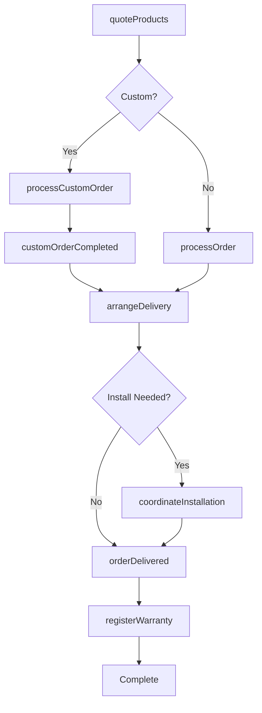
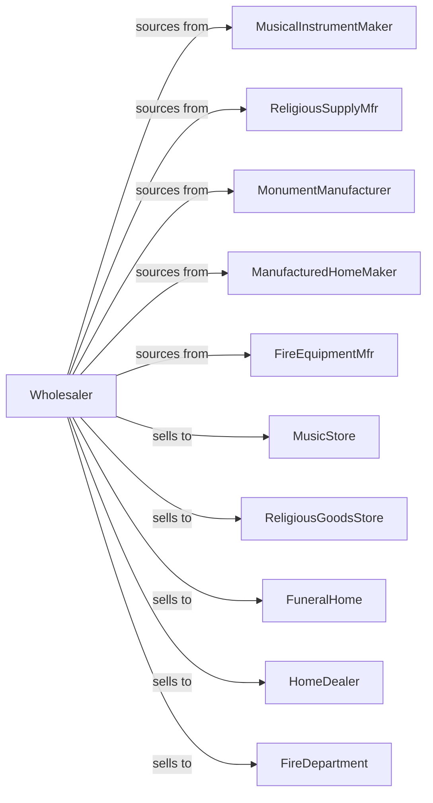

# Other Miscellaneous Durable Goods Merchant Wholesalers

> Business-as-Code definition for miscellaneous durable goods wholesale distribution. Models procurement and fulfillment for musical instruments, religious goods, monuments, manufactured homes, and specialty durable products.

## Overview

Miscellaneous durable goods wholesalers distribute musical instruments, religious supplies, monuments and memorials, manufactured homes, firefighting equipment, and other specialty durable products to retailers, dealers, and institutions. This definition exposes actions for product sourcing, dealer programs, and specialized delivery with events for seasonal demand and custom orders.

## Actors

| Actor | Description |
|-------|-------------|
| MusicalInstrumentMaker | Manufactures instruments and equipment |
| ReligiousSupplyMfr | Produces church and religious goods |
| MonumentManufacturer | Creates headstones and memorials |
| ManufacturedHomeMaker | Builds modular and manufactured homes |
| FireEquipmentMfr | Produces firefighting apparatus |
| MusicStore | Sells instruments to consumers |
| ReligiousGoodsStore | Retails church supplies |
| FuneralHome | Purchases monuments and memorials |
| HomeDealer | Sells manufactured housing |
| FireDepartment | Purchases firefighting equipment |

## Roles

| Role | Description |
|------|-------------|
| ProductSpecialist | Provides expertise on product lines |
| SalesRepresentative | Serves dealer and retail accounts |
| DeliveryCoordinator | Manages specialized transport |
| CustomOrderSpecialist | Handles personalized products |
| WarehouseManager | Oversees inventory operations |

## Entities

| Entity | Description |
|--------|-------------|
| Product | Durable goods item |
| Inventory | Stock levels by category |
| PurchaseOrder | Order placed with manufacturer |
| SalesOrder | Customer order |
| CustomOrder | Personalized or special product |
| DealerProgram | Authorized dealer agreement |
| Delivery | Specialized transport arrangement |
| Installation | Setup service for large items |
| Warranty | Product warranty coverage |
| Catalog | Product listings for dealers |
| Return | Customer return authorization |

## Actions

| Action | Description |
|--------|-------------|
| sourceProduct | Identify and onboard product lines |
| placeOrder | Submit purchase order to manufacturer |
| receiveInventory | Check in incoming products |
| stockWarehouse | Store products in locations |
| enrollDealer | Add dealer to program |
| quoteProducts | Price products for customer |
| processOrder | Fulfill customer order |
| processCustomOrder | Handle personalized items |
| arrangeDelivery | Schedule specialized transport |
| coordinateInstallation | Manage setup service |
| processReturn | Handle customer returns |
| registerWarranty | Activate product coverage |
| runPromotion | Execute sales special |
| manageCatalog | Update product information |

## Events

| Event | Description |
|-------|-------------|
| orderReceived | Customer placed order |
| inventoryReceived | Manufacturer shipment arrived |
| orderShipped | Products dispatched |
| orderDelivered | Customer received products |
| customOrderStarted | Personalized item in production |
| customOrderCompleted | Custom product ready |
| dealerEnrolled | New dealer authorized |
| deliveryScheduled | Transport arranged |
| installationCompleted | Setup finished |
| warrantyRegistered | Coverage activated |
| promotionLaunched | Sales special began |
| catalogUpdated | Product info changed |

## Searches

| Search | Description |
|--------|-------------|
| findProducts | Search by category, brand, specs |
| getInventory | Check stock levels |
| getOrders | Retrieve orders by status |
| getCustomOrders | Track personalized items |
| getDealers | List authorized dealers |
| getDeliveries | View scheduled transports |
| getWarranties | Track active coverage |

## Workflow



## Actor Relationships



## Usage

### Calling Actions

```typescript
import { wholesaleDurableGoods } from '@headlessly/wholesale-durable-goods'

const wholesaler = wholesaleDurableGoods()

// Search musical instruments
const guitars = await wholesaler.findProducts({
  category: 'musical-instrument',
  type: 'electric-guitar',
  brand: 'fender',
  priceRange: { min: 500, max: 1500 }
})

// Process custom monument order
const customOrder = await wholesaler.processCustomOrder({
  customerId: 'funeral-home-123',
  productType: 'granite-headstone',
  specifications: {
    material: 'black-granite',
    size: '36x24x4',
    inscription: 'In Loving Memory',
    design: 'rose-border'
  },
  deliveryDate: '2024-05-15'
})

// Arrange manufactured home delivery
await wholesaler.arrangeDelivery({
  orderId: 'home-order-789',
  deliveryType: 'oversized-transport',
  route: {
    origin: 'factory-location',
    destination: 'dealer-lot',
    permits: ['oversized-load', 'escort-required']
  },
  setupRequired: true
})
```

### Event-Driven Automation

```typescript
// Track custom order progress
wholesaler.customOrderStarted(async ({ orderId, customerId, estimatedCompletion }) => {
  await notifyCustomer({
    customerId,
    message: `Custom order ${orderId} in production. Est. completion: ${estimatedCompletion}`
  })
})

// Schedule follow-up after installation
wholesaler.installationCompleted(async ({ orderId, customerId, productType }) => {
  await wholesaler.registerWarranty({
    orderId,
    startDate: new Date(),
    productType
  })

  scheduleFollowUp({
    customerId,
    date: addDays(new Date(), 30),
    purpose: 'satisfaction-check'
  })
})
```
