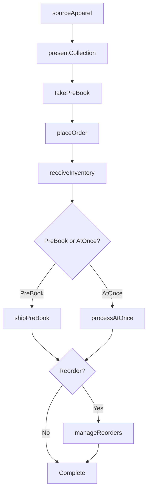
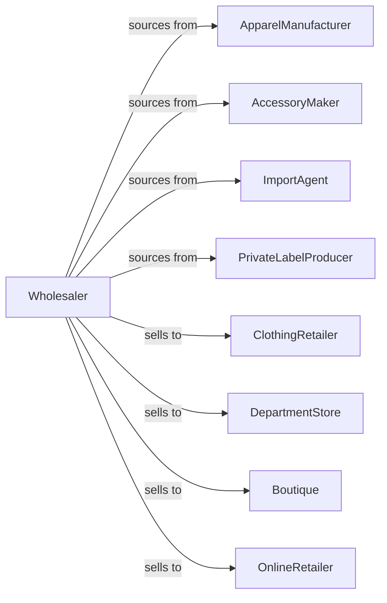

# Clothing and Clothing Accessories Merchant Wholesalers

> Business-as-Code definition for apparel wholesale distribution. Models fashion sourcing, seasonal collection management, and retail fulfillment for clothing, accessories, and fashion goods.

## Overview

Clothing and accessories wholesalers distribute dresses, sportswear, outerwear, lingerie, hosiery, handbags, and fashion accessories to retailers, department stores, and boutiques. This definition exposes actions for product sourcing, seasonal buying, and fashion trend response with events for collection cycles and inventory management.

## Actors

| Actor | Description |
|-------|-------------|
| ApparelManufacturer | Produces clothing and garments |
| AccessoryMaker | Creates handbags, belts, and accessories |
| ImportAgent | Sources apparel from overseas factories |
| PrivateLabelProducer | Makes store-brand merchandise |
| ClothingRetailer | Sells apparel to consumers |
| DepartmentStore | Retails clothing in apparel departments |
| Boutique | Specialty fashion retailer |
| OnlineRetailer | E-commerce apparel seller |

## Roles

| Role | Description |
|------|-------------|
| FashionBuyer | Sources apparel and accessories |
| SalesRepresentative | Serves retail accounts |
| ShowroomManager | Operates sample showroom |
| MerchandisingCoordinator | Supports visual presentation |
| InventoryPlanner | Manages seasonal stock levels |

## Entities

| Entity | Description |
|--------|-------------|
| Garment | Clothing item with style and specs |
| Accessory | Fashion accessory product |
| Inventory | Stock by style-size-color |
| PurchaseOrder | Order placed with manufacturer |
| SalesOrder | Customer order |
| Collection | Seasonal product grouping |
| PreBook | Advance seasonal order |
| AtOnce | Immediate fill order |
| Sample | Showroom display item |
| Markdown | Price reduction record |
| Return | Customer return authorization |

## Actions

| Action | Description |
|--------|-------------|
| sourceApparel | Contract with manufacturers |
| importProduct | Manage overseas shipments |
| placeOrder | Submit purchase order |
| receiveInventory | Check in apparel shipments |
| stockWarehouse | Store by style-size-color |
| presentCollection | Show line to retailers |
| takePreBook | Accept advance orders |
| processAtOnce | Fill immediate orders |
| shipOrder | Dispatch apparel |
| markdownProduct | Reduce prices on slow items |
| processReturn | Handle customer returns |
| trackTrends | Monitor fashion directions |
| forecastSeasonal | Project seasonal demand |
| manageReorders | Handle in-season replenishment |

## Events

| Event | Description |
|-------|-------------|
| orderReceived | Customer placed order |
| inventoryReceived | Manufacturer shipment arrived |
| orderShipped | Products dispatched |
| orderDelivered | Customer received products |
| collectionPresented | Line shown to retailers |
| preBookComplete | Advance orders finalized |
| trendIdentified | Fashion direction noted |
| markdownApplied | Price reduction taken |
| styleDiscontinued | Product ending |
| stockLow | Inventory below threshold |
| seasonChanging | Fashion season shifting |
| returnProcessed | Return completed |

## Searches

| Search | Description |
|--------|-------------|
| findApparel | Search by category, style, size |
| getInventory | Check stock by style-size-color |
| getOrders | Retrieve orders by status |
| getCollections | View seasonal lines |
| getPreBooks | Track advance orders |
| getTrends | Access fashion direction data |
| getCustomers | List retail accounts |

## Workflow



## Actor Relationships



## Usage

### Calling Actions

```typescript
import { wholesaleClothingClothing } from '@headlessly/wholesale-clothing-clothing'

const wholesaler = wholesaleClothingClothing()

// Search apparel inventory
const dresses = await wholesaler.findApparel({
  category: 'dress',
  style: 'cocktail',
  season: 'spring-2024',
  pricePoint: 'contemporary'
})

// Present collection to buyer
const presentation = await wholesaler.presentCollection({
  retailerId: 'boutique-456',
  collection: 'spring-2024',
  categories: ['dresses', 'tops', 'accessories'],
  showroomDate: '2024-01-20'
})

// Take pre-book order
await wholesaler.takePreBook({
  retailerId: 'boutique-456',
  collection: 'spring-2024',
  items: [
    {
      styleId: dresses[0].id,
      sizes: { XS: 1, S: 2, M: 3, L: 2, XL: 1 },
      colors: ['black', 'navy', 'red']
    }
  ],
  shipWindow: { start: '2024-02-15', end: '2024-03-01' }
})
```

### Event-Driven Automation

```typescript
// Respond to fashion trends
wholesaler.trendIdentified(async ({ trend, category, colors }) => {
  const matchingStyles = await wholesaler.findApparel({
    category,
    colors,
    inStock: true
  })

  await notifyBuyers({
    trend,
    recommendedStyles: matchingStyles
  })
})

// Markdown slow sellers at season end
wholesaler.seasonChanging(async ({ endingSeason, weeksRemaining }) => {
  if (weeksRemaining === 4) {
    const slowSellers = await identifySlowSellers(endingSeason)

    for (const style of slowSellers) {
      await wholesaler.markdownProduct({
        styleId: style.id,
        discount: calculateMarkdown(style.weeksOnHand)
      })
    }
  }
})
```
