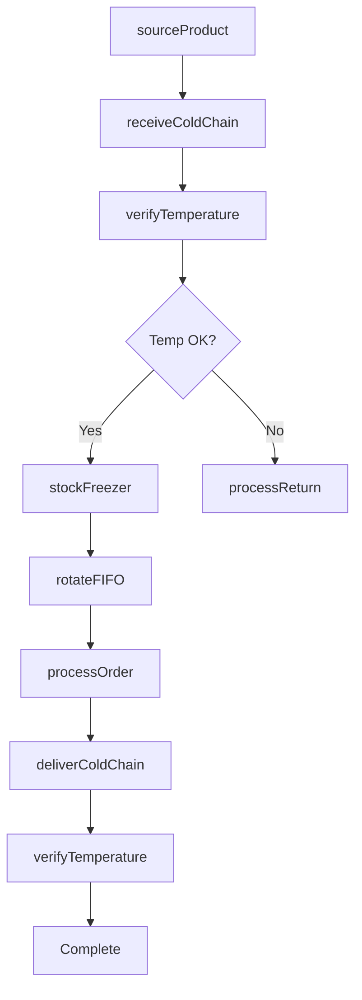
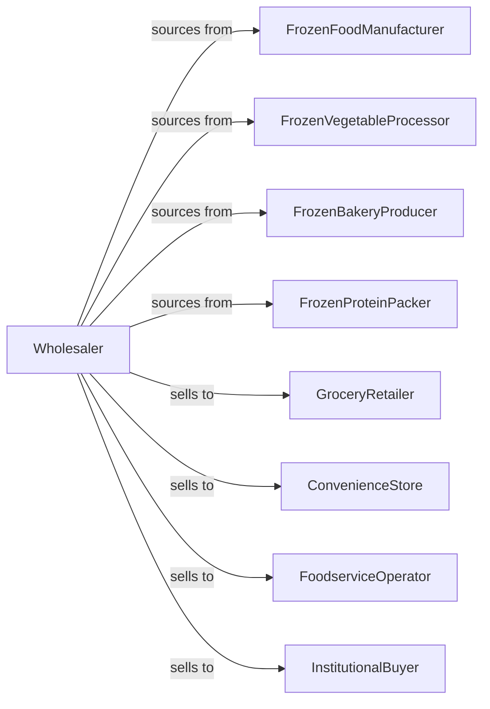

# Packaged Frozen Food Merchant Wholesalers

> Business-as-Code definition for frozen food wholesale distribution. Models cold chain logistics, temperature-controlled inventory, and retail fulfillment for frozen meals, vegetables, and proteins.

## Overview

Packaged frozen food wholesalers distribute frozen entrees, vegetables, fruits, bakery items, and proteins to grocers, foodservice operators, and convenience stores. This definition exposes actions for cold chain sourcing, temperature-controlled fulfillment, and freezer space management with events for temperature compliance and expiration tracking.

## Actors

| Actor | Description |
|-------|-------------|
| FrozenFoodManufacturer | Produces frozen meals and entrees |
| FrozenVegetableProcessor | Packs frozen vegetables and fruits |
| FrozenBakeryProducer | Makes frozen breads and desserts |
| FrozenProteinPacker | Processes frozen meats and seafood |
| GroceryRetailer | Sells frozen foods to consumers |
| ConvenienceStore | C-store with freezer section |
| FoodserviceOperator | Restaurant using frozen ingredients |
| InstitutionalBuyer | School or hospital foodservice |

## Roles

| Role | Description |
|------|-------------|
| CategoryManager | Manages frozen food categories |
| SalesRepresentative | Serves retail and foodservice accounts |
| ColdChainSpecialist | Oversees temperature compliance |
| RouteDriver | Delivers in refrigerated trucks |
| FreezerSpacePlanner | Optimizes freezer merchandising |

## Entities

| Entity | Description |
|--------|-------------|
| Product | Frozen food item with specs |
| Inventory | Stock levels with lot and expiry |
| PurchaseOrder | Order placed with manufacturer |
| SalesOrder | Customer order |
| ColdChain | Temperature-controlled supply chain |
| Route | Refrigerated delivery route |
| FreezerPlanogram | Freezer case configuration |
| TemperatureLog | Temperature monitoring record |
| Expiration | Product shelf life data |
| Promotion | Manufacturer deal |
| Return | Customer return authorization |

## Actions

| Action | Description |
|--------|-------------|
| sourceProduct | Contract with frozen food manufacturers |
| placeOrder | Submit purchase order |
| receiveColdChain | Check in with temperature verification |
| stockFreezer | Store in frozen warehouse |
| quoteProducts | Price products for customer |
| processOrder | Fulfill customer order |
| deliverColdChain | Transport in refrigerated vehicle |
| verifyTemperature | Check cold chain integrity |
| setupFreezerPlanogram | Configure freezer display |
| trackExpiration | Monitor product dates |
| runPromotion | Execute manufacturer deal |
| processReturn | Handle returns and damages |
| rotateFIFO | Ensure first-in-first-out stock |
| forecastSeasonal | Project seasonal demand |

## Events

| Event | Description |
|-------|-------------|
| orderReceived | Customer placed order |
| inventoryReceived | Manufacturer shipment arrived |
| temperatureVerified | Cold chain confirmed |
| orderDelivered | Products delivered |
| routeCompleted | Deliveries finished |
| temperatureExcursion | Cold chain breach detected |
| expirationApproaching | Products near expiry |
| planogramUpdated | Freezer configuration changed |
| promotionStarted | Manufacturer deal began |
| stockLow | Inventory below threshold |
| returnProcessed | Return completed |
| seasonalPeak | High demand period starting |

## Searches

| Search | Description |
|--------|-------------|
| findProducts | Search by category, brand, pack |
| getInventory | Check stock with expiry dates |
| getOrders | Retrieve orders by status |
| getRoutes | View delivery schedules |
| getTemperatureLogs | Access compliance records |
| getExpirations | Track products by date |
| getPromotions | View active deals |

## Workflow



## Actor Relationships



## Usage

### Calling Actions

```typescript
import { distributePackagedFrozen } from '@headlessly/distribute-packaged-frozen'

const distributor = distributePackagedFrozen()

// Search frozen products
const products = await distributor.findProducts({
  category: 'frozen-vegetables',
  type: 'mixed-vegetables',
  packSize: '2.5lb-bag',
  brand: 'birds-eye'
})

// Process order with cold chain
const order = await distributor.processOrder({
  customerId: 'grocer-456',
  items: products.map(p => ({ productId: p.id, cases: 10 })),
  delivery: {
    date: '2024-04-15',
    temperatureRange: { min: -10, max: 0, unit: 'fahrenheit' }
  }
})

// Deliver with temperature monitoring
await distributor.deliverColdChain({
  orderId: order.id,
  truckId: 'reefer-123',
  monitoring: {
    interval: 15,
    unit: 'minutes',
    alertThreshold: 0
  }
})
```

### Event-Driven Automation

```typescript
// Alert on temperature excursion
distributor.temperatureExcursion(async ({ loadId, temperature, threshold }) => {
  await createAlert({
    severity: 'high',
    type: 'cold-chain-breach',
    message: `Temperature ${temperature}F exceeded ${threshold}F threshold`
  })

  await quarantineLoad({ loadId })
})

// Promote items near expiration
distributor.expirationApproaching(async ({ productId, lotNumber, daysRemaining }) => {
  if (daysRemaining < 30) {
    await distributor.runPromotion({
      productId,
      lotNumber,
      discount: calculateDiscount(daysRemaining),
      reason: 'short-date'
    })
  }
})
```
