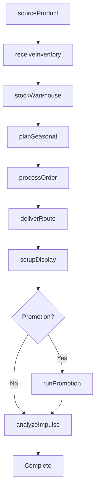
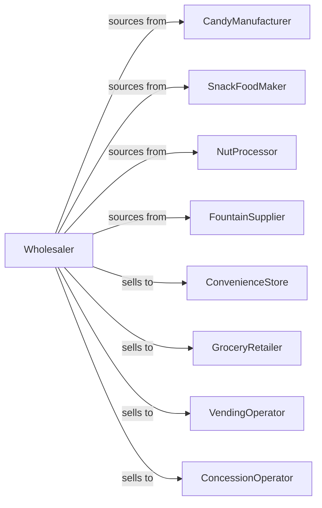

# Confectionery Merchant Wholesalers

> Business-as-Code definition for candy and snack wholesale distribution. Models procurement, seasonal programs, and retail merchandising support for confectionery, snacks, and fountain supplies.

## Overview

Confectionery wholesalers distribute candy, chocolate, snack foods, nuts, popcorn, and fountain supplies to convenience stores, grocers, and vending operators. This definition exposes actions for product sourcing, seasonal merchandising, and route delivery with events for holiday demand and impulse category management.

## Actors

| Actor | Description |
|-------|-------------|
| CandyManufacturer | Produces chocolate and confections |
| SnackFoodMaker | Makes chips, pretzels, and snacks |
| NutProcessor | Roasts and packages nuts |
| FountainSupplier | Provides syrups and fountain products |
| ConvenienceStore | C-store with candy and snack aisle |
| GroceryRetailer | Sells confectionery to consumers |
| VendingOperator | Stocks vending machines |
| ConcessionOperator | Runs theater or stadium concessions |

## Roles

| Role | Description |
|------|-------------|
| CategoryManager | Manages candy and snack categories |
| SalesRepresentative | Serves retail accounts |
| RouteDriver | Delivers products on schedule |
| MerchandisingSpecialist | Supports store displays |
| SeasonalPlanner | Coordinates holiday inventory |

## Entities

| Entity | Description |
|--------|-------------|
| Product | Candy or snack item |
| Inventory | Stock levels by location |
| PurchaseOrder | Order placed with manufacturer |
| SalesOrder | Customer order |
| Route | Scheduled delivery route |
| Display | Retail merchandising fixture |
| SeasonalProgram | Holiday or seasonal promotion |
| Planogram | Shelf configuration |
| Promotion | Manufacturer deal |
| ImpulseItem | High-margin checkout item |
| Return | Customer return authorization |

## Actions

| Action | Description |
|--------|-------------|
| sourceProduct | Identify and onboard product lines |
| placeOrder | Submit purchase order to manufacturer |
| receiveInventory | Check in incoming products |
| stockWarehouse | Store products in locations |
| quoteProducts | Price products for customer |
| processOrder | Fulfill customer order |
| deliverRoute | Execute scheduled delivery |
| setupDisplay | Configure retail merchandise |
| runPromotion | Execute manufacturer deal |
| planSeasonal | Prepare holiday inventory |
| managePlanogram | Optimize shelf configuration |
| processReturn | Handle customer returns |
| rotateStock | Ensure FIFO for freshness |
| analyzeImpulse | Optimize checkout items |

## Events

| Event | Description |
|-------|-------------|
| orderReceived | Customer placed order |
| inventoryReceived | Manufacturer shipment arrived |
| orderDelivered | Products delivered |
| routeCompleted | Deliveries finished |
| displaySetup | Merchandising fixture placed |
| promotionStarted | Manufacturer deal began |
| holidayApproaching | Seasonal peak coming |
| planogramUpdated | Shelf configuration changed |
| newProductLaunched | Item added to line |
| stockLow | Inventory below threshold |
| expirationApproaching | Products near freshness date |
| returnProcessed | Return completed |

## Searches

| Search | Description |
|--------|-------------|
| findProducts | Search by category, brand, pack |
| getInventory | Check stock levels |
| getOrders | Retrieve orders by status |
| getRoutes | View delivery schedules |
| getDisplays | Track merchandising fixtures |
| getPromotions | View active deals |
| getSeasonalPrograms | Access holiday plans |

## Workflow



## Actor Relationships



## Usage

### Calling Actions

```typescript
import { distributeConfectionery } from '@headlessly/distribute-confectionery'

const distributor = distributeConfectionery()

// Search candy products
const candy = await distributor.findProducts({
  category: 'chocolate',
  type: 'bar',
  brand: 'hershey',
  packType: 'king-size'
})

// Plan Halloween seasonal
const seasonal = await distributor.planSeasonal({
  holiday: 'halloween',
  categories: ['chocolate', 'candy-corn', 'novelty'],
  buildupStart: '2024-09-01',
  peakWeek: '2024-10-28',
  channels: ['grocery', 'c-store', 'drugstore']
})

// Setup checkout display
await distributor.setupDisplay({
  customerId: 'cstore-456',
  location: 'checkout-counter',
  displayType: 'impulse-rack',
  products: candy.slice(0, 12).map(c => c.id),
  planogram: 'high-margin-priority'
})
```

### Event-Driven Automation

```typescript
// Prepare for holiday peaks
distributor.holidayApproaching(async ({ holiday, weeksOut }) => {
  if (weeksOut === 8) {
    const forecast = await getForecast(holiday)

    await distributor.placeOrder({
      items: forecast.recommendedStock,
      priority: 'seasonal-rush'
    })
  }
})

// Rotate stock before expiration
distributor.expirationApproaching(async ({ productId, lotNumber, daysRemaining }) => {
  if (daysRemaining < 45) {
    await distributor.runPromotion({
      productId,
      lotNumber,
      discount: 25,
      channels: ['vending', 'concession']
    })
  }
})
```
